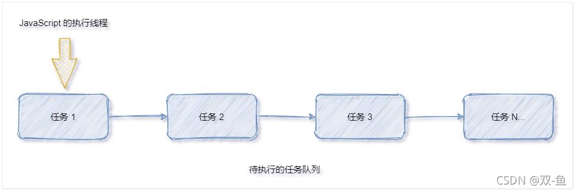
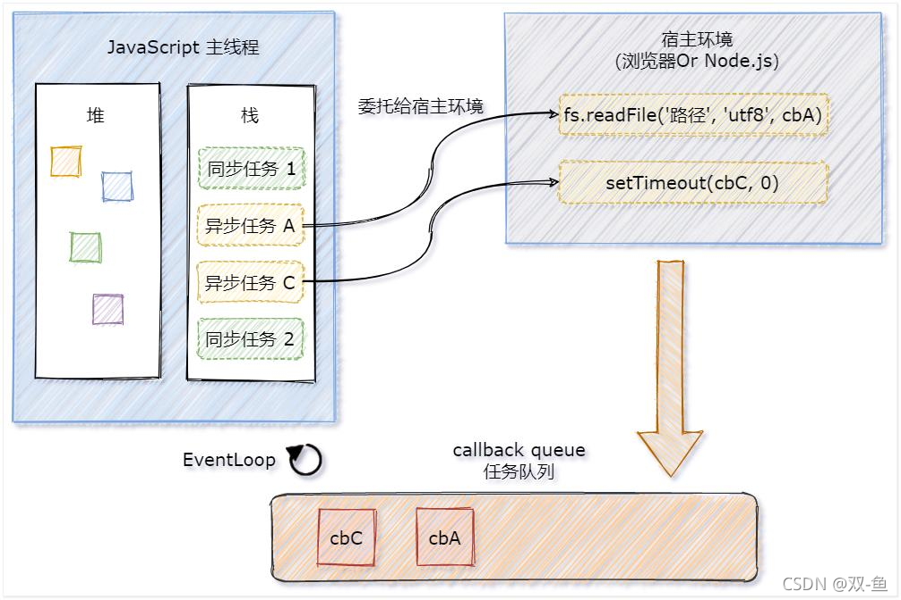
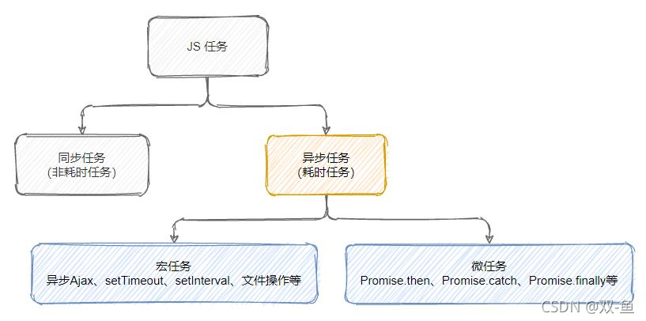
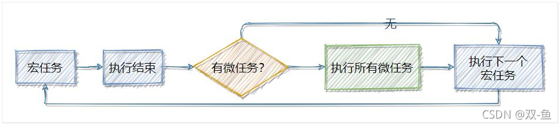

# ES6 模块化

## 回顾：node.js 中如何实现模块化

node.js 遵循了 CommonJS 的模块化规范。其中：
- 导入其它模块使用 `require()` 方法
- 模块对外共享成员使用 `module.export`s 对象
模块化的好处：大家都遵守同样的模块化规范写代码，降低了沟通的成本，极大方便了各个模块之间的相互调用，利人利己。


## 前端模块化规范的分类

在 ES6 模块化规范诞生之前，JavaScript 社区已经尝试并提出了 AMD、CMD、CommonJS 等模块化规范。
但是，这些由社区提出的模块化标准，还是存在一定的差异性与局限性、并不是浏览器与服务器通用的模块化
标准，例如：
- AMD 和 CMD 适用于浏览器端的 Javascript 模块化
- CommonJS 适用于服务器端的 Javascript 模块化
太多的模块化规范给开发者增加了学习的难度与开发的成本。因此，大一统的 ES6 模块化规范诞生了！


## 什么是 ES6 模块化规范

ES6 模块化规范是浏览器端与服务器端通用的模块化开发规范。它的出现极大的降低了前端开发者的模块化学习成本，开发者不需再额外学习 AMD、CMD 或CommonJS 等模块化规范。
ES6 模块化规范中定义：
- 每个 js 文件都是一个独立的模块
- 导入其它模块成员使用 import 关键字
- 向外共享模块成员使用 export关键字


## 在 node.js 中体验 ES6 模块化

node.js 中默认仅支持 CommonJS 模块化规范，若想基于 node.js 体验与学习 ES6 的模块化语法，可以按照如下两个步骤进行配置：
1. 确保安装了 v14.15.1 或更高版本的 node.js
2. 在终端中输入`npm init -y`，初始化包环境
3. 在 package.json 的根节点中添加 “type”: “module” 节点


## ES6 模块化的基本语法

ES6 的模块化主要包含如下 3 种用法：
- 默认导出与导入
- 按需导出与导入
- 直接导入并执行模块中的代码

### 默认导出和导入
**默认导出**：默认导出的语法： `export default 默认导出的成员`
每个模块中，只允许使用唯一的一次 export default，否则会报错！
```js
let n1 = 10 // 定义模块私有成员 n1
let n2 = 20 // 定义模块私有成员 n2

function show() {} // 定义模块私有方法 show

// 使用export default默认导出语法，向外共享 n1 和 show
export default {
  n1,
  show
}

// 下面代码打开会报错：SyntaxError: Identifier '.default' has already been declared
// export default {
//   n2
// }
```

**默认导入**：默认导入的语法： `import 接收名称 from '模块标识符'`
接收名称可以任意名称，只要是合法的成员名称即可
```js
// 导入上个js文件向外共享的成员，并用 m1 成员接收
import m1 from './01.默认导出.js'

// 输出：{ n1: 10, show: [Function: show] }
console.log(m1)
12345
```

### 按需导出和导入
**按需导出**：按需导出的语法： `export 按需导出的成员`
```js
// 导出 s1 和 s2 变量
export let s1 = 'aaa'
export let s2 = 'ccc'
export function say() {}

// 默认导出可以和按需导出混合使用
export default {
  s1,
  a: 20
}
```

**按需导入**：按需导入的语法：` import { s1 } from ‘模块标识符’`
```js
// 导入模块成员，使用 as 起别名，info 接受的是默认导出
import info, { s1, s2 as str2, say } from './03.按需导出.js'

console.log(s1) // aaa
console.log(str2) // ccc
console.log(say) // [Function: say]

console.log(info) // { s1: 'aaa', a: 20 }
```

**按需导出与导入的注意事项**
- 每个模块中可以使用多次按需导出
- 按需导入的成员名称必须和按需导出的名称保持一致
- 按需导入时，可以使用 as 关键字进行重命名
- 按需导入可以和默认导入一起使用

### 直接导入并执行模块中的代码
如果只想单纯地执行某个模块中的代码，并不需要得到模块中向外共享的成员。此时，可以直接导入并执行模块代码，示例代码如下：
```js
// 05.直接运行模块中的代码.js
for (let i = 0; i < 3; i++) {
  console.log(i)
}

// 06_test.js
// 直接导入就会运行上面的for循环，打印1 2 3
import './05.直接运行模块中的代码.js'

```


# Promise

## 回调地狱问题

多层回调函数的相互嵌套，就形成了回调地狱。
示例代码如下：
```javascript
setTimeout(() => {
	console.log("延迟 1 秒后输出")
	
	setTimeout(() => {
		console.log("延迟 2 秒后输出")
			
		setTimeout(() => {
			console.log("延迟 3 秒后输出")
	
		},3000)
	},2000)
},1000)
```

回调地狱的缺点：
- 代码耦合性太强，牵一发而动全身，难以维护
- 大量冗余的代码相互嵌套，代码的可读性变差

**解决回调地狱**：为了解决回调地狱的问题，ES6（ECMAScript 2015）中新增了 Promise 的概念。

## Promise 的基本概念
`Promise` 是一个构造函数
  - 我们可以创建 Promise 的实例 `const p = new Promise()`
  - new 出来的 Promise 实例对象，代表一个异步操作

`Promise.prototype` 上包含一个 `.then()` 方法
  - 每一次 `new Promise()` 构造函数得到的实例对象，
  - 都可以通过原型链的方式访问到 `.then()` 方法，例如 `p.then()`

`.then()` 方法用来预先指定成功和失败的回调函数
  - `p.then(成功的回调函数，失败的回调函数)`
  - `p.then(result => { }, error => { })`
  - 调用 `.then()` 方法时，成功的回调函数是必选的、失败的回调函数是可选的


## 基于回调函数按顺序读取文件内容
使用node的fs模块
```js
import fs from 'fs'

fs.readFile('./files/1.txt', 'utf8', ((err1, r1) => {
  if (err1) return console.log(err1.message) // 读取 1.txt 失败
  console.log(r1); // 读取 1.txt 成功

  fs.readFile('./files/2.txt', 'utf8', ((err2, r2) => {
    if (err2) return console.log(err2.message) // 读取 2.txt 失败
    console.log(r2); // 读取 2.txt 成功

    fs.readFile('./files/3.txt', 'utf8', ((err3, r3) => {
      if (err3) return console.log(err3.message) // 读取 3.txt 失败
      console.log(r3); // 读取 3.txt 成功
    }))
  }))
}))
```


## 基于 then-fs 读取文件内容
由于 node.js 官方提供的 fs 模块仅支持以回调函数的方式读取文件，不支持 Promise 的调用方式。因此，需要先运行如下的命令，安装 then-fs 这个第三方包，从而支持我们基于 Promise 的方式读取文件的内容：
```js
npm install then-fs
```

### then-fs 的基本使用
调用 then-fs 提供的 readFile() 方法，可以**异步**地读取文件的内容，它的返回值是 Promise 的实例对象。因此可以**调用 .then() 方法**为每个 Promise 异步操作指定**成功**和**失败**之后的回调函数。示例代码如下：

注意：因为异步所以无法保证文件的读取顺序，需要做进一步的改进！
```js
import thenFs from 'then-fs'

thenFs.readFile('./files/1.txt', 'utf8').then(
    r1 => console.log(r1),
    err1 => console.log(err1.message)
)
thenFs.readFile('./files/2.txt', 'utf8').then(
    r2 => console.log(r2),
    err2 => console.log(err2.message)
)
thenFs.readFile('./files/3.txt', 'utf8').then(
    r3 => console.log(r3),
    err3 => console.log(err3.message)
)
```

### .then() 方法的特性
如果上一个 .then() 方法中返回了一个新的 Promise 实例对象，则可以通过下一个 .then() 继续进行处理。通过 .then() 方法的链式调用，就解决了回调地狱的问题

### 基于 Promise 按顺序读取文件的内容
Promise 支持链式调用，从而来解决回调地狱的问题。在 Promise 的链式操作中如果发生了错误，可以使用 `Promise.prototype.catch` 方法进行捕获和处理
示例代码如下：
```js
import thenFs from 'then-fs'

thenFs.readFile('./files/1.txt', 'utf8') // 返回的就是promise对象
    // 通过.then为promise对象指定成功后的回调函数
    .then(r1 => {
      console.log(r1)
      return thenFs.readFile('./files/2.txt', 'utf8')
    })
    .then(r2 => {
      console.log(r2)
      return thenFs.readFile('./files/3.txt', 'utf8')
    })
    .then(r3 => {
      console.log(r3)
    })
    // 使用catch捕捉异常
    .catch(err => console.log(err.message))

```

如果不希望前面的错误导致后续的 .then 无法正常执行，则可以将 .catch 的**调用提前**
示例代码如下：
```js
import thenFs from 'then-fs'

thenFs.readFile('./files/11.txt', 'utf8') // 返回的就是promise对象
    // 将catch提前到then之前，捕捉异常
    .catch(err => console.log(err.message))
    // 通过.then为promise对象指定成功后的回调函数
    .then(r1 => {
      console.log(r1)
      return thenFs.readFile('./files/22.txt', 'utf8')
    })
    .catch(err => console.log(err.message))
    .then(r2 => {
      console.log(r2)
      return thenFs.readFile('./files/3.txt', 'utf8')
    })
    .then(r3 => {
      console.log(r3)
    })

```

### Promise.all() 方法
Promise.all() 方法会发起并行的 Promise 异步操作，等**所有的异步操作全部结束**后才会执行下一步的 .then操作（等待机制）。

示例代码如下：
注意：数组中 Promise 实例的顺序，就是最终结果的顺序！
```js
import thenFs from 'then-fs'

// 定义数组，存放三个读取文件的异步操作
const promiseArr = [
  thenFs.readFile('./files/3.txt', 'utf8'),
  thenFs.readFile('./files/2.txt', 'utf8'),
  thenFs.readFile('./files/1.txt', 'utf8'),
]

Promise.all(promiseArr)
    // 所有文件读取成功，才会调用then
    .then(([r1, r2, r3]) => {
      console.log(r1, r2, r3);
    })
    // 捕获异常
    .catch(err => {
      console.log(err.message);
    })

```

### Promise.race() 方法

Promise.race() 方法会发起并行的 Promise 异步操作，**只要任何一个异步操作完成**，就立即执行下一步的 .then 操作（赛跑机制）。

示例代码如下：
```js
import thenFs from 'then-fs'

// 定义数组，存放三个读取文件的异步操作
const promiseArr = [
  thenFs.readFile('./files/3.txt', 'utf8'),
  thenFs.readFile('./files/2.txt', 'utf8'),
  thenFs.readFile('./files/1.txt', 'utf8'),
]

Promise.race(promiseArr)
    // 只要有一个读取成功就会调用，赛跑机制
    .then(result => {
      console.log(result)
    })
    .catch(err => {
      console.log(err.message);
    })

```


## 基于 Promise 封装读文件的方法
方法的封装要求：
1. 方法的名称要定义为 getFile
2. 方法接收一个形参 fpath，表示要读取的文件的路径
3. 方法的返回值为 Promise 实例对象

**完整代码如下：**
```js
import fs from 'fs'

// 1.定义方法，fpath形参表示要读取的路径
function getFile(fpath) {
  // 2.返回promise对象，resolve表示成功的回调，reject表示失败的回调
  return new Promise(function (resolve, reject) {
    // 3.具体读取文件的异步操作
    fs.readFile(fpath, 'utf8', (err, dataStr) => {
      // 读取失败的返回reject，成功返回resolve
      if (err) return reject(err)
      resolve(dataStr)
    })
  })
}

// 4.调用方法，then接收resolve，catch接收catch
getFile('./files/1.txt')
    .then(r1 => console.log(r1))
    .catch((err) => console.log(err.message))

```


# async/await
## 什么是 async/await
async/await 是 ES8（ECMAScript 2017）引入的新语法，用来简化 Promise 异步操作。在async/await 出现之前，开发者只能通过链式 .then() 的方式处理 Promise 异步操作。
- then 链式调用的优点：解决了回调地狱的问题
- .then 链式调用的缺点：代码冗余、阅读性差、不易理解


## async/await 的基本使用
使用 async/await 简化 Promise 异步操作的

示例代码如下：
```js
import thenFs from 'then-fs'

console.log('A')

// 按照顺序读取 1 2 3 文件
async function getAllFile() {
  console.log('B')
  // 之后的代码是异步的，所以C就可以向下执行，不必等到getAllFile方法执行完
  const r1 = await thenFs.readFile('./files/1.txt', 'utf8')
  const r2 = await thenFs.readFile('./files/2.txt', 'utf8')
  const r3 = await thenFs.readFile('./files/3.txt', 'utf8')
  console.log(r1, r2, r3)
  console.log('D')
}

getAllFile()
console.log('C')
// 输出顺序
// A
// B
// C
// 111 222 333
// D

```

**async/await 的使用注意事项**
- 如果在 function 中使用了 await，则 function **必须**被 async 修饰
- 在 async 方法中，**第一个 await 之前的代码会同步执行**，await 之后的代码会异步执行


# EventLoop
## 同步和异步任务
JavaScript 是一门单线程执行的编程语言。也就是说，同一时间只能做一件事情。

单线程执行的问题：如果前一个任务非常耗时，则后续的任务就不得不一直等待，从而导致程序假死的问题。

为了防止某个耗时任务导致程序假死的问题，JavaScript 把待执行的任务分为了两类：
1. 同步任务（synchronous）
   - 又叫做非耗时任务，指的是在主线程上排队执行的那些任务
   - 只有前一个任务执行完毕，才能执行后一个任务
2. 异步任务（asynchronous）
   - 又叫做耗时任务，异步任务由 JavaScript 委托给宿主环境进行执行
   - 当异步任务执行完成后，会通知 JavaScript 主线程执行异步任务的回调函数


## 同步和异步任务的执行过程


1. 同步任务由 JavaScript 主线程次序执行
2. 异步任务委托给宿主环境执行
3. 已完成的异步任务**对应的回调函数**，会被加入到任务队列中等待执行
4. JavaScript 主线程的**执行栈**被清空后，会读取任务队列中的回调函数，次序执行
5. **JavaScript 主线程不断重复上面的第 4 步**


## EventLoop 的基本概念
JavaScript 主线程从任务队列中读取异步任务的回调函数，放到执行栈中依次执行。这个过程是**循环不断**的，所以整个的这种运行机制又称为 **EventLoop**（事件循环）。

## 结合 EventLoop 分析输出的顺序
```js
import thenFs from 'then-fs'

console.log('A');
// 异步
thenFs.readFile('./files/1.txt', 'utf8').then(value =>
    console.log('B')
)
// 异步
setTimeout(() => {
  console.log('C');
}, 0)

console.log('D');

```

正确的输出结果：ADCB 或 ADBC 
其中：
- A 和 D 属于**同步任务**。会根据代码的**先后顺序依次被执行**
- C 和 B 属于**异步任务**。它们的回调函数会被加入到任务队列中，等待主线程空闲时再执行，因为异步是的任务所以**先后顺序不确定**


# 宏任务和微任务
## 什么是宏任务和微任务
JavaScript 把异步任务又做了进一步的划分，异步任务又分为两类，分别是：



- 宏任务（macrotask）
  - 异步 Ajax 请求，setTimeout、setInterval，文件操作，其它宏任务…
- 微任务（microtask）
  - Promise.then、.catch 和 .finally，process.nextTick，其它微任务…

**宏任务和微任务的执行顺序**



每一个宏任务执行完之后，都会检查是否存在待执行的微任务，如果有，则执行完所有微任务之后，再继续执行下一个宏任务，如果没有，则直接执行下一个宏任务。


## 去银行办业务的场景

1. 小云和小腾去银行办业务。
2. 首先，需要取号之后进行排队
	- 宏任务队列

2. 假设当前银行网点只有一个柜员，小云在办理存款业务时，小腾只能等待
- **单线程**，宏任务按次序执行

3. 小云办完存款业务后，柜员询问他是否还想办理其它业务？
   - 当前宏任务执行完，**检查是否有微任务**

4. 小云告诉柜员：想要买理财产品、再办个信用卡、最后再兑换点马年纪念币？
   - 执行微任务，后续**宏任务被推迟**

5. 小云离开柜台后，柜员开始为小腾办理业务
   - 所有微任务执行完毕，开始执行下一个宏任务


## 面试题分析
第一道
```js
setTimeout(function(){
	console.log('1')
})

new Promise(function(resolve){
	console.log('2')
	resolve()
}).then(function(){
	console.log('3')
})

console.log('4')
```
正确的输出顺序是：2431
分析：
① 先执行所有的**同步任务**：执行第6行、第12行代码
② 再执行**微任务**：执行第9行代码
③ 再执行**下一个宏任务**：执行第二行代码

第二道：请分析以下代码输出的顺序（代码较长，截取成了左中右 3 个部分）
```js
console.log('1')

setTimeout(function(){
	console.log('2')
	new Promise(function(){
		console.log('3')
		resolve()
	}).then(function(){
		console.log('4')
	})
})

new Promise(function(){
	console.log('5')
	resolve()
}).then(function(){
	console.log('6')
})

setTimeout(function(){
	console.log('7')
	new Promise(funciton(resolve){
		console.log('8')
		resolve()
	}).then(function(){
		console.log('9')
	})
})
```
正确顺序为：156234789，如果第一个定时器加个2毫秒延迟呢 ？因为定时器是异步操作，谁先执行就不确定了，可能是 156234789 也可能是 156789234


# API 接口案例
## 搭建环境
**案例需求**：基于 MySQL 数据库 + Express 对外提供用户列表的 API 接口服务。用到的技术点如下：

- 第三方包 express 和 mysql2
- ES6 模块化
- Promise
- async/await

**搭建项目的基本结构**
- 启用 ES6 模块化支持
  - 在 package.json 中声明 `“type”: “module”`

- 安装第三方依赖包，express和mysql2
  - 运行`npm install express@4.17.1 mysql2@2.2.5`

- 安装nodemon
  - `npm install -g nodemon`

- 创建数据库，并插入数据
```sql
  CREATE DATABASE vue_test;
  USE vue_test;
  
  CREATE TABLE vue_test.ev_users (
      id INT PRIMARY KEY AUTO_INCREMENT,
      username VARCHAR(255),
      nickname VARCHAR(255)
  );
  INSERT INTO vue_test.ev_users VALUE (1, 'admin1', NULL);
  INSERT INTO vue_test.ev_users VALUE (2, 'admin2', 'abc');
  INSERT INTO vue_test.ev_users VALUE (3, 'admin3', NULL);
```


### 创建 db 数据库操作模块

```js
import mysql from 'mysql2'

const pool = mysql.createPool({
  host: '127.0.0.1', // 主机地址
  port: 3306, // 端口号
  database: 'my_db_01', // 数据库
  user: 'root', // 账号
  password: '123456', // 密码
})

// 默认导出的是支持 Promise API 的 pool
export default pool.promise()
```


### 创建 user_ctrl 模块
使用 `try…catch` 可以捕获 Promise 异步任务中产生的异常错误，并在 catch 块中进行处理

```js
import db from '../db/index.js'

// 使用 ES6 的按需导出语法，将 getAllUser 方法导出出去
export async function getAllUser(req, res) {
  try {
    // db.query() 的返回值是 Promise 对象，因此可以使用 await async 简化处理
    const [rows] = await db.query('select id, username, nickname from ev_users')
    res.send({
      status: 0,
      message: '获取用户列表数据成功！',
      data: rows,
    })
  } catch (err) {
    // 获取失败
    res.send({
      status: 1,
      message: '获取用户列表数据失败！',
      desc: err.message,
    })
  }
}
```


### 创建 user_router 模块

```js
import express from 'express'
// 按需导入 getAllUser 函数
import {getAllUser} from '../controller/user_ctrl.js'

// 创建路由对象
const router = new express.Router()
// 挂载路由规则
router.get('/user', getAllUser)

// 使用 es6 默认导出
export default router
```


### 导入并挂载路由模块

```js
import express from 'express'
import userRouter from './router/user_router.js'

const app = express()
// 挂载用户路由
app.use('/api', userRouter)

app.listen(80, () => {
  console.log('server running at http://127.0.0.1')
})
```

启动程序，使用浏览器访问：http://127.0.0.1/api/user，可以查看到获取的结果