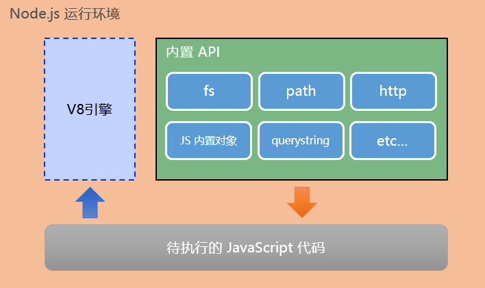

# 什么是 Node.js

> Node.js® is a JavaScript runtime built on Chrome's V8 JavaScript engine.

Node.js 是一个基于 Chrome V8 引擎的 JavaScript 运行环境。
Node.js 的[官网地址](https://nodejs.org/zh-cn/) 

## Node.js 中的 JavaScript 运行环境



注意：
- 浏览器是 JavaScript 的前端运行环境。
- Node.js 是 JavaScript 的后端运行环境。
- Node.js 中无法调用 DOM 和 BOM 等浏览器内置 API。

## Node.js 可以做什么
Node.js 作为一个 JavaScript 的运行环境，仅仅提供了基础的功能和 API。然而，基于 Node.js 提供的这些基础能，很多强大的工具和框架如雨后春笋，层出不穷，所以学会了 Node.js ，可以让前端程序员胜任更多的工作和岗位：

- 基于 [Express框架](http://www.expressjs.com.cn/)，可以快速构建 Web 应用
- 基于 [Electron框架](https://electronjs.org/)，可以构建跨平台的桌面应用
- 基于 [restify框架](http://restify.com/)，可以快速构建 API 接口项目
- 读写和操作数据库、创建实用的命令行工具辅助前端开发、etc…

总之：Node.js 是大前端时代的“大宝剑”，有了 Node.js 这个超级 buff 的加持，前端程序员的行业竞争力会越来越强！

# fs 文件系统模块
## 什么是fs文件系统模块
fs 模块是 Node.js 官方提供的、用来操作文件的模块。它提供了一系列的方法和属性，用来满足用户对文件的操作需求。

例如：
-  fs.readFile()方法，用来读取指定文件中的内容
-  fs.writeFile() 方法，用来向指定的文件中写入内容

如果要在 JavaScript 代码中，使用 fs 模块来操作文件，则需要使用如下的方式先导入它：

```javascript
const fs=require('fs')
```

## 读取指定文件中的内容
### fs.readFile()的语法格式
使用 fs.readFile() 方法，可以读取指定文件中的内容，语法格式如下：

```javascript
fs.readFile(path[,options],callback)
```

参数解读：

- 参数1：必选参数，字符串，表示文件的路径。
- 参数2：可选参数，表示以什么编码格式来读取文件。
- 参数3：必选参数，文件读取完成后，通过回调函数拿到读取的结果。

 

### fs.readFile() 的示例代码
以 utf8 的编码格式，读取指定文件的内容，并打印 err 和 dataStr 的值：
```javascript
const fs=require('fs')
fs.readFile('./files/11.text','utf8',function(err,dataStr){
	consloe.log(err)
    consloe.log('-----')
	consloe.log(datatSrt)
})
```


### 判断文件是否读取成功
可以判断 err 对象是否为 null，从而知晓文件读取的结果：

 ```javascript
 const fs = require('fs')  
 fs.readFi1e('./files/1.txt','utf8',function(err, result) {
     if(err){
         return console.log('文件读取失败!'+err.message)
     }
     console.log('文件读取成功,内容是：'+result)
 }) 
 ```


## 向指定的文件中写入内容

### fs.writeFile() 的语法格式
使用 `fs.writeFile()` 方法，可以向指定的文件中写入内容，语法格式如下：

```javascript
 fs.writeFile(file,data[,options],callback)
```

参数解读：

- 参数1：必选参数，需要指定一个文件路径的字符串，表示文件的存放路径。
- 参数2：必选参数，表示要写入的内容。
- 参数3：可选参数，表示以什么格式写入文件内容，默认值是：utf8。
- 参数4：必选参数，文件写入完成后的回调函数。

 

### fs.writeFile()的示例代码
向指定的文件路径中，写入文件内容：
```javascript
const fs = require('fs') 
fs.writeFile('./files/2.txt','Hello Node.js',function(err){
    console.log(err)
})
```


### 判断文件是否写入成功
可以判断 err 对象是否为 null，从而知晓文件写入的结果：
 ```javascript
 const fs = require('fs') 
 fs.writeFile('./files/2.txt','Hello Node.js',function(err){
     if(err){
         return console.log('文件写入失败！'+err.message)
     }
     console.log('文件写入成功')
 })
 ```


**fs模块-路径动态拼接的问题**

在使用 fs 模块操作文件时，如果提供的操作路径是以 ./ 或 ../ 开头的相对路径时，很容易出现路径动态拼接错误的问题。

原因：代码在运行的时候，会以执行 node 命令时所处的目录，动态拼接出被操作文件的完整路径。

解决方案：在使用 fs 模块操作文件时，直接提供完整的路径，不要提供 ./ 或 ../ 开头的相对路径，从而防止路径动态拼接的问题。

```javascript
// 不要使用  ./或者../ 这样的相对路径
fs.readFi1e('./files/1.txt','utf8',function(err, dataStr) {
    if(err) return console.log('文件读取失败!'+err.message)
    console.log(dataStr)
}) 

// __dirname 表示当前文件所处的目录
fs.readFi1e(__dirname+'/files/1.txt','utf8',function(err, dataStr) {
    if(err) return console.log('文件读取失败!'+err.message)
    console.log(dataStr)
}) 
```

# path 路径模块

## 什么是path路径模块
path 模块是 Node.js 官方提供的、用来处理路径的模块。它提供了一系列的方法和属性，用来满足用户对路径的处理需求。

例如：

 -  path.join()方法，用来将多个路径片段拼接成一个完整的路径字符串
 -  path.basename() 方法，用来从路径字符串中，将文件名解析出来

如果要在 JavaScript 代码中，使用 path 模块来处理路径，则需要使用如下的方式先导入它：

```javascript
  const path=require('path')
```

## 路径拼接

### path.join()的语法格式

使用 path.join() 方法，可以把多个路径片段拼接为完整的路径字符串，语法格式如下：
```javascript
  path.join([.paths])
```

参数解读：
  - .paths：\<string> 路径片段的序列
  - 返回值：\<string>

### path.join()的代码示例
使用 path.join() 方法，可以把多个路径片段拼接为完整的路径字符串：
```javascript
  const pathStr=path.join('/a','/b','../','/d','/e')
  console.log(pathStr)//输出\a\b\d\e
  
  const pathStr2=path.join(__dirname.'./files/1.txt')
  console.log(pathStr2)//输出当前文件所处目录\files\1.txt
```
注意：今后凡是涉及到路径拼接的操作，都要使用 path.join() 方法进行处理。不要直接使用 + 进行字符串的拼接。

## 获取路径中的文件名

### path.basename()的语法格式
使用 path.basename() 方法，可以获取路径中的最后一部分，经常通过这个方法获取路径中的文件名，语法格式如下：

```javascript
  path.basename(path[,ext])
```

参数解读：

 - path：必选参数，表示一个路径的字符串
 - ext：可选参数，表示文件扩展名
 - 返回：表示路径中的最后一部分

  

### path.basename()的代码示例
使用 path.basename() 方法，可以从一个文件路径中，获取到文件的名称部分：
 ```javascript
 const fpath = '/a/b/c/index.html' // 文件的存放路径
 
 var fullName = path.basename(fpath)
 console.log(fullName) // 输出 index.html
 
 var nameWithoutExt = path.basename(fpath,'.html')
 console.log(nameWithoutExt) // 输出 index
 ```


## 获取路径中的文件扩展名

### path.extname()的语法格式
使用 path.extname() 方法，可以获取路径中的扩展名部分，语法格式如下：

```javascript
path.extname(path)
```

参数解读：

- path：选参数，表示一个路径的字符串
- 返回 ：返回得到的扩展名字符串

 

### path.extname()的代码示例

使用 path.extname() 方法，可以获取路径中的扩展名部分：
```javascript
const fpath = '/a/b/c/index.html' // 路径字符串

const fext = path.extname('fpath')
console.log(fext) // 输出 .html
```

# http 模块

## 什么是http模块

回顾：什么是客户端、什么是服务器？

在网络节点中，负责消费资源的电脑，叫做客户端；负责对外提供网络资源的电脑，叫做服务器。

http 模块是 Node.js 官方提供的、用来创建 web 服务器的模块。通过 http 模块提供的 http.createServer() 方法，就能方便的把一台普通的电脑，变成一台 Web 服务器，从而对外提供 Web 资源服务。

如果要希望使用 http 模块创建 Web 服务器，则需要先导入它：

```javascript
const http = require('http')
```

**进一步理解http模块的作用**

服务器和普通电脑的**区别**在于，服务器上安装了 web 服务器软件，例如：IIS、Apache 等。通过安装这些服务器软件，就能把一台普通的电脑变成一台 web 服务器。

在 Node.js 中，我们不需要使用 IIS、Apache 等这些第三方 web 服务器软件。因为我们可以基于 Node.js 提供的 http 模块，**通过几行简单的代码，就能轻松的手写一个服务器软件**，从而对外提供 web 服务。

**服务器相关的概念**

**IP 地址**
**IP** **地址**就是互联网上每台计算机的唯一地址，因此 IP 地址具有唯一性。如果把“个人电脑”比作“一台电话”，那么“IP地址”就相当于“电话号码”，只有在知道对方 IP 地址的前提下，才能与对应的电脑之间进行数据通信。

IP 地址的格式：通常用“点分十进制”表示成（a.b.c.d）的形式，其中，a,b,c,d 都是 0~255 之间的十进制整数。例如：用点分十进表示的 IP地址（192.168.1.1）

注意：
1. **互联网中每台We服务器，都有自己的IP地址**，例如：大家可以在Windows 的终端中运行 `ping www.baidu.com` 命令，即可查看到百度服务器的 IP 地址。
2. 在开发期间，自己的电脑既是一台服务器，也是一个客户端，为了方便测试，可以在自己的浏览器中输入 127.0.0.1 这个 IP 地址，就能把自己的电脑当做一台服务器进行访问了。

**域名和域名服务器**

尽管 IP 地址能够唯一地标记网络上的计算机，但IP地址是一长串数字，不直观，而且不便于记忆，于是人们又发明了另一套字符型的地址方案，即所谓的**域名（Domain Name）地址**。

IP地址和域名是一一对应的关系，这份对应关系存放在一种叫做**域名服务器**(DNS，Domain name server)的电脑中。使用者只需通过好记的域名访问对应的服务器即可，对应的转换工作由域名服务器实现。因此，**域名服务器就是提供** **IP** **地址和域名之间的转换服务的服务器**。

注意：
 - 单纯使用 IP 地址，互联网中的电脑也能够正常工作。但是有了域名的加持，能让互联网的世界变得更加方便。
 - 在开发测试期间， 127.0.0.1 对应的域名是 localhost，它们都代表我们自己的这台电脑，在使用效果上没有任何区别。

**端口号**
计算机中的端口号，就好像是现实生活中的门牌号一样。通过门牌号，外卖小哥可以在整栋大楼众多的房间中，准确把外卖送到你的手中。

同样的道理，在一台电脑中，可以运行成百上千个 web 服务。每个 web 服务都对应一个唯一的端口号。客户端发送过来的网络请求，通过端口号，可以被准确地交给对应的 web 服务进行处理。


注意：
- 每个端口号不能同时被多个 web 服务占用。
- 在实际应用中，URL 中的 80 端口可以被省略。

## 创建最基本的web服务器
### 创建web服务器的基本步骤

1. 导入 http 模块
2. 创建 web 服务器实例
3. 为服务器实例绑定 **request** 事件，监听客户端的请求
4. 启动服务器

#### 步骤1.导入http模块

如果希望在自己的电脑上创建一个 web 服务器，从而对外提供 web 服务，则需要导入 http 模块：
```javascript
  const http = require('http')
```


#### 步骤2 创建web服务器实例

调用 http.createServer() 方法，即可快速创建一个 web 服务器实例：
```javascript
const server = http.createServer()
```


#### 步骤3 为服务器实例绑定request事件

为服务器实例绑定 request 事件，即可监听客户端发送过来的网络请求：
```javascript
// 使用服务器实例的 .on() 方法，为服务器绑定一个request事件
server.on('request',(req,res)=>{
    // 只要有客户端来请求我们自己的服务器，就会触发request事件，从而调用这个事件处理函数
    consolg.log('Someone visit our web server.')
})
```


#### 步骤4 启动服务器

调用服务器实例的 .listen() 方法，即可启动当前的 web 服务器实例：
```javascript
// 调用server.listen(端口号,cb回调)方法。即可启动web服务器
server.listen(80,()=>{
    console.log('http server running at http://127.0.01')
})
```


### req请求对象

只要服务器接收到了客户端的请求，就会调用通过 server.on() 为服务器绑定的 request 事件处理函数。

如果想在事件处理函数中，访问与客户端相关的**数据**或**属性**，可以使用如下的方式：

```javascript
server.listen(80,()=>{
    // req 是请求对象，它包含了与客户端相关的数据和属性，例如：
    // req.url 是客户端请求的 URL 地址
    // req.methoud 是客户端的method 请求类型
    const str = `Your request url is ${req.url},and request methoud is ${req.method}`
    console.log(str)
})
```


### res响应对象

在服务器的 request 事件处理函数中，如果想访问与服务器相关的**数据**或**属性**，可以使用如下的方式：

```javascript
server.listen(80,()=>{
    // res 是响应对象，它包含了与服务器相关的数据和属性，例如：
    // 要发送到客户端的字符串
    const str = `Your request url is ${req.url},and request methoud is ${req.method}`
    // res.end() 方法的作用
    // 向客户端发送指定的内容，并结束这次请求的处理过程
    res.end(str)
})
```


### 解决中文乱码问题

当调用 res.end() 方法，向客户端发送中文内容的时候，会出现乱码问题，此时，需要手动设置内容的编码格式：

```javascript
server.listen(80,()=>{
    // 发送的内容包含中文
    const str = `您请求的 url 地址是${req.url},请求的 method 类型是 ${req.method}`
    // 为了防止中文显示乱码的问题，需要设置响应头 Content-Tpye 的值为 text/html;charset=utf-8
    res.setHeader('Content-Typy','text/html;charset=utf-8')
    // 把包含中文的内容，响应给客户端
    res.end(str)
})
```
