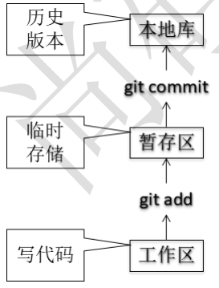

## 版本控制工具应该具备的功能
- 协同修改：多人并行不悖的修改服务器端的同一个文件。
- 数据备份：不仅保存目录和文件的当前状态，还能够保存每一个提交过的历史状态。
- 版本管理：在保存每一个版本的文件信息的时候要做到不保存重复数据，以节约存储空 间，提高运行效率。这方面 SVN 采用的是增量式管理的方式，而 Git 采取了文件系统快照的方式。
- 权限控制：对团队中参与开发的人员进行权限控制。  对团队外开发者贡献的代码进行审核——Git 独有。
- 历史记录：查看修改人、修改时间、修改内容、日志信息。  将本地文件恢复到某一个历史状态。
- 分支管理：允许开发团队在工作过程中多条生产线同时推进任务，进一步提高效率。

# 1. 版本控制简介
## 1.1 版本控制
工程设计领域中使用版本控制管理工程蓝图的设计过程。在 IT 开发过程中也可以使用版本控制思想管理代码的版本迭代。

## 1.2 版本控制工具
思想：版本控制
实现：版本控制工具
集中式版本控制工具： CVS、SVN、VSS……


分布式版本控制工具： Git、Mercurial、Bazaar、Darcs……


# 2. Git 简介
## 2.1 Git 简介


## 2.2 Git 官网和 Logo

 [官网地址](https://git-scm.com/)
 
## 2.3 Git 的优势
- 大部分操作在本地完成，不需要联网
- 完整性保证
- 尽可能添加数据而不是删除或修改数据
- 分支操作非常快捷流畅
- 与 Linux 命令全面兼容

## 2.4 Git 结构


## 2.5 Git 和代码托管中心
代码托管中心 的任务：维护远程库
- 局域网环境下：GitLab 服务器
- 外网环境下：GitHub、码云

## 2.6 本地库和远程库
团队内部协作


 跨团队协作


# 3. Git 命令行操作
## 3.1 本地库初始化
- 命令：`git init `
- 效果
  ```xml
  $ ll .git/
  total 16
  -rw-r--r-- 1 Jun 197609   21 Feb 10 22:51 COMMIT_EDITMSG
  -rw-r--r-- 1 Jun 197609   23 Feb 10 22:33 HEAD
  -rw-r--r-- 1 Jun 197609  174 Feb 10 22:41 config
  -rw-r--r-- 1 Jun 197609   73 Feb 10 22:33 description
  drwxr-xr-x 1 Jun 197609    0 Feb 10 22:33 hooks/
  -rw-r--r-- 1 Jun 197609 2267 Feb 10 22:51 index
  drwxr-xr-x 1 Jun 197609    0 Feb 10 22:33 info/
  drwxr-xr-x 1 Jun 197609    0 Feb 10 22:51 logs/
  drwxr-xr-x 1 Jun 197609    0 Feb 10 22:51 objects/
  drwxr-xr-x 1 Jun 197609    0 Feb 10 22:33 refs/
  
  ```
- 注意：.git 目录中存放的是本地库相关的子目录和文件，不要删除，也不要胡乱修改。

## 3.2 设置签名
- 形式：
  用户名：tom
  Email 地址：goodMorning@atguigu.com
- 作用：区分不同开发人员的身份
- 辨析：这里设置的签名和登录远程库(代码托管中心)的账号、密码没有任何关系。
- 命令
- 项目级别/仓库级别：仅在当前本地库范围内有效
    - `git config use.name 名称 `
    - `git config user.email 邮箱地址 `

  - 信息保存位置：`./.git/config` 文件

    ```xml
    $ cat ./.git/config
    [core]
            repositoryformatversion = 0
            filemode = false
            bare = false
            logallrefupdates = true
            symlinks = false
            ignorecase = true
    [user]
            name = Jun
            email = Ming0v0@163.com
    ```

 - 系统用户级别：登录当前操作系统的用户范围
     - `git config --global use.name 名称 `
     -` git config --global user.email 邮箱地址 `

  - 信息保存位置：`~/.gitconfig` 文件

- 级别优先级
  - 就近原则：项目级别优先于系统用户级别，二者都有时采用项目级别的签名
  - 如果只有系统用户级别的签名，就以系统用户级别的签名为准
  - 二者都没有不允许

## 3.3 基本操作
### 状态查看
- `git status`
	查看工作区、暂存区状态

### 添加
- `git add \[file name]`
	将工作区的“新建/修改”添加到暂存区

### 提交
- `git commit -m "commit message" \[file name]`
	将暂存区的内容提交到本地库

### 查看历史记录
- `git log`
```xml
commit f895261bc7ba08768b96bc4052ec7ada09fa6080 (HEAD -> master)
Author: Jun <Ming0v0@163.com>
Date:   Thu Feb 10 22:51:08 2022 +0800
```

多屏显示控制方式：
- 空格向下翻页
- b 键向上翻页
- q 键退出

`git log --pretty=oneline`

```xml
f895261bc7ba08768b96bc4052ec7ada09fa6080 (HEAD -> master) Time:2022-2-10 22:51
```

`git log --oneline`

```xml
f895261 (HEAD -> master) Time:2022-2-10 22:51
```

`git reflog`

```xml
f895261 (HEAD -> master) HEAD@{0}: commit (initial): Time:2022-2-10 22:51
```

HEAD@{移动到当前版本需要多少步}

###  前进后退
本质：
基于索引值操作\[推荐]
  - `git reset --hard [局部索引值]`
  - `git reset --hard a6ace91 `
- 使用^符号：只能后退
  - `git reset --hard HEAD^ `
  - 注：一个^表示后退一步，n 个表示后退 n 步
- 使用~符号：只能后退
  - `git reset --hard HEAD~n `
  - 注：表示后退 n

### reset 命令的三个参数对比
 --soft 参数
- 仅仅在本地库移动 HEAD 指针


--mixed 参数
- 在本地库移动 HEAD 指针
- 重置暂存区


--hard 参数
- 在本地库移动 HEAD 指针
- 重置暂存区
- 重置工作

### 删除文件并找回
- 前提：删除前，文件存在时的状态提交到了本地库。
- 操作：`git reset --hard [指针位置]`
    - 删除操作已经提交到本地库：指针位置指向历史记录
    - 删除操作尚未提交到本地库：指针位置使用 HEAD

### 比较文件差异
- `git diff [文件名]`
  - 将工作区中的文件和暂存区进行比较
- `git diff [本地库中历史版本] [文件名]`
    - 将工作区中的文件和本地库历史记录比较
    - 不带文件名比较多个文件

# 4. 分支管理
## 4.1 什么是分支？
在版本控制过程中，使用多条线同时推进多个任务。


## 4.2 分支的好处
- 同时并行推进多个功能开发，提高开发效率
- 各个分支在开发过程中，如果某一个分支开发失败，不会对其他分支有任何影响。失败的分支删除重新开始即可。

## 4.3 分支操作
- 创建分支：`git branch [分支名]`
- 查看分支：`git branch -v `
- 切换分支：`git checkout [分支名]`
- 合并分支
  - 第一步：切换到接受修改的分支（被合并，增加新内容）上：`git checkout [被合并分支名]`
  - 第二步：执行 merge 命令：`git merge [有新内容分支名]`

- 解决冲突：冲突的表现
  
- 冲突的解决
  - 第一步：编辑文件，删除特殊符号
  - 第二步：把文件修改到满意的程度，保存退出
  - 第三步：`git add [文件名]`
  - 第四步：`git commit -m "日志信息" `
    - 注意：此时 commit 一定不能带具体文件名

# 5. Git 基本原理
## 哈希

哈希是一个系列的加密算法，各个不同的哈希算法虽然加密强度不同，但是有以下几个共同点：
1. 不管输入数据的数据量有多大，输入同一个哈希算法，得到的加密结果长度固定。
2. 哈希算法确定，输入数据确定，输出数据能够保证不变
3. 哈希算法确定，输入数据有变化，输出数据一定有变化，而且通常变化很大
4. 哈希算法不可逆 Git 底层采用的是 SHA-1 算法。

哈希算法可以被用来验证文件。原理如下图所示：


# 6. Git 保存版本的机制
## 集中式版本控制工具的文件管理机制
以文件变更列表的方式存储信息。这类系统将它们保存的信息看作是一组基本文件和每个文件随时间逐步累积的差异。


## Git 的文件管理机制
Git 把数据看作是小型文件系统的一组快照。每次提交更新时 Git 都会对当前的全部文件制作一个快照并保存这个快照的索引。为了高效，如果文件没有修改，

Git 不再重新存储该文件，而是只保留一个链接指向之前存储的文件。所以 Git 的工作方式可以称之为快照流。


## Git 文件管理机制细节
- Git 的“提交对象”


- 提交对象及其父对象形成的链


## Git 分支管理机制
### 分支的创建


### 分支的切换


