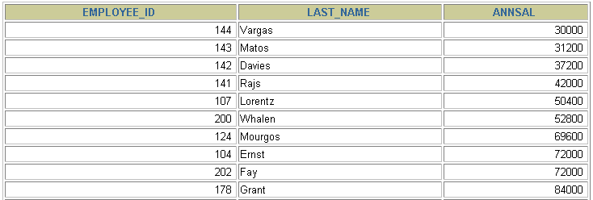

# 第05章 排序与分页

## 1. 排序数据

### 1.1 排序规则

- 使用 ORDER BY 子句排序
  - **ASC（ascend）: 升序**
  - **DESC（descend）:降序**
- **ORDER BY 子句在SELECT语句的结尾。**

### 1.2 单列排序

```mysql
SELECT   last_name, job_id, department_id, hire_date
FROM     employees
ORDER BY hire_date ;
```

 


```mysql
SELECT   last_name, job_id, department_id, hire_date
FROM     employees
ORDER BY hire_date DESC ;
```

 


```mysql
SELECT employee_id, last_name, salary*12 annsal
FROM   employees
ORDER BY annsal;
```

 


### 1.3 多列排序

```mysql
SELECT last_name, department_id, salary
FROM   employees
ORDER BY department_id, salary DESC;
```


- 可以使用不在SELECT列表中的列排序。
- 在对多列进行排序的时候，首先排序的第一列必须有相同的列值，才会对第二列进行排序。如果第一列数据中所有值都是唯一的，将不再对第二列进行排序。

## 2. 分页

### 2.1 背景

背景1：查询返回的记录太多了，查看起来很不方便，怎么样能够实现分页查询呢？

背景2：表里有 4 条数据，我们只想要显示第 2、3 条数据怎么办呢？

### 2.2 实现规则

- 分页原理

  所谓分页显示，就是将数据库中的结果集，一段一段显示出来需要的条件。

- **MySQL中使用 LIMIT 实现分页**

- 格式：

  ```mysql
  LIMIT [位置偏移量,] 行数
  ```

  第一个“位置偏移量”参数指示MySQL从哪一行开始显示，是一个可选参数，如果不指定“位置偏移量”，将会从表中的第一条记录开始（第一条记录的位置偏移量是0，第二条记录的位置偏移量是1，以此类推）；第二个参数“行数”指示返回的记录条数。

- 举例

```mysql
--前10条记录：
SELECT * FROM 表名 LIMIT 0,10;
或者
SELECT * FROM 表名 LIMIT 10;

--第11至20条记录：
SELECT * FROM 表名 LIMIT 10,10;

--第21至30条记录： 
SELECT * FROM 表名 LIMIT 20,10;
```

> MySQL 8.0中可以使用“LIMIT 3 OFFSET 4”，意思是获取从第5条记录开始后面的3条记录，和“LIMIT 4,3;”返回的结果相同。

- **分页显式公式**：`（当前页数-1）*每页条数，每页条数`

```mysql
SELECT * FROM table 
LIMIT(PageNo - 1)*PageSize,PageSize;
```

- **注意：LIMIT 子句必须放在整个SELECT语句的最后！**
- 使用 LIMIT 的好处

约束返回结果的数量可以`减少数据表的网络传输量`，也可以`提升查询效率`。如果我们知道返回结果只有 1 条，就可以使用`LIMIT 1`，告诉 SELECT 语句只需要返回一条记录即可。这样的好处就是 SELECT 不需要扫描完整的表，只需要检索到一条符合条件的记录即可返回。

### 2.3 拓展

在不同的 DBMS 中使用的关键字可能不同。在 MySQL、PostgreSQL、MariaDB 和 SQLite 中使用 LIMIT 关键字，而且需要放到 SELECT 语句的最后面。

- 如果是 SQL Server 和 Access，需要使用 `TOP` 关键字，比如：

```mysql
SELECT TOP 5 name, hp_max FROM heros ORDER BY hp_max DESC
```

- 如果是 DB2，使用`FETCH FIRST 5 ROWS ONLY`这样的关键字：


```mysql
SELECT name, hp_max FROM heros ORDER BY hp_max DESC FETCH FIRST 5 ROWS ONLY
```

- 如果是 Oracle，你需要基于 `ROWNUM` 来统计行数：


```mysql
SELECT rownum,last_name,salary FROM employees WHERE rownum < 5 ORDER BY salary DESC;
```

需要说明的是，这条语句是先取出来前 5 条数据行，然后再按照 hp_max 从高到低的顺序进行排序。但这样产生的结果和上述方法的并不一样。我会在后面讲到子查询，你可以使用

```mysql
SELECT rownum, last_name,salary
FROM (
    SELECT last_name,salary
    FROM employees
    ORDER BY salary DESC)
WHERE rownum < 10;
```

得到与上述方法一致的结果。


