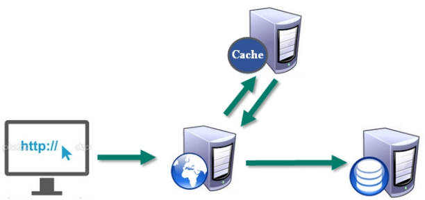

# Redis概述
- Redis是一个**开源**的**key-value**存储系统。
- 和Memcached类似，它支持存储的value类型相对更多，包括**string(字符串)、*ist(链表)、set(集合)、zset(sorted set --有序集合)和hash（哈希类型）。**
- 这些数据类型都支持push/pop、add/remove及取交集并集和差集及更丰富的操作，而且这些操作都是**原子性**的。
- 在此基础上，Redis支持各种不同方式的**排序**。
- 与memcached一样，为了保证效率，**数据都是缓存在内存中。**
- 区别的是Redis会**周期性**的把更新的**数据写入磁盘**或者把修改操作写入追加的记录文件。
- 并且在此基础上实现了**master-slave(主从)同步**。

## 应用场景
### 配合关系型数据库做高速缓存
- 高频次，热门访问的数据，降低数据库IO
- 分布式架构，做session共享

### 多样的数据结构存储持久化数据
![[attachment/Pasted image 20220614134222.png]]

## Redis介绍相关知识
- 默认16个数据库，类似数组下标从0开始，初始*默认使用0号库*
- 使用命令 `select  <dbid>`来切换数据库。如: `select 8`   
- 统一密码管理，所有库同样密码。  
- `dbsize`查看当前数据库的key的数量  
- `flushdb`清空当前库
- `flushall`通杀全部库  

**Redis是单线程+多路IO复用技术**

多路复用是指使用一个线程来检查多个文件描述符（Socket）的就绪状态，比如调用select和poll函数，传入多个文件描述符，如果有一个文件描述符就绪，则返回，否则阻塞直到超时。得到就绪状态后进行真正的操作可以在同一个线程里执行，也可以启动线程执行（比如使用线程池）

==串行  vs  多线程+锁（memcached） vs  单线程+多路IO复用(Redis)

（与Memcache三点不同: 支持多数据类型，支持持久化，单线程+多路IO复用） 

