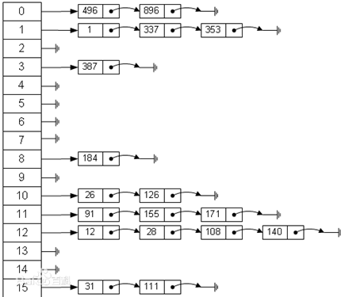

# 基本介绍

散列表（Hash table，也叫哈希表），是根据关键码值(Key value)而直接进行访问的数据结构。也就是说，它通过把关键码值映射到表中一个位置来访问记录，以加快查找的速度。这个映射函数叫做散列函数，存放记录的数组叫做散列表。



# 哈希表(散列)

看一个实际需求，google公司的一个上机题:

有一个公司,当有新的员工来报道时,要求将该员工的信息加入(id,性别,年龄,住址..),当输入该员工的id时,要求查找到该员工的 所有信息

要求: 不使用数据库,尽量节省内存,速度越快越好=>哈希表(散列)

```java
//创建HashTab 管理多条链表
class HashTap {
    private EmpLinkedList[] empLinkedListsArray;
    int size;//表示有多少条链表

    //构造器
    public HashTap(int size) {
        this.size = size;
        //初始化empLinkedListArray
        empLinkedListsArray = new EmpLinkedList[size];
        for (int i = 0; i < size; i++) {
            empLinkedListsArray[i] = new EmpLinkedList();
        }
    }

    //添加雇员
    public void add(Emp emp) {
        //根据员工的id，得到该员工应当添加到那条链表
        int eNO = hashFun(emp.id);
        //将emp添加到对应的链表中
        empLinkedListsArray[eNO].add(emp);
    }

    public void del(Emp emp) {
        //根据员工的id，得到该员工应当添加到那条链表
        int eNO = hashFun(emp.id);
        //将emp添加到对应的链表中
        empLinkedListsArray[eNO].delEmpById(emp.id);
    }

    //遍历所有链表,遍历hashtag
    public void list() {
        for (int i = 0; i < size; i++) {
            empLinkedListsArray[i].list(i);
        }
    }

    //根据输入的id，查找雇员
    public void findEmpById(int id) {
        //使用散列函数确定要那条链表查找
        int eNO = hashFun(id);
        Emp emp = empLinkedListsArray[eNO].findEmpById(id);
        if (emp != null) {
            System.out.printf("在第%d条链表中找到雇员id=%d\n", eNO, id);
        } else {
            System.out.println("在哈希表中，没有找到该雇员");
        }
    }

    //编写散列函数
    public int hashFun(int id) {
        return id % size;
    }
}
```

```java
class Emp {
    public int id;
    public String name;
    public Emp next;

    public Emp(int id, String name) {
        this.id = id;
        this.name = name;
    }
}
```

```java
//创建EmpLinkedList,表示链表
class EmpLinkedList {
    //头指针，指向第一个Emp，因此我们这个链表的head是指向第一个Emp
    private Emp head;//默认null

    /*添加雇员到链表
    说明
        1.假定，当添加雇员时，id是自增长，即id的分配总是从小到大
        因此我们将雇员直接添加到本链表的最后即可
     */
    public void add(Emp emp) {
        //如果添加第一个雇员
        if (head == null) {
            head = emp;
            return;
        }
        //如果不是第一个雇员，则使用一个辅助的指针，帮助定位到最后
        Emp curEmp = head;
        while (curEmp.next != null) {//说明没有到链表最后
            curEmp = curEmp.next;//后移
        }
        //退出时将链表emp加入链表
        curEmp.next = emp;
    }

    //遍历链表的雇员信息
    public void list(int no) {
        if (head == null) {//说明链表为空
            System.out.printf("第%d条链表为空\n", no + 1);
            return;
        }
        System.out.printf("第%d链表的信息为：\n", no + 1);
        Emp curEmp = head;//辅助指针
        while (curEmp != null) {
            System.out.printf("雇员的id：%d,姓名：%s\n", curEmp.id, curEmp.name);
            curEmp = curEmp.next;
        }
    }

    //根据id查找雇员
    //如果找到，就返回Emp，如果没有找到，就返回null
    public Emp findEmpById(int id) {
        //判断链表是否为空
        if (head == null) {
            System.out.println("链表为空");
            return null;
        }
        //辅助指针
        Emp curEmp = head;
        while (true) {
            if (curEmp.id == id) {//找到
                return curEmp;//这时curEmp就指向要查找的雇员
            }
            //退出
            if (curEmp.next == null) {//说明遍历当前链表没有找到该雇员
                curEmp = null;
                break;
            }
            curEmp = curEmp.next;//后移
        }
        return curEmp;
    }


    public boolean delEmpById(int id) {
        //判断链表是否为空
        if (head == null) {
            System.out.println("链表为空");
            return false;
        }
        if (head.id == id) {
            head = head.next;
            return true;
        }
        //辅助指针
        Emp curEmp = head.next;
        while (curEmp != null) {
            if (curEmp.next.id == id) {
                curEmp.next = curEmp.next.next;
                return true;
            }
            curEmp = curEmp.next;
        }
        return false;
    }
}
```

