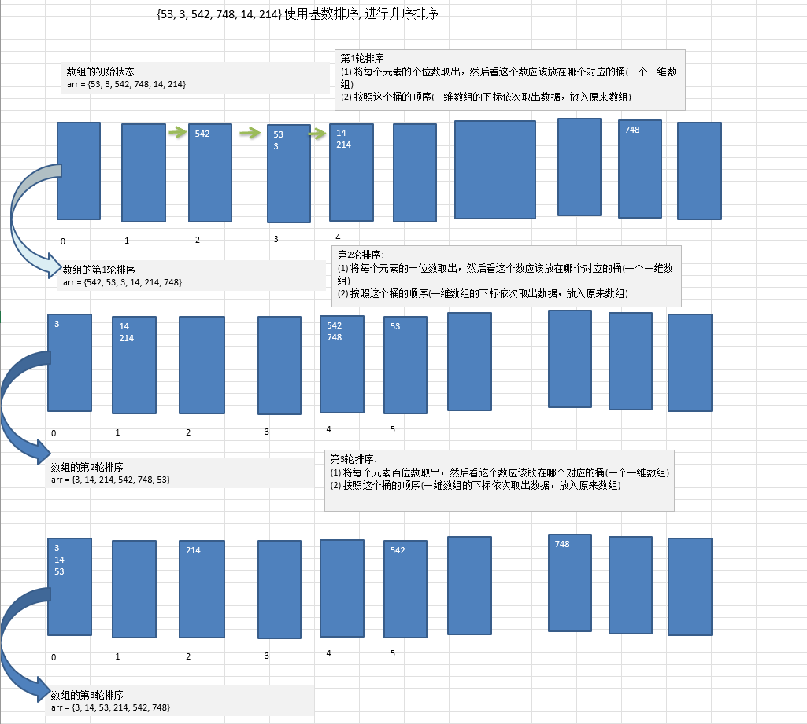

# 基数排序(桶排序)介绍:

-   基数排序（radix sort）属于“分配式排序”（distribution sort），又称“桶子法”（bucket sort）或bin sort，顾名思义，它是通过键值的各个位的值，将要排序的元素分配至某些“桶”中，达到排序的作用
-   基数排序法是属于稳定性的排序，基数排序法的是效率高的稳定性排序法
-   基数排序(Radix Sort)是桶排序的扩展
-   基数排序是1887年赫尔曼·何乐礼发明的。它是这样实现的：将整数按位数切割成不同的数字，然后按每个位数分别比较。


<br/>

# 基数排序基本思想

将所有待比较数值统一为同样的数位长度，数位较短的数前面补零。然后，从最低位开始，依次进行一次排序。这样从最低位排序一直到最高位排序完成以后, 数列就变成一个有序序列。



```java
public class RadixSort {
    public static void main(String[] args) {
        int[] arr = {53, 3, 748, 14, 214};
        radixSort(arr);

        System.out.println(Arrays.toString(arr));
    }

    public static void radixSort(int[] arr) {
        // 根据前面的推导过程，我们可以得到最终的基数排序代码
        // 1.得到数组中最大的数的位数
        int max = arr[0];// 假设第一元素就是最大数
        for (int i = 0; i < arr.length; i++) {
            if (max < arr[i]) {
                max = arr[i];
            }
        }
        // 得到最大数是几位数
        int maxLength = (max + "").length();
		
        // 创建十个桶，长度由数组的长度决定
        int[][] bucket = new int[10][arr.length];
		
        // 数组的下标用于表示每个桶当前存在有多个元素
        int[] bucketElementCounts = new int[10];

        for (int i = 0, n = 1; i < maxLength; i++, n *= 10) {
            for (int j = 0; j < arr.length; j++) {
                // 针对每个元素的对应位进行排序处理，第一次是个位，第二次是十位，第三次是百位....
                int digitOfElement = arr[j] / n % 10;
                // 放入到对应的桶中
                bucket[digitOfElement][bucketElementCounts[digitOfElement]] = arr[j];
                bucketElementCounts[digitOfElement]++;
            }
            // 按照这个桶的顺序（一维数组的下标依次取出数据，放入原来数组）
            int index = 0;
            // 遍历每一个桶，并将桶中的数据，放入到原数值
            for (int k = 0; k < bucket.length; k++) {
                // 如果桶中有数据，我们才放入到元数组
                if (bucketElementCounts[k] != 0) {
                    // 循环该桶即第k个桶（即第k个一维数组），放入
                    for (int l = 0; l < bucketElementCounts[k]; l++) {
                        // 取出元素放入到arr
                        arr[index++] = bucket[k][l];
                    }
                }
                bucketElementCounts[k] = 0;
            }
        }
    }
```

<br/>

# 基数排序的说明:

- 基数排序是对传统桶排序的扩展，速度很快.
- 基数排序是经典的空间换时间的方式，占用内存很大, 当对海量数据排序时，容易造成 OutOfMemoryError
- 基数排序时稳定的。[注:假定在待排序的记录序列中，存在多个具有相同的关键字的记录，若经过排序，这些记录的相对次序保持不变，即在原序列中，r[i]=r[j]，且r[i]在r[j]之前，而在排序后的序列中，r[i]仍在r[j]之前，则称这种排序算法是稳定的；否则称为不稳定的]
