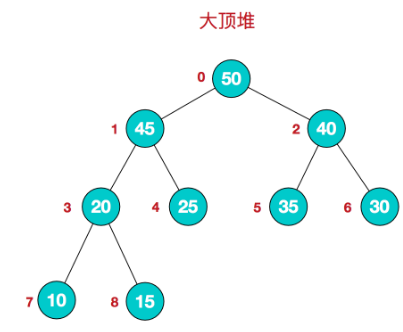
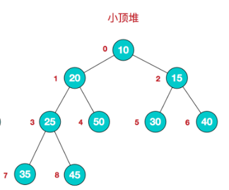
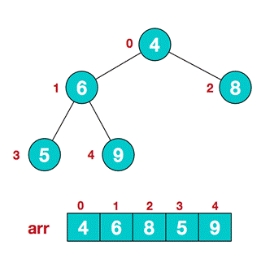
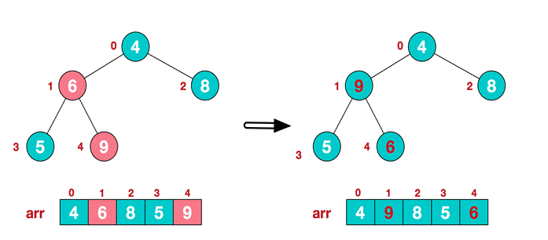
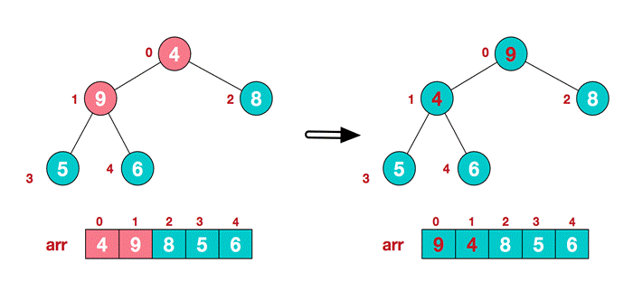
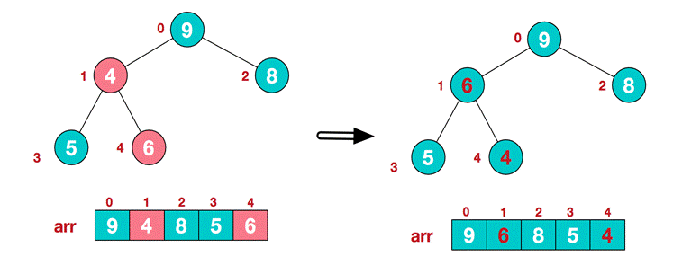
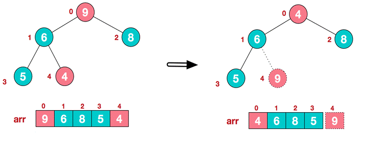
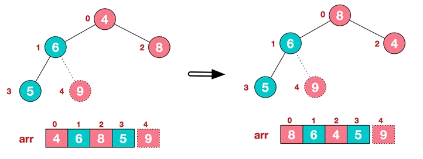
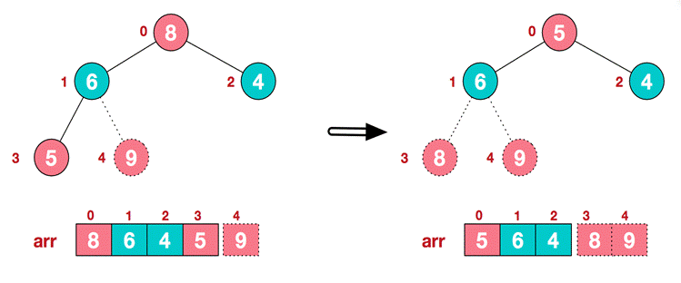
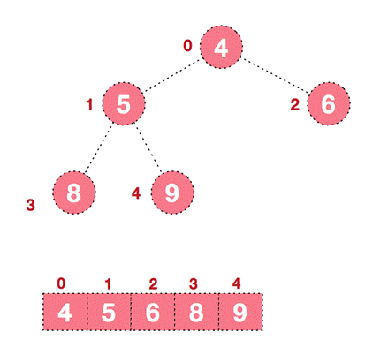

# 基本介绍

堆排序是利用**堆**这种数据结构而设计的一种排序算法，堆排序是一种**选择排序，它的最坏，最好，平均时间复杂度均为O(nlogn)，它也是不稳定排序。

堆是具有以下性质的完全二叉树：每个结点的值都大于或等于其左右孩子结点的值，称为大顶堆

>**注意**：没有要求结点的左孩子的值和右孩子的值的大小关系

每个结点的值都小于或等于其左右孩子结点的值，称为小顶堆

**大顶堆举例说明**



我们对堆中的结点按层进行编号，映射到数组中就是下面这个样子: 


```txt
大顶堆特点：array[i] >= array[2*i+1] && array[i] >= array[2*i+2]
```

**i 对应第几个节点，i从0开始编号**，即结点大于它的左节点和右节点的值

**小顶堆举例说明**



```txt
小顶堆特点：array[i] <= array[2*i+1] && array[i] >= array[2*i+2] 
```

**i 对应第几个节点，i从0开始编号**，即结点小于它的左节点和右节点的值

一般**升序采用大顶堆**，**降序采用小顶堆** 


# 基本思想

堆排序的基本思想是

- 将待排序序列构造成一个大顶堆

- 此时，整个序列的最大值就是堆顶的根节点

- 将其与末尾元素进行交换，此时末尾就为最大值

- 然后将剩余`n-1`个元素重新构造成一个堆，这样会得到n个元素的次小值。如此反复执行，便能得到一个有序序列了

可以看到在构建大顶堆的过程中，元素的个数逐渐减少，最后就得到一个有序序列了.


## 步骤图解说明

要求：给你一个数组 {4,6,8,5,9} , 要求使用堆排序法，将数组升序排序。

**步骤一 构造初始堆。将给定无序序列构造成一个大顶堆（一般升序采用大顶堆，降序采用小顶堆)。**

假设给定无序序列结构如下




此时我们从最后一个非叶子结点开始（叶结点自然不用调整，第一个非叶子结点 `array.length/2-1`，也就是下面的6结点），从左至右，从下至上进行调整。




找到第二个非叶节点4，由于`[4,9,8]`中9元素最大，4和9交换。



这时，交换导致了子根`[4,5,6]`结构混乱，继续调整，`[4,5,6]`中6最大，交换4和6。



此时，我们就将一个无序序列构造成了一个大顶堆。

**步骤二 将堆顶元素与末尾元素进行交换，使末尾元素最大。然后继续调整堆，再将堆顶元素与末尾元素交换，得到第二大元素。如此反复进行交换、重建、交换。**

将堆顶元素9和末尾元素4进行交换



重新调整结构，使其继续满足堆定义



再将堆顶元素8与末尾元素5进行交换，得到第二大元素8



后续过程，继续进行调整，交换，如此反复进行，最终使得整个序列有序



**再简单总结下堆排序的基本思路**

- **将无序序列构建成一个堆，根据升序降序需求选择大顶堆或小顶堆**

- **将堆顶元素与末尾元素交换，将最大元素"沉"到数组末端**

- **重新调整结构，使其满足堆定义，然后继续交换堆顶元素与当前末尾元素，反复执行调整+交换步骤，直到整个序列有序**


# 代码实现

```java
package sort;

import java.util.Arrays;


public class HeapSort {

    // 编写 一个堆排序的方法
    public static void main(String[] args) {
        int[] arr = {4, 6, 8, 5, 9};
        heapSort(arr);
        System.out.println(Arrays.toString(arr));
    }

    // 编写一个堆排序的方法
    public static void heapSort(int[] arr) {
        int temp = 0;
        System.out.println("堆排序！");
        // 1. 将无序序列建成一个堆，根据升序降序需求选择大顶堆或小顶堆
        for (int i = arr.length / 2 - 1; i >= 0; i--) {
            adjustHeap(arr, i, arr.length);
        }
        // 2. 将堆顶元素与末尾元素，将最大元素“沉”到数组末端
        // 3. 重新调整结构，使其满足堆定义，然后继续交换堆顶元素与当前末尾元素，反复执行调整+交换步骤直到整个序列有序。
        for (int j = arr.length - 1; j > 0; j--) {
            // 交换
            temp = arr[j];
            arr[j] = arr[0];
            arr[0] = temp;
            System.out.println(Arrays.toString(arr));
            adjustHeap(arr, 0, j);
        }
    }

    // 将一个数组(二叉树)，调整成一个大顶堆

    /**
     * 功能：完成 将以 i 对应的非叶子结点的树调整成大顶堆
     * 举例 int[] arr={4,6,8,5,9};=> i = 1; => adjustHeap =>得到{4,9,8,5,6}
     * 如果我们再次调正 adjustHeap 传入的是 i = 0 => 得到{4,9,8,5,6} =>{9,6,8,5,4}
     *
     * @param arr    待调整的数组
     * @param i      表示非叶子结点在数组中的索引
     * @param length 表示要对多少个元素进行调整，length 是在逐渐的减少
     */
    public static void adjustHeap(int[] arr, int i, int length) {
        int temp = arr[i]; //先取出当前元素的值，保存在临时变量
        // 开始调整
        // 说明
        //  1. k = i * 2 + 1; k是i结点的左子结点
        for (int k = i * 2 + 1; k < length; k = k * 2 + 1) {
            if (k + 1 < length && arr[k] < arr[k + 1]) { // 说明左子节点的值小于右子节点的值
                k++;// k 指向右子节点
            }
            if (arr[k] > temp) { //如果子结点大于父结点
                arr[i] = arr[k]; // 把较大的值赋给当前结点
                i = k;  // i 指向k，继续循环比较
            } else {
                break;
            }
        }
        // 当for 循环结束后,我们已经将以 i 为父结点的树的最大值，放在了 最顶 (局部)
        arr[i] = temp; // 将temp值放到调整后的位置
    }
}
```
