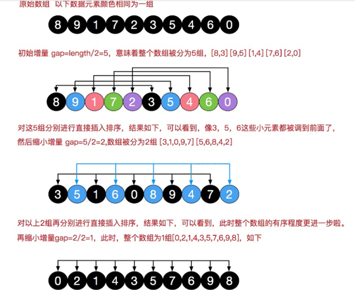
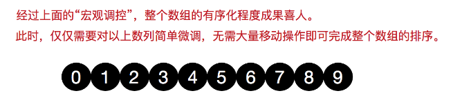

# 希尔排序法介绍
希尔排序是希尔（Donald Shell）于1959年提出的一种排序算法。希尔排序也是一种插入排序，它是简单插入排序经过改进之后的一个更高效的版本，也称为缩小增量排序。

# 希尔排序法基本思想
希尔排序是把**记录按下标的一定增量分组，对每组使用直接插入排序算法排序**；随着增量逐渐减少，每组包含的关键词越来越多，当增量减至1时，整个文件恰被分成一组，算法便终止


# 希尔排序法的示意图





```java
   	/**
     * 希尔排序：交换法
     */
    public static void shellSort(int[] arr) {
        int temp = 0;
        //int count = 0;
        for (int gap = arr.length / 2; gap > 0; gap /= 2) {
            for (int i = gap; i < arr.length; i++) {
                for (int j = i - gap; j >= 0; j -= gap) {
                    if (arr[j] > arr[j + gap]) {
                        temp = arr[j];
                        arr[j] = arr[j + gap];
                        arr[j + gap] = temp;

                    }
                }
            }
        }
    }
```

```java
	/**
     * 希尔排序：移动法
     *
     */
    public static void shellSort2(int[] arr) {
        //增量gap，并逐步的缩小增量
        for (int gap = arr.length / 2; gap > 0; gap /= 2) {
            //从gap个元素，逐个对其所在的组进行直接插入排序
            for (int i = gap; i < arr.length; i++) {
                int j = i;
                int temp = arr[j];
                if (arr[j] < arr[j - gap]) {
                    while (j - gap >= 0 && temp < arr[j - gap]) {
                        //后移
                        arr[j] = arr[j - gap];
                        j -= gap;
                    }
                    //当退出while后
                    arr[j] = temp;
                }
            }
        }
    }
```

