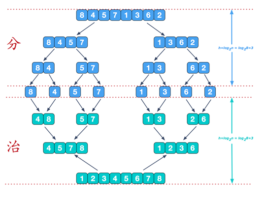
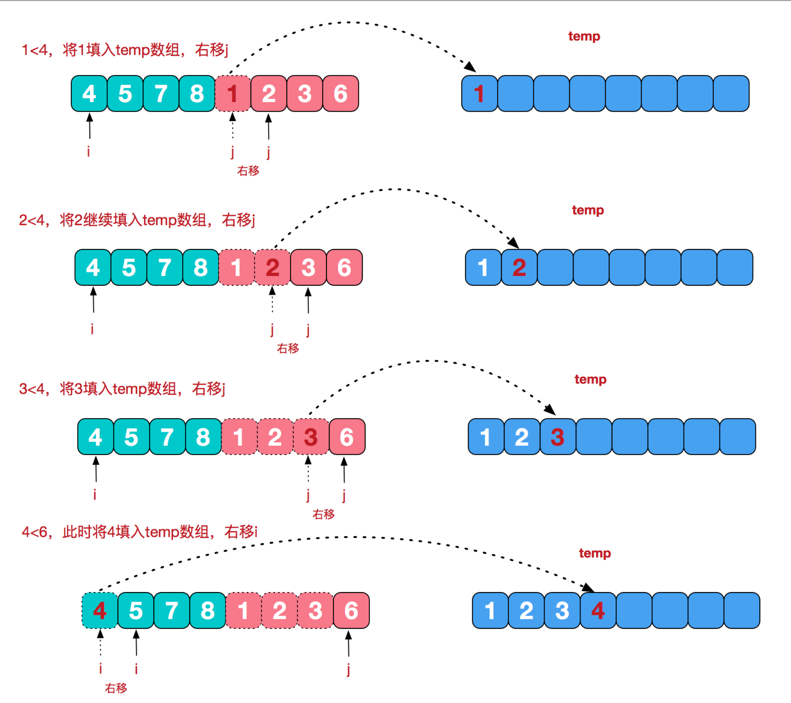
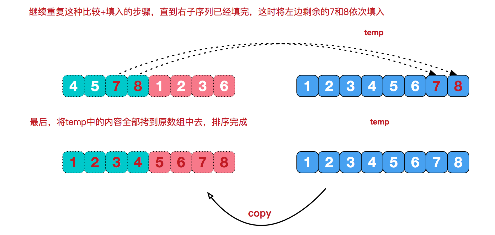

# 归并排序介绍:

归并排序（MERGE-SORT）是利用归并的思想实现的排序方法，该算法采用经典的分治（divide-and-conquer）策略（分治法将问题分(divide)成一些小的问题然后递归求解，而治(conquer)的阶段则将分的阶段得到的各答案"修补"在一起，即分而治之)。

<br/>

# 归并排序思想示意图1-基本思想:

将整个待排序序列划分成多个不可再分的子序列，每个子序列中仅有 1 个元素

   <br/>

# 归并排序思想示意图2-合并相邻有序子序列:
再来看看治阶段，我们需要将两个已经有序的子序列合并成一个有序序列，比如上图中的最后一次合并，要将[4,5,7,8]和[1,2,3,6]两个已经有序的子序列，合并为最终序列[1,2,3,4,5,6,7,8]，来看下实现步骤

所有的子序列进行两两合并，合并过程中完成排序操作，最终合并得到的新序列就是有序序列。


```java
public class MergeSort {

    public static void main(String[] args) {
        int[] arr = {8, 4, 5, 7, 1, 3, 6, 2};
        int[] temp = new int[arr.length];
        mergeSort(arr, 0, arr.length - 1, temp);

        System.out.println("归并排序后=" + Arrays.toString(arr));
    }

    /**
     * 分＋合方法
     */
    public static void mergeSort(int[] arr, int left, int right, int[] temp) {
        if (left < right) {
            int mid = (left + right) / 2;//中间索引
            // 向左递归进行分解
            mergeSort(arr, left, mid, temp);
            // 向右递归进行分解
            mergeSort(arr, mid + 1, right, temp);// 为什么要加1，因为假如有十个数，mid等于4，4是左边数组的最后一个元素，加一才是右边数组的第一个元素
            // 合并
            merge(arr, left, mid, right, temp);
        }
    }


    /**
     *  合并方法
     * @param arr   排序的原始数组
     * @param left  左边有序序列的初始索引
     * @param mid   中间索引
     * @param right 右边索引
     * @param temp  做中转的数组
     */
    public static void merge(int[] arr, int left, int mid, int right, int[] temp) {
        int i = left;       // 初始化i，左边有序序列的初始索引
        int j = mid + 1;    // 初始化j，右边有序序列的初始索引
        int t = 0;          // 指向temp数组的当前索引

        
        // 1.先把左右两边（有序）的数据按照规则填充到temp数组，直到左右两边的有序序列，有一边处理完毕为止
        while (i <= mid && j <= right) {//继续
            // 如果左边的有序序列的当前元素，小于等于右边有序的当前元素
            // 即将左边的当前元素，填充到temp数组
            // 然后t++，i++
            if (arr[i] <= arr[j]) {
                temp[t] = arr[i];
                t += 1;
                i += 1;
            } else {// 反之，将右边有序序列的当前元素，填充到temp数组
                temp[t] = arr[j];
                t += 1;
                j += 1;
            }
        }
        
        // 2.把有剩余的数据依次全部填充到temp
        while (i <= mid) {// 左边的有序序列还有剩余的元素，就全部填充到temp
            temp[t] = arr[i];
            t += 1;
            i += 1;
        }
        while (j <= right) {// 右边的有序序列还有剩余的元素，就全部填充到temp
            temp[t] = arr[j];
            t += 1;
            j += 1;
        }
        
        // 3.把temp数组的元素拷贝到arr，注意，并不是每次都拷贝所有
        t = 0;
        int tempLeft = left;
        while (tempLeft <= right) {
            arr[tempLeft] = temp[t];
            t += 1;
            tempLeft += 1;
        }
    }
}
```

