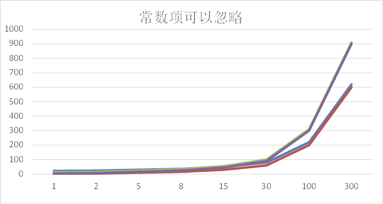
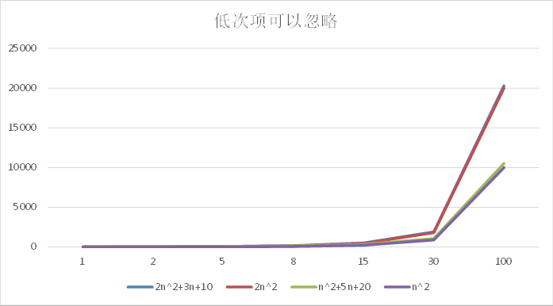
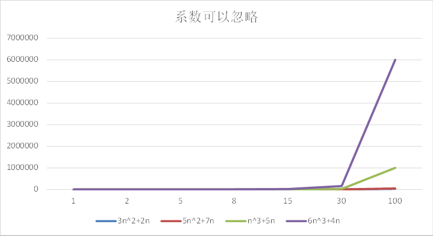
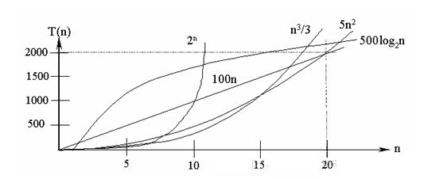
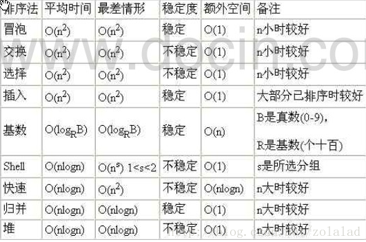

# 算法的时间复杂度

  度量一个程序(算法)执行时间的两种方法

1. 事后统计的方法
             这种方法可行,     但是有两个问题：一是要想对设计的算法的运行性能进行评测，需要实际运行该程序；二是所得时间的统计量依赖于计算机的硬件、软件等环境因素, 这种方式，**要在同一台计算机的相同状态下运行，才能比较那个算法速度更快。**
2. 事前估算的方法
             通过分析某个算法的时间复杂度来判断哪个算法更优.

## 时间频度

  基本介绍

  时间频度：一个算法花费的时间与算法中语句的执行次数成正比例，哪个算法中语句执行次数多，它花费时间就多。**一个算法中的语句执行次数称为语句频度或时间频度。**记为T(n)。

### 举例说明-基本案例

```java
int total=0;
int end=100;
// 使用for循环计算
for(int i=1;i<=end;i++){
    tatal+=i;
}
// 时间频度为 T(n)=n+1;

//直接计算
tatal=(1+end)*end/2
// 时间频度为 T(n)=1
```


### 举例说明-忽略常数项

|      | T(n)=2n+20 | T(n)=2*n | T(3n+10) | T(3n) |
| ---- | ---------- | -------- | -------- | ----- |
| 1    | 22         | 2        | 13       | 3     |
| 2    | 24         | 4        | 16       | 6     |
| 5    | 30         | 10       | 25       | 15    |
| 8    | 36         | 16       | 34       | 24    |
| 15   | 50         | 30       | 55       | 45    |
| 30   | 80         | 60       | 100      | 90    |
| 100  | 220        | 200      | 310      | 300   |
| 300  | 620        | 600      | 910      | 900   |



结论: 

1. 2n+20 和 2n 随着n 变大，执行曲线无限接近,     20可以忽略
2. 3n+10 和 3n 随着n 变大，执行曲线无限接近,     10可以忽略


### 举例说明-忽略低次项

|      | T(n)=2n^2+3n+10 | T(2n^2) | T(n^2+5n+20) | T(n^2) |
| ---- | --------------- | ------- | ------------ | ------ |
| 1    | 15              | 2       | 26           | 1      |
| 2    | 24              | 8       | 34           | 4      |
| 5    | 75              | 50      | 70           | 25     |
| 8    | 162             | 128     | 124          | 64     |
| 15   | 505             | 450     | 320          | 225    |
| 30   | 1900            | 1800    | 1070         | 900    |
| 100  | 20310           | 20000   | 10520        | 10000  |



 结论:

1. 2n^2+3n+10 和 2n^2 随着n 变大,     执行曲线无限接近, 可以忽略 3n+10
2. n^2+5n+20 和 n^2 随着n 变大,执行曲线无限接近,     可以忽略 5n+20


### 举例说明-忽略系数

|      | T(3n^2+2n) | T(5n^2+7n) | T(n^3+5n) | T(6n^3+4n) |
| ---- | ---------- | ---------- | --------- | ---------- |
| 1    | 5          | 12         | 6         | 10         |
| 2    | 16         | 34         | 18        | 56         |
| 5    | 85         | 160        | 150       | 770        |
| 8    | 208        | 376        | 552       | 3104       |
| 15   | 705        | 1230       | 3450      | 20310      |
| 30   | 2760       | 4710       | 27150     | 162120     |
| 100  | 30200      | 50700      | 1000500   | 6000400    |



结论: 

1. 随着n值变大，5n^2+7n 和 3n^2 + 2n     ，执行曲线重合, 说明 这种情况下, 5和3可以忽略。
2. 而n^3+5n 和 6n^3+4n ，执行曲线分离，说明多少次方式关键

<br/>

# 时间复杂度

 

  一般情况下，算法中的基本操作语句的**重复执行次数是问题规模n的某个函数**，用T(n)表示，若有某个辅助函数f(n)，使得当n趋近于无穷大时，T(n) / f(n) 的极限值为不等于零的常数，则称f(n)是T(n)的同数量级函数。记作 T(n)=Ｏ( f(n) )，称Ｏ( f(n) ) 为算法的渐进时间复杂度，简称时间复杂度。

 

  T(n) 不同，但时间复杂度可能相同。 如：T(n)=n²+7n+6 与 T(n)=3n²+2n+2 它们的T(n) 不同，但时间复杂度相同，都为O(n²)。

  计算时间复杂度的方法：

- 用**常数1代替**运行时间中的所有**加法常数** T(n)=n²+7n+6 => T(n)=n²+7n+1
- 修改后的运行次数函数中，只**保留最高阶项** T(n)=n²+7n+1 => T(n) =     n²
- **去除最高阶项的系数** T(n) = n² => T(n) = n² =>     O(n²)

 

## 常见的时间复杂度

- 常数阶O(1)
- 对数阶O(log2n)
- 线性阶O(n)
- 线性对数阶O(nlog2n)
- 平方阶O(n^2)
- 立方阶O(n^3)
- k次方阶O(n^k)
- 指数阶O(2^n)

 

  说明：

  常见的算法时间复杂度由小到大依次为：**Ο(1)＜Ο(log2n)＜Ο(n)＜Ο(nlog2n)＜Ο(n2)＜Ο(n3)＜ Ο(n^k) ＜Ο(2n)** ，随着问题规模n的不断增大，上述时间复杂度不断增大，算法的执行效率越低

  从图中可见，我们应该尽可能避免使用指数阶的算法

### 常数阶O(1)

  无论代码执行了多少行，只要是**没有循环等复杂结构**，那这个代码的时间复杂度就都是O(1)

```java
int i = 1;
int j = 2;
++i;
j++;
int m = i + j;
```

上述代码在执行的时候，它消耗的时候并**不随着某个变量的增长而增长**，那么无论这类代码有多长，即使有几万几十万行，都可以用O(1)来表示它的时间复杂度。


### 对数阶O(log2n)

```java
int i = 1;
while(i<n){
    i = i * 2; 
}
```

 说明：在while循环里面，每次都将 i 乘以 2，乘完之后，i 距离 n 就越来越近了。假设循环x次之后，i 就大于 2 了，此时这个循环就退出了，也就是说 2 的 x 次方等于 n，那么 x = log2n也就是说当循环 log2n 次以后，这个代码就结束了。因此这个代码的时间复杂度为：O(log2n) 。 O(log2n) 的这个2 时间上是根据代码变化的，i = i * 3 ，则是 O(log3n) .


### 线性阶O(n)

```java
for(int i = 1; i<=n; i++){
    j = i;
    j++;
}
```

说明：这段代码，for循环里面的代码会执行n遍，因此它消耗的时间是随着n的变化而变化的，因此这类代码都可以用O(n)来表示它的时间复杂度


### 线性对数阶O(nlogN)

```java
for(int i = 1; i<=n; i++){
  	int j = 1;
    while(j<n){
        j = j * 2;
    }
}
```

说明：线性对数阶O(nlogN) 其实非常容易理解，将时间复杂度为O(logN)的代码循环N遍的话，那么它的时间复杂度就是 n * O(logN)，也就是了O(nlogN)

 

### 平方阶O(n²)

```java
for(x = 1;i <= n;x++){
    for(i = 1;j <= n;i++){
        j=i;
        j++;
    }
}
```

 说明：平方阶O(n²) 就更容易理解了，如果把 O(n) 的代码再嵌套循环一遍，它的时间复杂度就是 O(n²)，这段代码其实就是嵌套了2层n循环，它的时间复杂度就是 O(n\*n)，即 O(n²) 如果将其中一层循环的n改成m，那它的时间复杂度就变成了 O(m*n)


### 立方阶O(n³)、K次方阶O(n^k)

  说明：参考上面的O(n²) 去理解就好了，O(n³)相当于三层n循环，其它的类似


# 平均时间复杂度和最坏时间复杂度

平均时间复杂度是指所有可能的输入实例均以等概率出现的情况下，该算法的运行时间。

最坏情况下的时间复杂度称最坏时间复杂度。一般讨论的时间复杂度均是最坏情况下的时间复杂度。 这样做的原因是：最坏情况下的时间复杂度是算法在任何输入实例上运行时间的界限，这就保证了算法的运行时间不会比最坏情况更长。

平均时间复杂度和最坏时间复杂度是否一致，和算法有关(如图:)。

