   

# 应用场景-字符串匹配问题
字符串匹配问题：：
1. 有一个字符串 str1= ""硅硅谷 尚硅谷你尚硅 尚硅谷你尚硅谷你尚硅你好""，和一个子串 str2="尚硅谷你尚硅你"
2. 现在要判断 str1 是否含有 str2, 如果存在，就返回第一次出现的位置, 如果没有，则返回-1

   

# 暴力匹配算法
如果用暴力匹配的思路，并假设现在str1匹配到 i 位置，子串str2匹配到 j 位置，则有:
1. 如果当前字符匹配成功（即str1\[i\] == str2\[j\]），则i++，j++，继续匹配下一个字符
2. 如果失配（即str1\[i\]! = str2\[j\]），令i = i - (j - 1)，j = 0。相当于每次匹配失败时，i 回溯，j 被置为0。
3. 用暴力方法解决的话就会有大量的回溯，每次只移动一位，若是不匹配，移动到下一位接着判断，浪费了大量的时间。(不可行!)
4. 暴力匹配算法实现.

```java
// 暴力匹配的代码:
package kmp;

public class ViolenceMatch {

	public static void main(String[] args) {
		String str1 = "硅硅谷 尚硅谷你尚硅 尚硅谷你尚硅谷你尚硅你好";
		String str2 = "尚硅谷你尚硅你";
		System.out.println(violentMatch(str1, str2));
	}
	
	public static boolean violentMatch(String originStr, String subString)  {  
		char[] s= originStr.toCharArray();
		char[] p = subString.toCharArray();
	    int sLen = s.length;  
	    int pLen = p.length;  
	  
	    int i = 0;  
	    int j = 0;  
	    while (i < sLen && j < pLen)  
	    {  
	        if (s[i] == p[j])  
	        {  
	            // ①如果当前字符匹配成功（即s[i] == p[j]），则i++，j++      
	            i++;  
	            j++;  
	        }  
	        else  
	        {  
	            // ②如果失配（即s[i]! = p[j]），令i = i - (j - 1)，j = 0      
	            i = i - j + 1;  
	            j = 0;  
	        }  
	    }  
	    // 匹配成功，返回 true 否则返回false // 位置应该是  i - j  
	    if (j == pLen)  {
	    	System.out.println(i -j);
	    	return true; 
	    }
	    else  
	        return false;  
	}  
}
```


# KMP算法介绍

1. KMP是一个解决模式串在文本串是否出现过，如果出现过，最早出现的位置的经典算法

2. Knuth-Morris-Pratt **字符串查找算法**，简称为 “KMP算法”，常用于在一个文本串S内查找一个模式串P 的出现位置，这个算法由Donald Knuth、Vaughan Pratt、James H. Morris三人于1977年联合发表，故取这3人的姓氏命名此算法.

3. KMP方法算法就利用之前判断过信息，通过一个next数组，保存模式串中**前后最长公共子序列**的长度，每次回溯时，通过next数组找到，前面匹配过的位置，省去了大量的计算时间

4. 参考资料：https://www.cnblogs.com/ZuoAndFutureGirl/p/9028287.html 


## KMP算法最佳应用-字符串匹配问题

字符串匹配问题：：

1. 有一个字符串 str1= "BBC ABCDAB ABCDABCDABDE"，和一个子串 str2="ABCDABD"
2. **现在要判断** **str1** **是否含有** **str2**, 如果存在，就返回第一次出现的位置, 如果没有，则返回-1
3. 要求：使用KMP算法完成判断，不能使用简单的暴力匹配算法.

<br />

## KMP算法思路分析

1. 首先，用Str1的第一个字符和Str2的第一个字符去比较，不符合，关键词向后移动一位	
	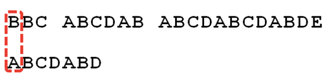

2. 重复第一步，还是不符合，再后移 
	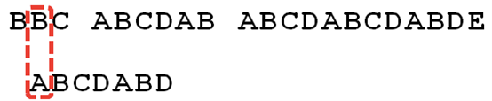

3. 一直重复，直到Str1有一个字符与Str2的第一个字符符合为止 
	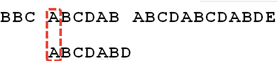

4.  接着比较字符串和搜索词的下一个字符，还是符合。 

	 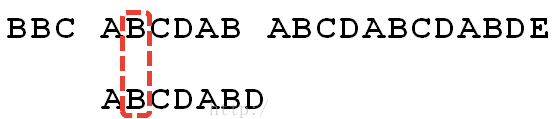

5. 遇到Str1有一个字符与Str2对应的字符不符合。
	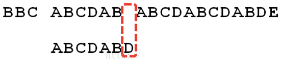

6. 这时候，想到的是继续遍历Str1的下一个字符，重复第1步。(其实是很不明智的，因为此时BCD已经比较过了，没有必要再做重复的工作，一个基本事实是，当空格与D不匹配时，你其实知道前面六个字符是”ABCDAB”。KMP 算法的想法是，设法利用这个已知信息，**不要把”搜索位置”移回已经比较过的位置，继续把它向后移**，这样就提高了效率。) 

   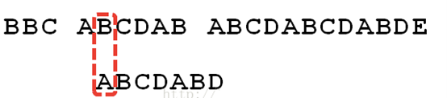

7. 怎么做到把刚刚重复的步骤省略掉？可以对Str2计算出一张《部分匹配表》，这张表的产生在后面介绍 

   

8. 已知空格与D不匹配时，前面六个字符”ABCDAB”是匹配的。查表可知，最后一个匹配字符B对应的”部分匹配值”为2，因此按照下面的公式算出向后移动的位数： 

   ```移动位数 = 已匹配的字符数 - 对应的部分匹配值 ```

   因为 6 - 2 等于4，所以将搜索词向后移动 4 位。 

   

9. 因为空格与Ｃ不匹配，搜索词还要继续往后移。这时，已匹配的字符数为2（”AB”），对应的”部分匹配值”为0。所以，移动位数 = 2 - 0，结果为 2，于是将搜索词向后移 2 位。

   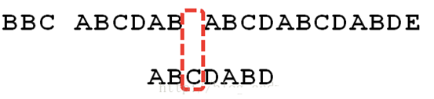

10. 因为空格与A不匹配，继续后移一位W。 

    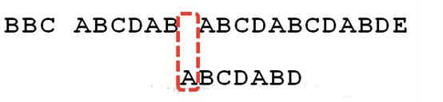

11. 逐位比较，直到发现C与D不匹配。于是，移动位数 = 6 - 2，继续将搜索词向后移动 4 位。

    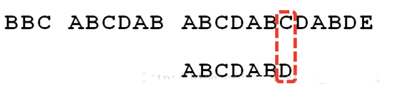

12. 逐位比较，直到搜索词的最后一位，发现完全匹配，于是搜索完成。如果还要继续搜索（即找出全部匹配），移动位数 = 7 - 0，再将搜索词向后移动 7 位，这里就不再重复了。

    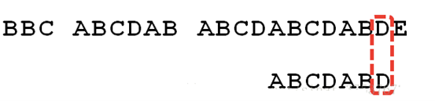

13. ## 介绍《部分匹配表》怎么产生的 

    先介绍前缀，后缀是什么 

    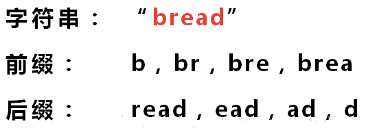

    **“部分匹配值”就是”前缀”和”后缀”的最长的共有元素的长度。**以”ABCDABD”为例， 

    - ”A”的前缀和后缀都为空集，共有元素的长度为0； 

    - ”AB”的前缀为[A]，后缀为[B]，共有元素的长度为0； 

    - ”ABC”的前缀为[A, AB]，后缀为[BC, C]，共有元素的长度0； 

    - ”ABCD”的前缀为[A, AB, ABC]，后缀为[BCD, CD, D]，共有元素的长度为0； 

    - ”ABCDA”的前缀为[A, AB, ABC, ABCD]，后缀为[BCDA, CDA, DA, A]，共有元素为”A”，长度为1； 

    - ”ABCDAB”的前缀为[A, AB, ABC, ABCD, ABCDA]，后缀为[BCDAB, CDAB, DAB, AB, B]，共有元素为”AB”，长度为2； 

    - ”ABCDABD”的前缀为[A, AB, ABC, ABCD, ABCDA, ABCDAB]，后缀为[BCDABD, CDABD, DABD, ABD, BD, D]，共有元素的长度为0。

14. ”部分匹配”的实质是，有时候，字符串头部和尾部会有重复。比如，”ABCDAB”之中有两个”AB”，那么它的”部分匹配值”就是2（”AB”的长度）。搜索词移动的时候，第一个”AB”向后移动 4 位（字符串长度-部分匹配值），就可以来到第二个”AB”的位置。

    


# 代码实现

```java
package kmp;

import java.util.Arrays;

public class KMPAlgorithm {

	public static void main(String[] args) {
		// TODO Auto-generated method stub
		String str1 = "BBC ABCDAB ABCDABCDABDE";
		String str2 = "ABCDABD";
		//String str2 = "BBC";
		
		int[] next = prefixTable("ABCDABD"); //[0, 1, 2, 0]
		System.out.println("next=" + Arrays.toString(next));
		
		int index = kmpSearch(str1, str2, next);
		System.out.println("index=" + index); // 15了		
	}
	
	// 写出我们的kmp搜索算法
	/**
	 * 
	 * @param str1 源字符串
	 * @param str2 子串
	 * @param next 部分匹配表, 是子串对应的部分匹配表
	 * @return 如果是-1就是没有匹配到，否则返回第一个匹配的位置
	 */
	public static int kmpSearch(String str1, String str2, int[] next) {
		// 遍历 
		for(int i = 0, j = 0; i < str1.length(); i++) {
			// 需要处理 str1.charAt(i) ！= str2.charAt(j), 去调整j的大小
			// KMP算法核心点, 可以验证...
			while( j > 0 && str1.charAt(i) != str2.charAt(j)) {
				j = next[j-1]; 
			}	
			if(str1.charAt(i) == str2.charAt(j)) {
				j++;
			}			
			if(j == str2.length()) {// 找到了 // j = 3 i 
				return i - j + 1;
			}
		}
		return  -1;
	}

	// 获取到一个字符串(子串) 的部分匹配值表
	public static int[] prefixTable(String needle) {
        int[] prefix = new int[needle.length()];
        prefix[0] = 0;

        // len 有两种表示 ① 部分匹配值 ② 前缀的最后一个下标
        int len = 0;

        // i 有两种表示 ① 子串的长度 ② 后缀的第一个下标
        int i = 1;

        // 判断子串长度是否超过字符串长度
        while (i < needle.length()) {
            // 判断前缀和后缀对应的值是否相等
            if (needle.charAt(i) == needle.charAt(len)) {
                // 部分匹配值加一
                len++;
                // 部分匹配表[子串的长度] = 部分匹配值
                prefix[i] = len;
                // 子串扩大
                i++;
            } else {
                // 因为前缀和后缀不相等，所以部分匹配值需要回溯
                if (len > 0) {
                    // 这里往前移一位是去找当前这个前缀串往前一位的"最长公共前后缀"
                    // 然后通过两个最长公共前后缀的最长公共前后缀来求出当前这个整个串的最长公共前后缀
                    // 总的来说就是用公共部分的公共部分再去求一次
                    len = prefix[len - 1];
                } else {
                    prefix[i] = len;
                    i++;
                }
            }
        }
        return prefix;
    }
```

