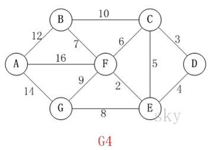
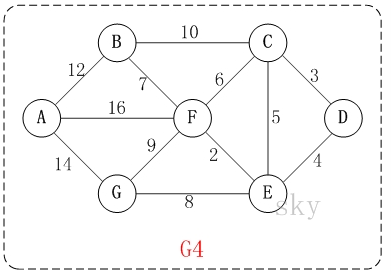
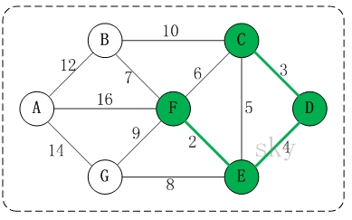

 **应用场景-公交站问题**
看一个应用场景和问题：



1. 某城市新增7个站点(A, B, C, D, E, F, G) ，现在需要修路把7个站点连通

2. 各个站点的距离用边线表示(权) ，比如 A – B 距离 12公里

3. 问：如何修路保证各个站点都能连通，并且总的修建公路总里程最短? 


# 克鲁斯卡尔算法介绍

1. 克鲁斯卡尔(Kruskal)算法，是用来求加权连通图的最小生成树的算法。

2. **基本思想**：按照权值从小到大的顺序选择n-1条边，并保证这n-1条边不构成回路

3. **具体做法**：首先构造一个只含n个顶点的森林，然后依权值从小到大从连通网中选择边加入到森林中，并使森林中不产生回路，直至森林变成一棵树为止


## 克鲁斯卡尔算法图解说明

以城市公交站问题来图解说明 克鲁斯卡尔算法的原理和步骤：

在含有n个顶点的连通图中选择n-1条边，构成一棵极小连通子图，并使该连通子图中n-1条边上权值之和达到最小，则称其为连通网的最小生成树。 



例如，对于如上图G4所示的连通网可以有多棵权值总和不相同的生成树。


### **克鲁斯卡尔算法图解**

以上图G4为例，来对克鲁斯卡尔进行演示(假设，用数组R保存最小生成树结果)。


**第1步**：将边<E,F>加入R中。 
   边<E,F>的权值最小，因此将它加入到最小生成树结果R中。 
 **第2步**：将边<C,D>加入R中。 
   上一步操作之后，边<C,D>的权值最小，因此将它加入到最小生成树结果R中。 
 **第3步**：将边<D,E>加入R中。 
   上一步操作之后，边<D,E>的权值最小，因此将它加入到最小生成树结果R中。 
 **第4步**：将边<B,F>加入R中。 
   上一步操作之后，边<C,E>的权值最小，但<C,E>会和已有的边构成回路；因此，跳过边<C,E>。同理，跳过边<C,F>。将边<B,F>加入到最小生成树结果R中。 
 **第5步**：将边<E,G>加入R中。 
   上一步操作之后，边<E,G>的权值最小，因此将它加入到最小生成树结果R中。 
 **第6步**：将边<A,B>加入R中。 
   上一步操作之后，边<F,G>的权值最小，但<F,G>会和已有的边构成回路；因此，跳过边<F,G>。同理，跳过边<B,C>。将边<A,B>加入到最小生成树结果R中。

此时，最小生成树构造完成！它包括的边依次是：**<E,F> <C,D> <D,E> <B,F> <E,G> <A,B>**。


### **克鲁斯卡尔算法分析**

根据前面介绍的克鲁斯卡尔算法的基本思想和做法，我们能够了解到，克鲁斯卡尔算法重点需要解决的以下两个问题： 
 **问题一**：对图的所有边按照权值大小进行排序。 
 **问题二**：将边添加到最小生成树中时，怎么样判断是否形成了回路。

问题一，很好解决，采用排序算法进行排序即可。

问题二，处理方式是：记录顶点在"最小生成树"中的终点，顶点的终点是"在最小生成树中与它连通的最大顶点"。然后每次需要将一条边添加到最小生存树时，判断该边的两个顶点的终点是否重合，重合的话则会构成回路


### **如何判断是否构成回路-举例说明(如图)**



在将<E,F> <C,D> <D,E>加入到最小生成树R中之后，这几条边的顶点就都有了终点：

**(01)** C的终点是F。 
**(02)** D的终点是F。 
**(03)** E的终点是F。 
**(04)** F的终点是F。


**关于终点的说明：**

1) 就是将所有顶点按照从小到大的顺序排列好之后；某个顶点的终点就是"与它连通的最大顶点"。 

2) 因此，接下来，虽然<C,E>是权值最小的边。但是C和E的终点都是F，即它们的终点相同，因此，将<C,E>加入最小生成树的话，会形成回路。这就是判断回路的方式。也就是说，**我们加入的边的<font color="blue">两个顶点</font>不能都指向<font color="red">同一个终点</font>，否则将构成回路**。【后面有代码说明】


### **克鲁斯卡尔算法的代码说明**

```java
package kruskal;

import java.util.Arrays;

public class KruskalCase {

	private int edgeNum; // 边的个数
	private char[] vertexs; // 顶点数组
	private int[][] matrix; // 邻接矩阵
	// 使用 INF 表示两个顶点不能连通
	private static final int INF = Integer.MAX_VALUE;
	
	public static void main(String[] args) {
		char[] vertexs = {'A', 'B', 'C', 'D', 'E', 'F', 'G'};
		// 克鲁斯卡尔算法的邻接矩阵  
	      int matrix[][] = {
	      /*A*//*B*//*C*//*D*//*E*//*F*//*G*/
	/*A*/ {   0,  12, INF, INF, INF,  16,  14},
	/*B*/ {  12,   0,  10, INF, INF,   7, INF},
	/*C*/ { INF,  10,   0,   3,   5,   6, INF},
	/*D*/ { INF, INF,   3,   0,   4, INF, INF},
	/*E*/ { INF, INF,   5,   4,   0,   2,   8},
	/*F*/ {  16,   7,   6, INF,   2,   0,   9},
	/*G*/ {  14, INF, INF, INF,   8,   9,   0}}; 
	      // 大家可以在去测试其它的邻接矩阵，结果都可以得到最小生成树.
	      
	      // 创建KruskalCase 对象实例
	      KruskalCase kruskalCase = new KruskalCase(vertexs, matrix);
	      // 输出构建的
	      kruskalCase.print();
	      kruskalCase.kruskal();
	      
	}
	
	// 构造器
	public KruskalCase(char[] vertexs, int[][] matrix) {
		// 初始化顶点数和边的个数
		int vlen = vertexs.length;
		
		// 初始化顶点, 复制拷贝的方式
		this.vertexs = new char[vlen];
		for(int i = 0; i < vertexs.length; i++) {
			this.vertexs[i] = vertexs[i];
		}
		
		// 初始化边, 使用的是复制拷贝的方式
		this.matrix = new int[vlen][vlen];
		for(int i = 0; i < vlen; i++) {
			for(int j= 0; j < vlen; j++) {
				this.matrix[i][j] = matrix[i][j];
			}
		}
		// 统计边的条数
		for(int i =0; i < vlen; i++) {
			for(int j = i+1; j < vlen; j++) {
				if(this.matrix[i][j] != INF) {
					edgeNum++;
				}
			}
		}
		
	}
	public void kruskal() {
		int index = 0; // 表示最后结果数组的索引
		int[] ends = new int[edgeNum]; // 用于保存"已有最小生成树" 中的每个顶点在最小生成树中的终点
		// 创建结果数组, 保存最后的最小生成树
		EData[] rets = new EData[edgeNum];
		
		// 获取图中 所有的边的集合 ， 一共有12边
		EData[] edges = getEdges();
		System.out.println("图的边的集合=" + Arrays.toString(edges) + " 共"+ edges.length); //12
		
		// 按照边的权值大小进行排序(从小到大)
		sortEdges(edges);
		
		// 遍历 edges 数组，将边添加到最小生成树中时，判断是准备加入的边否形成了回路，如果没有，就加入 rets, 否则不能加入
		for(int i=0; i < edgeNum; i++) {
			// 获取到第i条边的第一个顶点(起点)
			int p1 = getPosition(edges[i].start); //p1=4
			// 获取到第i条边的第2个顶点
			int p2 = getPosition(edges[i].end); //p2 = 5
			
			// 获取p1这个顶点在已有最小生成树中的终点
			int m = getEnd(ends, p1); //m = 4
			// 获取p2这个顶点在已有最小生成树中的终点
			int n = getEnd(ends, p2); // n = 5
			// 是否构成回路
			if(m != n) { //没有构成回路
				ends[m] = n; // 设置m 在"已有最小生成树"中的终点 <E,F> [0,0,0,0,5,0,0,0,0,0,0,0]
				rets[index++] = edges[i]; //有一条边加入到rets数组
			}
		}
		//<E,F> <C,D> <D,E> <B,F> <E,G> <A,B>。
		//统计并打印 "最小生成树", 输出  rets
		System.out.println("最小生成树为");
		for(int i = 0; i < index; i++) {
			System.out.println(rets[i]);
		}
		
		
	}
	
	// 打印邻接矩阵
	public void print() {
		System.out.println("邻接矩阵为: \n");
		for(int i = 0; i < vertexs.length; i++) {
			for(int j=0; j < vertexs.length; j++) {
				System.out.printf("%12d", matrix[i][j]);
			}
			System.out.println();//换行
		}
	}

	/**
	 * 功能：对边进行排序处理, 冒泡排序
	 * @param edges 边的集合
	 */
	private void sortEdges(EData[] edges) {
		for(int i = 0; i < edges.length - 1; i++) {
			for(int j = 0; j < edges.length - 1 - i; j++) {
				if(edges[j].weight > edges[j+1].weight) {//交换
					EData tmp = edges[j];
					edges[j] = edges[j+1];
					edges[j+1] = tmp;
				}
			}
 		}
	}
	/**
	 * 
	 * @param ch 顶点的值，比如'A','B'
	 * @return 返回ch顶点对应的下标，如果找不到，返回-1
	 */
	private int getPosition(char ch) {
		for(int i = 0; i < vertexs.length; i++) {
			if(vertexs[i] == ch) {//找到
				return i;
			}
		}
		//找不到,返回-1
		return -1;
	}
	/**
	 * 功能: 获取图中边，放到EData[] 数组中，后面我们需要遍历该数组
	 * 是通过matrix 邻接矩阵来获取
	 * EData[] 形式 [['A','B', 12], ['B','F',7], .....]
	 * @return
	 */
	private EData[] getEdges() {
		int index = 0;
		EData[] edges = new EData[edgeNum];
		for(int i = 0; i < vertexs.length; i++) {
			for(int j=i+1; j <vertexs.length; j++) {
				if(matrix[i][j] != INF) {
					edges[index++] = new EData(vertexs[i], vertexs[j], matrix[i][j]);
				}
			}
		}
		return edges;
	}
	/**
	 * 功能: 获取下标为i的顶点的终点(), 用于后面判断两个顶点的终点是否相同
	 * @param ends ： 数组就是记录了各个顶点对应的终点是哪个,ends 数组是在遍历过程中，逐步形成
	 * @param i : 表示传入的顶点对应的下标
	 * @return 返回的就是 下标为i的这个顶点对应的终点的下标, 一会回头还有来理解
	 */
	private int getEnd(int[] ends, int i) { // i = 4 [0,0,0,0,5,0,0,0,0,0,0,0]
		while(ends[i] != 0) {
			i = ends[i];
		}
		return i;
	}
 
}

//创建一个类EData ，它的对象实例就表示一条边
class EData {
	char start; //边的一个点
	char end; //边的另外一个点
	int weight; //边的权值
	//构造器
	public EData(char start, char end, int weight) {
		this.start = start;
		this.end = end;
		this.weight = weight;
	}
	//重写toString, 便于输出边信息
	@Override
	public String toString() {
		return "EData [<" + start + ", " + end + ">= " + weight + "]";
	}
	
	
}

```

