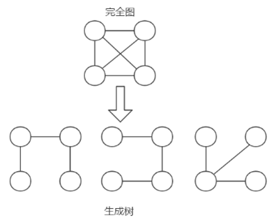

**应用场景-修路问题**

看一个应用场景和问题：


1. 胜利乡有7个村庄(A, B, C, D, E, F, G) ，现在需要修路把7个村庄连通

2. 各个村庄的距离用边线表示(权) ，比如 A – B 距离 5公里

3. 问：如何修路保证各个村庄都能连通，并且总的修建公路总里程最短?

思路: 将10条边，连接即可，但是总的里程数不是最小.

**正确的思路**，就是尽可能的选择少的路线，并且每条路线最小，保证总里程数最少. 


# 最小生成树

修路问题本质就是就是最小生成树问题， 先介绍一下最小生成树 **(Minimum Cost Spanning Tree)**，简称**MST。**

1. 给定一个带权的无向连通图,如何选取一棵生成树,使树上所有**边上权的总和为最小**,这叫最小生成树

2. N个顶点，一定有N-1条边

3. 包含全部顶点

4. N-1条边都在图中

5. 举例说明(如图:)

   

求最小生成树的算法主要是**普里姆算法和克鲁斯卡尔算法**


# 普里姆算法介绍

1. 普利姆(Prim)算法求最小生成树，也就是在包含n个顶点的连通图中，找出只有(n-1)条边包含所有n个顶点的连通子图，也就是所谓的**极小连通子图**
2. 普利姆的算法如下:
	- 设G=(V,E)是连通网，T=(U,D)是最小生成树，V,U是顶点集合，E,D是边的集合 
	- 若从顶点u开始构造最小生成树，则从集合V中取出顶点u放入集合U中，标记顶点v的visited[u]=1
	- 若集合U中顶点ui与集合V-U中的顶点vj之间存在边，则寻找这些边中权值最小的边，但不能构成回路，将顶点vj加入集合U中，将边（ui,vj）加入集合D中，标记visited[vj]=1
	- 重复步骤②，直到U与V相等，即所有顶点都被标记为访问过，此时D中有n-1条边

**提示**: 单独看步骤很难理解，我们通过代码来讲解，比较好理解.


**应用场景-修路问题**

看一个应用场景和问题：


**思路图解**

```html
1. 从 A 开始处理，A 有三条路
	A -> B 权值为：5
	A -> G 权值为：2
	A -> C 权值为：7
	根据权值最小的选择：<A,G>
2. <A,G> 开始，将 A 和 G 顶点和他们相邻的还没有访问的顶点进行处理
    A -> C 权值为：7
    A -> B 权值为：5
    G -> B 权值为：3
    G -> E 权值为：4
    G -> F 权值为：6
	根据权值最小的选择：<A,G,B>
3. <A,G,B> 开始，将 A, G 和 B 顶点和他们相邻的还没有访问的顶点进行处理
    A -> C 权值为：7
    B -> D 权值为：9
    G -> E 权值为：4
    G -> F 权值为：6
    根据权值最小的选择：<A,G,B,E>
4. <A,G,B,E> 开始，将 A, G , B 和 E 顶点和他们相邻的还没有访问的顶点进行处理
    A -> C 权值为：7
    B -> D 权值为：9
    G -> F 权值为：6
    E -> C 权值为：8
    E -> F 权值为：5
    根据权值最小的选择：<A,G,B,E,F>
5. <A,G,B,E,F> 开始，将 A, G , B , E 和 F 顶点和他们相邻的还没有访问的顶点进行处理    
    A -> C 权值为：7
    B -> D 权值为：9
    G -> F 权值为：6    
    E -> C 权值为：8
    F -> D 权值为：4
    根据权值最小的选择：<A,G,B,E,F,D>
6.  <A,G,B,E,F,D> 开始，将 A, G , B , E , F 和 D 顶点和他们相邻的还没有访问的顶点进行处理 
    A -> C 权值为：7
    B -> D 权值为：9
    G -> F 权值为：6    
    E -> C 权值为：8
    根据权值最小的选择：<A,G,B,E,F,D,C>
```


**代码实现**

```java
package prim;

import java.util.Arrays;

public class PrimAlgorithm {
    public static void main(String[] args) {
        // 测试看看图是否创建ok
        char[] data = new char[]{'A', 'B', 'C', 'D', 'E', 'F', 'G'};
        int verxs = data.length;
        // 邻接矩阵的关系使用二维数组表示,10000这个大数，表示两个点不联通
        int[][] weight = new int[][]{
                {10000, 5, 7, 10000, 10000, 10000, 2},
                {5, 10000, 10000, 9, 10000, 10000, 3},
                {7, 10000, 10000, 10000, 8, 10000, 10000},
                {10000, 9, 10000, 10000, 10000, 4, 10000},
                {10000, 10000, 8, 10000, 10000, 5, 4},
                {10000, 10000, 10000, 4, 5, 10000, 6},
                {2, 3, 10000, 10000, 4, 6, 10000},};

        // 创建MGraph对象
        MGraph graph = new MGraph(verxs);
        // 创建一个MinTree对象
        MinTree minTree = new MinTree();
        minTree.createGraph(graph, verxs, data, weight);
        // 输出
        minTree.showGraph(graph);
        // 测试普利姆算法
        minTree.prim(graph, 0);
    }
}

// 创建最小生成树->村庄的图
class MinTree {
    /**
     * 创建图的邻接矩阵
     *
     * @param graph  图对象
     * @param verxs  图对应的顶点个数
     * @param data   图的各个顶点的值
     * @param weight 图的邻接矩阵
     */
    public void createGraph(MGraph graph, int verxs, char data[], int[][] weight) {
        int i, j;
        for (i = 0; i < verxs; i++) {// 顶点
            graph.data[i] = data[i];
            for (j = 0; j < verxs; j++) {
                graph.weight[i][j] = weight[i][j];
            }
        }
    }

    // 显示图的邻接矩阵
    public void showGraph(MGraph graph) {
        for (int[] link : graph.weight) {
            System.out.println(Arrays.toString(link));
        }
    }


    /**
     * 编写prim算法，得到最小生成树
     *
     * @param graph 图
     * @param v     表示从图的第几个顶点开始生成'A'->0 'B'->1...
     */
    public void prim(MGraph graph, int v) {
        // visited[] 标记结点(顶点)是否被访问过
        int[] visited = new int[graph.verxs];


        // 把当前这个结点标记为已访问
        visited[v] = 1;
        // h1 和 h2 记录两个顶点的下标
        int h1 = -1;
        int h2 = -1;
        int minWeight = 10000; // 将 minWeight 初始成一个大数，后面在遍历过程中，会被替换
        for (int k = 1; k < graph.verxs; k++) {// 因为有 graph.verxs顶点，普利姆算法结束后，有 graph.verxs-1边

            // 这个是确定每一次生成的子图 ，和哪个结点的距离最近
            for (int i = 0; i < graph.verxs; i++) {// i结点表示被访问过的结点
                for (int j = 0; j < graph.verxs; j++) {// j结点表示还没有访问过的结点

                    // 根据图解说明
                    // 第一次的时候  visited 数组 只有 A 被标记成已访问，j 就在[0][j]去找权值最小且未被访问到结点 G(最终)，并将 G 标记成已访问
                    // 第二次的时候  visited 数组里存有 A 和 G ,j 就会在[0][j]和[6][j]去找离A和G最近且权值最小的结点 B
                    if (visited[i] == 1 && visited[j] == 0 && graph.weight[i][j] < minWeight) {
                        // 替换minWeight(寻找已经访问过的结点和未访问过的结点间的权值最小的边)
                        minWeight = graph.weight[i][j];
                        h1 = i;
                        h2 = j;
                    }
                }
            }
            // 找到一条边是最小
            System.out.println("边<" + graph.data[h1] + "," + graph.data[h2] + "> 权值:" + minWeight);
            // 将当前这个结点标记为已经访问
            visited[h2] = 1;
            // minWeight 重新设置为最大值 10000
            minWeight = 10000;
        }
    }
}

class MGraph {
    int verxs; // 表示图的节点个数
    char[] data;// 存放结点数据
    int[][] weight; // 存放边，就是我们的邻接矩阵

    public MGraph(int verxs) {
        this.verxs = verxs;
        data = new char[verxs];
        weight = new int[verxs][verxs];
    }
}
```

