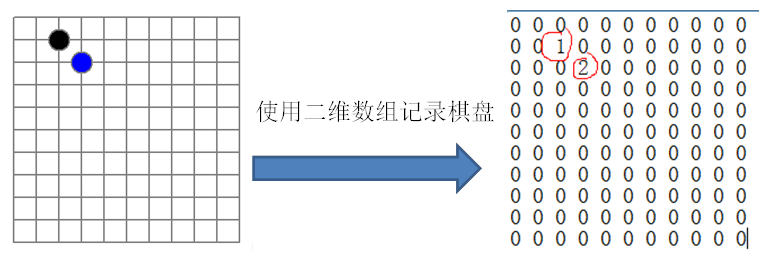
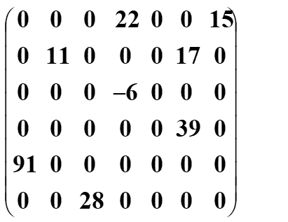
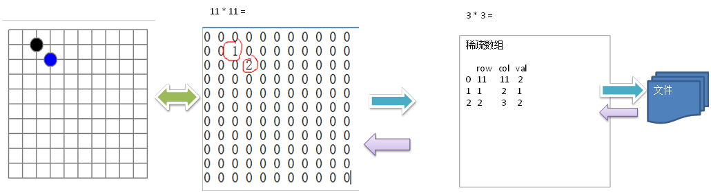

先看一个实际的需求
编写的五子棋程序中，有**存盘退出**和**续上盘**的功能。



分析问题
因为该二维数组的很多值是默认值0, 因此记录了很多没有意义的数据.


# 基本介绍

当一个数组中大部分元素为０，或者为同一个值的数组时，可以使用稀疏数组来保存该数组。


稀疏数组的处理方法
1. 记录数组一共有几行几列，有多少个不同的值
2. 把具有不同值的元素的行列及值记录在一个小规模的数组中，从而缩小程序的规模

 

稀疏数组举例说明



**应用实例**
使用稀疏数组，来保留类似前面的二维数组(棋盘、地图等等)

把稀疏数组存盘，并且可以从新恢复原来的二维数组数

**整体思路分析**


**二维数组转稀疏数组的思路**

遍历 原始的二维数组，得到有效数据的个数 sum
```java
int sum = 0;
for (int i = 0; i < chessArr.length; i++) {
     for (int j = 0; j < chessArr.length; j++) {
        if (chessArr[i][j] != 0) {
            sum++;
         }
     }
}
```

根据sum就可以创建 稀疏数组 `sparseArr  int[sum + 1] [3]`
   ```java
// 2.创建对应的稀疏数组
int[][] sparsArray = new int[sum + 1][3];
//行根据非0个的个数创建，列永远是3
// 给稀疏数组赋值
sparsArray[0][0] = chessArr.length;//代表原始数组的行数
sparsArray[0][1] = chessArr.length;//代表原始数组的列数
sparsArray[0][2] = sum;//代表有多个非0数据
   ```

将二维数组的有效数据数据存入到 稀疏数组
   ```java
// 遍历二维数组，将非0的值存放到sparsArray中
int count = 0;//用于记录是第几个非0数据
for (int i = 0; i < chessArr.length; i++) {
    for (int j = 0; j < chessArr.length; j++) {
	        if (chessArr[i][j] != 0) {
	                count++;
                    sparsArray[count][0] = i;//原始数组的第几行
                    sparsArray[count][1] = j;//原始数组的第几列
                    sparsArray[count][2] = chessArr[i][j];//把原始数组的值赋给稀疏数组
            }
    }
}
   ```

   

**稀疏数组转原始的二维数组的思路**

先读取稀疏数组的第一行，根据第一行的数据，创建原始的二维数组，比如上面的 
```java
int[][] chessArr1 = new int[sparsArray[0][0]][sparsArray[0][1]];
 ```

在读取稀疏数组后几行的数据，并赋给原始的二维数组即可.
```java
for (int i = 1; i < sparsArray.length; i++) {
	chessArr1[sparsArray[i][0]][sparsArray[i][1]] = sparsArray[i][2];
}
```


# 完整代码

```java
public class SparsArray {
    public static void main(String[] args) {
        //创建一个原始的二维数组 chessArr.length*chessArr.length
        //0：表示没有棋子，1表示黑子，2表示蓝子
        int[][] chessArr = new int[11][11];
        chessArr[1][2] = 1;
        chessArr[2][3] = 2;
        System.out.println("原始的二维数组为：");
        for (int[] row : chessArr) {
            for (int data : row) {
                System.out.printf("%d\t", data);
            }
            System.out.println();
        }

        /**
         * 将二维数组转稀疏数组
         */
        //1.先遍历二维数组得到非0数据的个数
        int sum = 0;
        for (int i = 0; i < chessArr.length; i++) {
            for (int j = 0; j < chessArr.length; j++) {
                if (chessArr[i][j] != 0) {
                    sum++;
                }
            }
        }

        //2.创建对应的稀疏数组
        int[][] sparsArray = new int[sum + 1][3];//行根据非0个的个数创建，列永远是3
        //给稀疏数组赋值
        sparsArray[0][0] = chessArr.length;//代表原始数组的行数
        sparsArray[0][1] = chessArr.length;//代表原始数组的列数
        sparsArray[0][2] = sum;//代表有多个非0数据
        //遍历二维数组，将非0的值存放到sparsArray中
        int count = 0;//用于记录是第几个非0数据
        for (int i = 0; i < chessArr.length; i++) {
            for (int j = 0; j < chessArr.length; j++) {
                if (chessArr[i][j] != 0) {
                    count++;
                    sparsArray[count][0] = i;//原始数组的第几行
                    sparsArray[count][1] = j;//原始数组的第几列
                    sparsArray[count][2] = chessArr[i][j];//把原始数组的值赋给稀疏数组

                }
            }
        }
        System.out.println();
        System.out.println("得到的稀疏数组为:~~~~~~~");
        /*
         * 将稀疏数组-->恢复成原始的二维数组
         * 1.先读去稀疏数组的第一行，根据第一行的数据，创建原始的二维数组
         * 2.在读取稀疏数组后几行的数据，并赋给原始的二维数组即可
         */
        for (int i = 0; i < sparsArray.length; i++) {
            System.out.printf("%d\t%d\t%d\t\n", sparsArray[i][0], sparsArray[i][1], sparsArray[i][2]);
        }

        System.out.println();
        System.out.println("恢复的数组为:~~~~~~~");

        int[][] chessArr1 = new int[sparsArray[0][0]][sparsArray[0][1]];

        for (int i = 1; i < sparsArray.length; i++) {
            chessArr1[sparsArray[i][0]][sparsArray[i][1]] = sparsArray[i][2];
        }
        for (int[] row : chessArr1) {
            for (int data : row) {
                System.out.printf("%d\t", data);
            }
            System.out.println();
        }
    }
}
```

