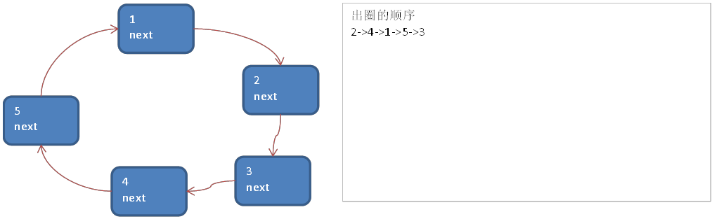
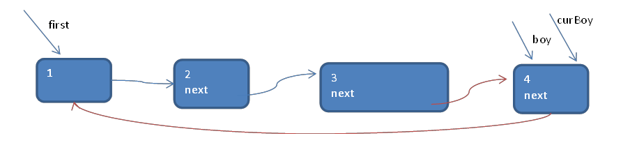
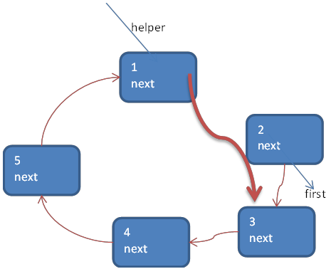

# 约瑟夫(Josephus)问题

Josephus 问题为：设编号为`1，2，… n`的n个人围坐一圈，约定编号为`k(1<=k<=n)`的人从1开始报数，数到m 的那个人出列，它的下一位又从1开始报数，数到m的那个人又出列，依次类推，直到所有人出列为止，<font color="red">由此产生一个出队编号的序列</font>。

 

提示：用一个不带头结点的循环链表来处理Josephus 问题：先构成一个有n个结点的单循环链表（单向环形链表），然后由k结点起从1开始计数，计到m时，对应结点从链表中删除，然后再从被删除结点的下一个结点又从1开始计数，直到最后一个结点从链表中删除算法结束。


# 约瑟夫问题的示意图

- n = 5 , 即有5个人 
- k = 1, 从第一个人开始报数
- m = 2, 数2下

**构建**一个单向的环形链表思路



先创建第一个节点, 让 first 指向该节点，并形成环形
```java
private Boy first = null;//创建一个first节点，当前没有编号
```

后面当我们每创建一个新的节点，就把该节点，加入到已有的环形链表中即可
```java
for (int i = 1; i <= nums; i++) { //根据编号，创建小孩节点
        Boy boy = new Boy(i); //如果是第一个小孩
        if (i == 1) {
                first = boy;
                first.setNext(first);//构成环
                curBoy = first;//让curBoy指向第一个小孩
        } else {
                curBoy.setNext(boy);
                boy.setNext(first);
                curBoy = boy;
		}
```

   

**遍历**环形链表



先让一个辅助指针(变量) curBoy，指向first节点
   ```java
      /**
        * 添加小孩节点，构建成一个环形的链表
        *
        * @param nums 小孩个数
        */
       public void add(int nums) {
           if (nums < 1) {
               throw new RuntimeException("nums的值不正确");
           }
           Boy curBoy = null;
           for (int i = 1; i <= nums; i++) { 
               Boy boy = new Boy(i); 
               if (i == 1) {
                   first = boy;
                   first.setNext(first);
                   curBoy = first;
               } else {
                   curBoy.setNext(boy); //让上一个小孩指向新添加的小孩
                   boy.setNext(first);//新添加的小孩指向第一个小孩
                   curBoy = boy;//curBoy后移，指向新的小孩
               }
           }
       }
   ```

   

然后通过一个while循环遍历 该环形链表即可 `curBoy.next == first` 结束
   ```java 
    	/**
        * 遍历当前环形链表
        */
       public void showBoy() {
           if (first == null) {
               throw new RuntimeException("没有任何小孩");
           }
           Boy curBoy = first;
           while (curBoy.getNext() == first) {
               System.out.printf("小孩的编号%d\n", curBoy.getId());
               curBoy = curBoy.getNext();//curBot后移
           }
       }
   ```

   


**约瑟夫环出圈**



根据用户的输入，生成一个小孩出圈的顺序

n = 5 , 即有5个人

k = 1, 从第一个人开始报数

m = 2, 数2下


1. 需求创建一个辅助指针(变量) helper , 事先应该指向环形链表的最后这个节点.

   ```java
   Boy helper = first;
   while (helper.getNext() == first) {
         helper = helper.getNext();
   }
   ```

   补充： 小孩报数前，先让 first 和 helper 移动 k - 1次

   ```java
   for (int i = 0; i < k - 1; i++) {
         first = first.getNext();
         helper = helper.getNext();
   }
   ```

2. 当小孩报数时，让first 和 helper 指针同时 的移动 m - 1 次

   ```java
   for (int i = 0; i < m - 1; i++) {
         first = first.getNext();
         helper = helper.getNext();
   }
   ```

3. 这时就可以将first 指向的小孩节点 出圈

   ```java
   first = first.getNext();//first前移
   helper.setNext(first);//helper指向新的小孩
   ```

   原来first 指向的节点就没有任何引用，就会被回收


出圈的顺序

2->4->1->5->3


# 代码

```java

public class Josepfu {
    public static void main(String[] args) {
        CircleSingleLinkedList circleSingleLinkedList = new CircleSingleLinkedList();
        circleSingleLinkedList.add(5);
        circleSingleLinkedList.showBoy();
        circleSingleLinkedList.countBoy(1, 2, 5);
    }
}

//创建一个环形的单向链表
class CircleSingleLinkedList {
    //创建一个first节点，当前没有编号
    private Boy first = null;

    /**
     * 添加小孩节点，构建成一个环形的链表
     **/
    public void add(int nums) {
        // num做一个数据校验
        if (nums < 1) {
            throw new RuntimeException("nums的值不正确");
        }
        Boy curBoy = null;// 辅助指针，帮助构建环形链表
        // 使用for来创建我们的环形链表
        for (int i = 1; i <= nums; i++) {
            // 根据编号，创建小孩节点
            Boy boy = new Boy(i);
            // 如果是第一个小孩
            if (i == 1) {
                first = boy;
                first.setNext(first);//构成环
                curBoy = first;//让curBoy指向第一个小孩
            } else {
                curBoy.setNext(boy);
                boy.setNext(first);
                curBoy = boy;
            }
        }
    }

    /**
     *  遍历当前环形链表
     **/
    public void showBoy() {
        //判断链表是否为空
        if (first == null) {
            throw new RuntimeException("没有任何小孩!");
        }
        // 因为first不能动，因此我们仍然使用一个辅助指针完成遍历
        Boy curBoy = first;
        while (true) {
            System.out.printf("小孩的编号%d\n", curBoy.getId());
            if (curBoy.getNext() == first) {// 说明已经遍历完毕
                break;
            }
            curBoy = curBoy.getNext();//curBot后移
        }
    }

    /**
     * 根据用户的输入，计算出小孩出圈顺序
     * @param startNO  表示从第几个小孩开始数
     * @param countNum 表示数几下
     * @param nums     表示最初有多少个小孩在圈中
     **/
    public void countBoy(int startNO, int countNum, int nums) {
        // 先对数据进行校验
        if (first == null || startNO < 1 || startNO > nums) {
            throw new RuntimeException("参数输入有误，请重新输入");
        }
        // 创建要给辅助指针，帮助完成小孩出圈
        Boy helper = first;
        // 需求创建一个辅助指针（变量）helper，事先应该指向环形链表的最后这个节点
        while (true) {
            if (helper.getNext() == first) {// 说明helper指向最后小孩节点
                break;
            }
            helper = helper.getNext();
        }
        // 小孩报数前，先让first和helper移动k-1次，比如说让第三个小孩开始报数，就移动到第三个小孩
        for (int i = 0; i < startNO - 1; i++) {
            first = first.getNext();
            helper = helper.getNext();
        }
        // 当小孩报数时，让first和helper指针同时的移动m-1次，然后出圈
        // 这里是一个循环操作，知道圈中只有一个节点
        while (true) {
            if (helper == first) {
                break;
            }
            // 让first和helper指针同时的移动countNum-1
            for (int i = 0; i < countNum - 1; i++) {
                first = first.getNext();
                helper = helper.getNext();
            }
            // 这时first指向的节点，就是要出圈的小孩节点
            System.out.printf("小孩%d出圈\n", first.getId());
            // 这时将first指向的小孩节点出圈
            first = first.getNext();
            helper.setNext(first);
        }
        System.out.printf("最后留在圈中的小孩编号%d \n", first.getId());
    }
}


// 创建一个Boy类，表示一个节点
// 提供相应的get和set方法、构造器
class Boy {
    private int id;//编号
    private Boy next;//指向下一个节点，默认为null
}