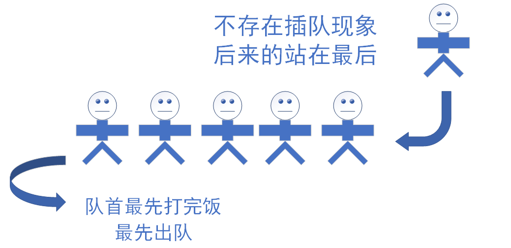
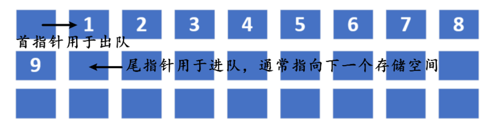
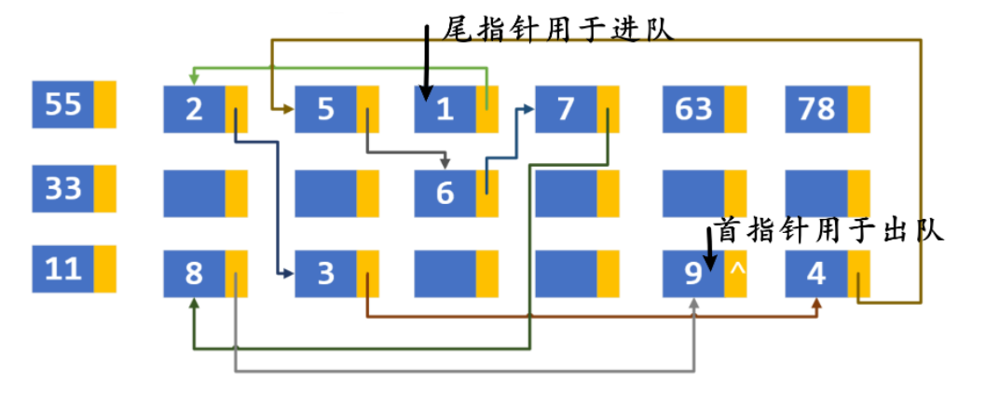
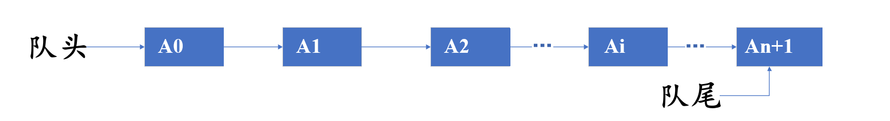

# 定义
如果说链表和顺序表是对数据的存取位置的组织方式，那么**队列就是一种对于存取方式限制的组织方式**。换一种方式描述的话就是，队列既可以采用链表来表示，也可以采用数组（线性表）来表示，我们限制的是对于存放数据的存取方式。


很显然我们对数据的组织也是以这种方式进行的。当然数据存储方式还是有两种，一种是顺序存储，一种是链式存储。

**分类**
静态队列：用数组实现 静态队列通常都必须是循环队列


  

链式队列：用链表实现


**应用**
==**所有和时间有关的事件都有队列的影子**==


# 队列

### 队列的逻辑结构
- **队列**：只允许在一端进行插入操作，而另一端进行删除操作的线性表。
- **空队列**：不含任何数据元素的队列。
- 允许插入（也称入队、进队）的一端称为队尾，允许删除（也称出队）的一端称为队头。



- 队列的操作特性：先进先出(FIFO)，后入后出(LILO)。

  

# 循环队列

**静态队列为什么必须是循环队列**

现在如果一个数组里面存了四个元素，那么front就只向第一个有效元素，而real指向最后一个元素的下一个元素（下一个元素入队的位置）。


- 当增加元素时，只能在rear一端增加，即rear向上移。
- 删除元素时，只能在front一端删除元素，即front向上移。

但是如果一直增增删删，那么就会造成rear端溢出（是rear指针指向的位置超过数组的长度），而front端浪费（是指fron指针已经出队的元素位置不能下次利用），所以对于这种情况，可以采用循环队列的形式，即**当rear已经指向数组最后一个元素时，那么就可以转而将rear指向数组的第一个空出来的空间。**


**循环队列需要几个参数来确定**

需要2个参数来确定：`front` 和 `rear`（队头和队尾）  
```txt
front =(front+1)% 数组长度
rear= (rear+1) % 数组长度
```

**循环队列各个参数的含义**

2个参数在不同场合有不同的含义

**队列初始化**
- `front`和`rear`的值都为零

**队列非空**
  - `front`：代表的是队列的第一个元素
  - `rear`：代表的是队列的最后一个有效元素的**下一个元素**

**队列为空**
- `front`和`real`的值相等，但不一定为零


**如何判断循环队列队为满**

因为`front`的值可能比`rear`大，也可能比他小，也可能相等
  
所以有两种方式
 - 多增加一个标识是否满的参数
- 少用一个元素【通常用此种方式】
  
如果`front`和`rear`的值相差1，且`front > rear`,则证明队列已满。
  
用C语言伪算法表示为
  ```c
if ((rear + 1) % 数组长度 == front){
    已满
}else{	
    未满   
}
  ```

 

### 循环队列入队伪算法讲解

两步完成
- 将值存入rear所代表的位置
- 错误的写法：`rear = rear + 1`;

正确的写法是：`rear = ( rear + 1 ) % 数组的长度`


### 循环队列出队伪算法讲解

`Front =(front + 1)% 数组的长度`


# 完整代码

```c
#include <malloc.h>
#include <stdbool.h>
#include <stdio.h>
typedef struct Queue {
  int* pBase;
  int front;
  int rear;

} QUEUE;

void init(QUEUE*,int);           //初始化
bool addQueue(QUEUE*, int);  //入队
void traverse(QUEUE*);       //遍历
bool isFull(QUEUE*);         //是否为空
bool out(QUEUE*, int *);       //出队
bool emput(QUEUE*);          //是否为满

int main(void) {
  QUEUE Q;

  init(&Q,6);
  addQueue(&Q, 1);
  addQueue(&Q, 2);
  addQueue(&Q, 3);
  addQueue(&Q, 4);
  addQueue(&Q, 5);
  addQueue(&Q, 6);

  traverse(&Q);

  return 0;
}

void init(QUEUE* pQ,int len) {
  pQ->pBase = (int*)malloc(sizeof(int) * len);// 动态的创建数组
  // 初始化时，队头和队尾都指向一起（0），因为没有元素
  pQ->front = 0;// 队头指向当前元素
  pQ->rear = 0;// 队尾指向最后一个元素的后一个位置
}

bool addQueue(QUEUE* pQ, int val) {
  if (isFull(pQ)) {
    return false;
  } else {
    pQ->pBase[pQ->rear] = val;// 赋值
    pQ->rear = (pQ->rear + 1) % 6;// 队尾上移
    return true;
  }
}
bool isFull(QUEUE* pQ) {
  if ((pQ->rear + 1) % 6 == pQ->front) { // 判断队尾的下一个位置是否是队头的位置
    return true;
  } else {
    return false;
  }
}

void traverse(QUEUE* pQ) {
  int i = pQ->front;//创建一个临时变量，保存队头的位置

  while (i != pQ->rear) {
    printf("%d\n", pQ->pBase[i]);
    i = (i + 1) % 6;//后移
  }
  return;
}

bool emput(QUEUE* pQ) {
  if (pQ->front == pQ->rear) {
    return true;
  } else {
    return false;
  }
}

bool out(QUEUE* pQ, int* pVal) {
  if (emput(pQ)) {
    return false;

  } else {
    *pVal = pQ->pBase[pQ->front];
    pQ->front = (pQ->front + 1) % 6;
    return true;
  }
}
```

