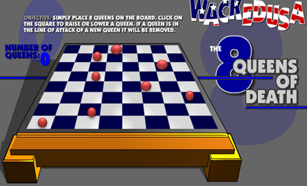

   

# 八皇后问题介绍

八皇后问题，是一个古老而著名的问题，是回溯算法的典型案例。该问题是国际西洋棋棋手马克斯·贝瑟尔于1848年提出：在8×8格的国际象棋上摆放八个皇后，使其不能互相攻击，即：**任意两个皇后都不能处于同一行、同一列或同一斜线上，问有多少种摆法。**



   


# 八皇后问题算法思路分析

1.  第一个皇后先放第一行第一列
2.  第二个皇后放在第二行第一列、然后判断是否OK， 如果不OK，继续放在第二列、第三列、依次把所有列都放完，找到一个合适
3.  继续第三个皇后，还是第一列、第二列……直到第8个皇后也能放在一个不冲突的位置，算是找到了一个正确解
4.  当得到一个正确解时，在栈回退到上一个栈时，就会开始回溯，即将第一个皇后，放到第一列的所有正确解，全部得到.
5.  然后回头继续第一个皇后放第二列，后面继续循环执行 1,2,3,4的步骤 【示意图】

说明：
理论上应该创建一个二维数组来表示棋盘，但是实际上可以通过算法，用一个一维数组即可解决问题.。
> arr[8] = {0 , 4, 7, 5, 2, 6, 1, 3} 

对应arr 下标 表示第几行，即第几个皇后，arr[i] = val , val 表示第i+1个皇后，放在第i+1行的第val+1列


```java
/**
 * 理论上应该创建一个二维数组来表示棋盘，但是实际上可以通过算法，用一个一维数组即可解决问题。
 * arr={0，4，7，5，2，6，1，3}
 * arr的下标表示第几行，即第几个皇后
 * val,val表示第几列。
 * arr[i]=val,表示第i+1个皇后，放在第i+1行的第val+1列
 */
public class Queue8 {
    // 定义一个max表示共有多少个皇后
    int max = 8;
    // 定义数组array，保存皇后放置位置的结果，比如arr={0，4，7，5，2，6，1，3}
    int[] array = new int[max];
    static int count;

    public static void main(String[] args) {
        Queue8 queue8 = new Queue8();
        queue8.check(0);
        System.out.printf("一共有%d中解法", count);
    }

    /**
     * 编写一个方法，放置第n个皇后
     * 特别注意：check是每一次递归时，进入到check都有 for (int i = 0; i < max; i++),因此回应回溯
     */
    private void check(int n) {
        if (n == max) {//n=8，其中8个皇后就既然放好
            print();
            return;
        }
        //依次放入皇后，并判断是否冲突
        for (int i = 0; i < max; i++) {
            // 先把当前这个皇后n，放到该行的第一列
            array[n] = i;
            // 判断当放置第n个皇后到i列时，是否冲突
            if (judeg(n)) {//不冲突
                // 接着放n+1皇后，即开始递归
                check(n + 1);
            }
            // 如果冲突，就继续执行array[n]=i，即将第n个皇后，放置在本行的后移的一个位置
        }

    }


    /**
     * @param n 表示第n个皇后
     * 查看当我们放置第n个皇后，就去检测该皇后是否和前面已经摆放的皇后冲突
     */
    private boolean judeg(int n) {
        for (int i = 0; i < n; i++) {
        /* 说明：
            1.array[i]==array[n] 表示判断第n个皇后是否和前面的n-1皇后在同一列
            2.Math.abs(n - i) == Math.abs(array[n] - array[i])表示判断第n个皇后是否和第i皇后是否在同一斜线
            	就是行数的差值与列的差值不能相等，相等就是在对角线上
            3.判断是否在同一行，没有必要，n每次都在递增
         */
            if (array[i] == array[n] || Math.abs(n - i) == Math.abs(array[n] - array[i])) {
                return false;
            }
        }
        return true;
    }

    /**
     *  写一个方法，可以将皇后摆放的位置输出
     */
    private void print() {
        count++;
        for (int i = 0; i < array.length; i++) {
            System.out.print(array[i] + " ");
        }
        System.out.println();
    }
}

```

>  对Math.abs(n - i) == Math.abs(array[n] - array[i]的理解

如果要把❤️放在当前的位置，就要对这个位置进行判断，是否在同一列，同一斜线上有相同的皇后。

当`Math.abs(4 - 1) == Math.abs(4 - 1)`==`3 == 3`

说明在当前这个位置向前移三格，向下移三格，存在一个皇后。

从图中可以看到他们处于同一斜线中。

| 8        | 0    | 0    | 0    | 0    | 00   | 0    | 0    | 0    |
| -------- | ---- | ---- | ---- | ---- | ---- | ---- | ---- | ---- |
| 7        | 0    | 0    | 0    | 0    | 0    | 0    | 0    | 0    |
| 6        | 0    | 0    | 0    | 0    | 0    | 0    | 0    | 0    |
| 5        | 0    | 0    | 0    | 0    | 0    | 0    | 0    | 0    |
| 4        | 0    | 0    | 0    | ❤️    | 0    | 0    | 0    | 0    |
| 3        | 0    | 0    | 0    | 0    | 0    | 0    | 0    | 🔱    |
| 2        | 0    | 0    | 🔱    | 0    | 0    | 0    | 0    | 0    |
| 1        | 🔱    | 0    | 0    | 0    | 0    | 0    | 0    | 0    |
| 棋盘下标 | 1    | 2    | 3    | 4    | 5    | 6    | 7    | 8    |

