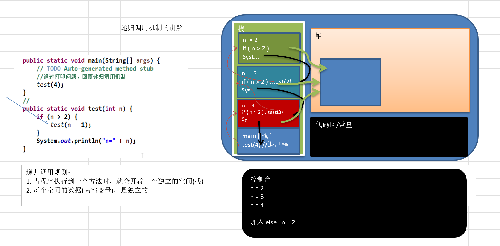

# 函数的调用

当在一个函数的运行期间调用另一个函数时，在运行被调函数之前，系统需要完成三件事：

-   将所有的实际参数，返回地址等信息传递给被调函数。
-   为被调函数的局部变量（也包括形参）分配存储空间
-   将控制转移到被调函数的入口

从被调函数返回主调函数之前，系统也要完成三件事：
-   保存被调函数的返回结果
-   释放被调函数所占的存储空间
-   依照被调函数保存的返回地址将控制转移到调用函数

> 当有多个函数相互调用时，按照“后调用先返回”的原则，上述函数之间信息传递和控制转移必须借助“栈”来实现，即系统将整个程序 运行时所需的数据空间安排在一个栈中，每当调用一个函数时，将在栈顶分配一个存储区，进行压栈操作，每当一个函数退出时，就释放它的存储区，就进行出栈操作，当前运行的函数永远都在栈顶位置。

-   A函数调用A函数和A函数调用B函数在计算机看来是没有任何区别的，只不过用我们日常的思维方式比较怪异而已。

 

# 知识点一：递归的概念

简单的说: 递归就是方法自己调用自己,每次调用时传入不同的变量.递归有助于编程者解决复杂的问题,同时可以让代码变得简洁。

递归需要遵守的重要规则

1.  执行一个方法时，就创建一个新的受保护的独立空间(栈空间)
2.  方法的局部变量是独立的，不会相互影响, 比如n变量
3.  如果方法中使用的是引用类型变量(比如数组)，就会共享该引用类型的数据.
4.  递归必须向退出递归的条件逼近，否则就是无限递归,出现StackOverflowError，死龟了。
5.  当一个方法执行完毕，或者遇到return，就会返回，遵守谁调用，就将结果返回给谁，同时当方法执行完毕或者返回时，该方法也就执行完毕。

 

# 知识点二：递归必须满足的三个条件

-   递归必须得有一个明确的终止条件
-   该函数所处理的数据规模必须在递减
-   这个转化必须是可解的

 

# 知识点三：递归和循环的优缺点比较

递归：

-   易于理解
-   速度慢
-   存储空间大

循环

-    不易理解
-    速度快
-    存储空间小

 

# 知识点四：递归的应用
-   树和森林就是以递归的方式定义的
-   树和图的很多算法都是以递归来实现的
-   很多数学公式就是以递归的方式定义的
-   斐波拉契序列：1 2 3 5 8 13 21 34