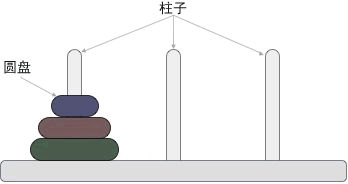

汉诺塔问题源自印度一个古老的传说，印度教的“创造之神”梵天创造世界时做了 3 根金刚石柱，其中的一根柱子上按照从小到大的顺序摞着 64 个黄金圆盘。梵天命令一个叫婆罗门的门徒将所有的圆盘移动到另一个柱子上，移动过程中必须遵守以下规则：

-   每次只能移动柱子最顶端的一个圆盘；
-   每个柱子上，小圆盘永远要位于大圆盘之上；

图 1 展示了包含 3 个圆盘的汉诺塔问题：



一根柱子上摞着 3 个不同大小的圆盘，那么在不违反规则的前提下，如何将它们移动到另一个柱子上呢？图 2 给大家提供了一种实现方案：


> 汉诺塔问题中，3 个圆盘至少需要移动 7 次，移动 n 的圆盘至少需要操作 2n-1 次

<br/>

## 分治算法解决汉诺塔问题
我们将 3 个柱子分别命名为起始柱、目标柱和辅助柱。实际上，解决汉诺塔问题是有规律可循的：  
1) 当起始柱上只有 1 个圆盘时，我们可以很轻易地将它移动到目标柱上；  
  
2) 当起始柱上有 2 个圆盘时，移动过程如下图所示：  


	
	移动过程是：先将起始柱上的 1 个圆盘移动到辅助柱上，然后将起始柱上遗留的圆盘移动到目标柱上，最后将辅助柱上的圆盘移动到目标柱上。  

3) 当起始柱上有 3 个圆盘时，移动过程如图 2 所示，仔细观察会发现，移动过程和 2 个圆盘的情况类似：先将起始柱上的 2 个圆盘移动到辅助柱上，然后将起始柱上遗留的圆盘移动到目标柱上，最后将辅助柱上的圆盘移动到目标柱上。  

	通过分析以上 3 种情况的移动思路，可以总结出一个规律：对于 n 个圆盘的汉诺塔问题，移动圆盘的过程是：
	
	1.  将起始柱上的 n-1 个圆盘移动到辅助柱上；
	2.  将起始柱上遗留的 1 个圆盘移动到目标柱上；
	3.  将辅助柱上的所有圆盘移动到目标柱上。


由此，n 个圆盘的汉诺塔问题就简化成了 n-1 个圆盘的汉诺塔问题。按照同样的思路，n-1 个圆盘的汉诺塔问题还可以继续简化，直至简化为移动 3 个甚至更少圆盘的汉诺塔问题。


**如下为分治算法解决汉诺塔问题的伪代码：**

```c
// num 表示移动圆盘的数量，source、target、auxiliary 分别表示起始柱、目标柱和辅助柱
hanoi(num , source , target , auxiliary): 
    if num == 1:     // 如果圆盘数量仅有 1 个，则直接从起始柱移动到目标柱
        print(从 source 移动到 target)
    else:
        // 递归调用 hanoi 函数，将 num-1 个圆盘从起始柱移动到辅助柱上，整个过程的实现可以借助目标柱
        hanoi(num-1 , source , auxiliary , target)
        // 将起始柱上剩余的最后一个大圆盘移动到目标柱上
        print(从 source 移动到 target) 
        // 递归调用 hanoi 函数，将辅助柱上的 num-1 圆盘移动到目标柱上，整个过程的实现可以借助起始柱               
        hanoi(n-1 , auxiliary , target , source)
```

```c
#include <stdio.h>
void HanoiRight(int n,char A,char B,char C);  // n表示盘子的数目，A表示要移动的柱子，B表示借助的柱子，C表示要放的柱子
int main(void) {
  char a = 'A';
  char b = 'B';
  char c = 'C';

  int n = 0;
  printf("请输入要移动的盘子的个数: ");
  scanf_s("%d", &n);

  HanoiRight(n, 'A', 'B', 'C');

  return 0;
}

void HanoiRight(int n, char move, char help, char end) {
  /*
  如果是1个盘子
     直接将A柱子上的盘子从A移到C
   否则
     先将A柱子上的n-1盘子借助C移动到B
     直接将A柱子上的盘子从A移到C
     最后将B柱子上的n-1盘子借助A移动到C
  */

  if (n == 1) {
    printf("将编号为%d的盘子从%c柱子移动到%c柱子\n", n, move, end);
  } else {
    HanoiRight(n - 1, move, end, help);
    printf("将编号为%d的盘子从%c柱子移动到%c柱子\n", n, move, end);
    HanoiRight(n - 1, help, move, end);
  }
}
```

