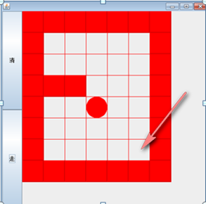

说明:

1) 小球得到的路径，和程序员  设置的找路策略有关即：找 路的上下左右的顺序相关
2) 再得到小球路径时，可以先  使用(下右上左)，再改成(上右下左)，看看路径是不是有变化
3) 测试回溯现象
4) 思考: 如何求出最短路径?


```java
public class MiGong {
    public static void main(String[] args) {
        // 先创建一个二维数组，模拟迷宫
        // 地图
        int[][] map = new int[8][7];
        // 使用1表示墙
        // 上下全部置为1
        for (int i = 0; i < 7; i++) {
            map[0][i] = 1;
            map[7][i] = 1;
        }
        // 左右全部置为1
        for (int i = 0; i < 8; i++) {
            map[i][0] = 1;
            map[i][6] = 1;
        }
        // 设置挡板
        map[3][1] = 1;
        map[3][2] = 1;
        // 输出地图
        System.out.println("地图情况");
        for (int i = 0; i < 8; i++) {
            for (int j = 0; j < 7; j++) {
                System.out.print(map[i][j] + " ");
            }
            System.out.println();
        }
        System.out.println();

        System.out.println("输出新的地图，小球走过，并标识过的递归");

        setWay(map, 1, 1);
        for (int i = 0; i < 8; i++) {
            for (int j = 0; j < 7; j++) {
                System.out.print(map[i][j] + " ");
            }
            System.out.println();
        }
    }

    /**
     * 使用递归回溯来给小球找路
     * 说明
     * 1.map表示地图
     * 2.i，j表示从地图的哪个位置开始出发(1,1)
     * 3.如果小球能到map[6][5]位置，则说明通路找到
     * 4.约定：当map[i][j]为0表示该点没有走过、当为1表示墙；2表示通路可以走；3表示该点已经走过，但走不通
     * 5.在走迷宫时，需要确定一个策略(方法) 下->右->上->左，如果改点走不通，再回溯
     *
     * @Param map 表示地图
     * @Param i 表示从那个位置开始找
     * @Param j
     * @Return 如果找到通路, 就返回true, 否则返回false
     **/
    public static boolean setWay(int[][] map, int i, int j) {
        if (map[6][5] == 2) { // 通路已经找到ok
            return true;
        } else {
            if (map[i][j] == 0) { // 如果当前这个点还没有走过
                // 按照策略下->右->上->左 走
                map[i][j] = 2; // 假定该点是可以走通

                if (setWay(map, i + 1, j)) { // 向下走
                    return true;
                }
                if (setWay(map, i, j + 1)) { // 向右走
                    return true;
                }
                if (setWay(map, i - 1, j)) { // 向上走
                    return true;
                }
                if (setWay(map, i, j - 1)) { // 向左走
                    return true;
                } else {
                    // 说明该点是走不通的，是死路
                    map[i][j] = 3;
                    return false;
                }
            } else { // 如果map[i][j]！=0，可能是1，2，3
                return false;
            }
        }
    }
}
```

