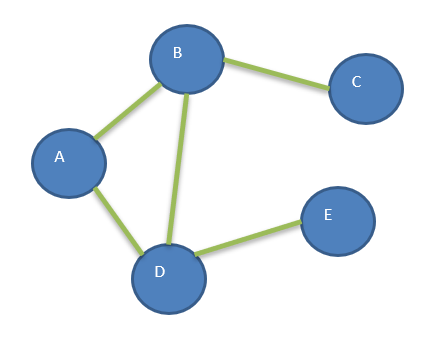
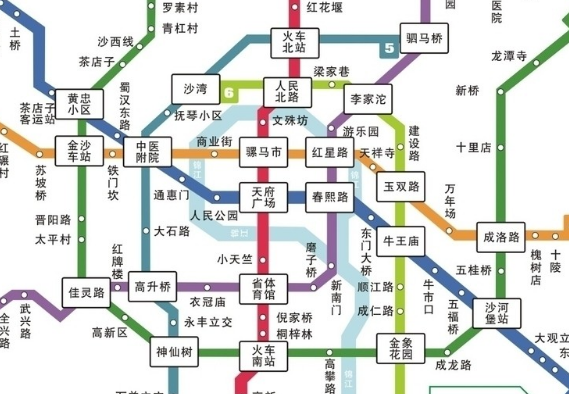
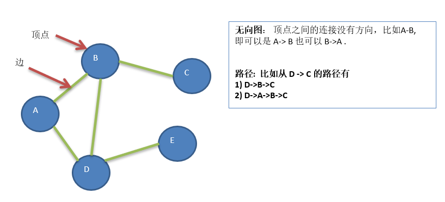
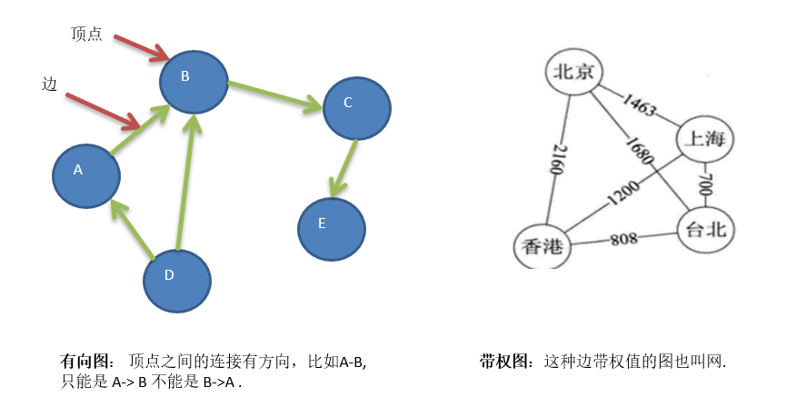
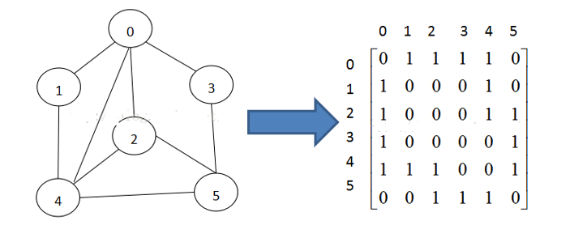
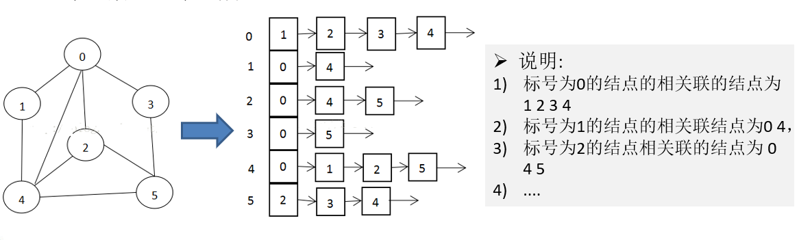
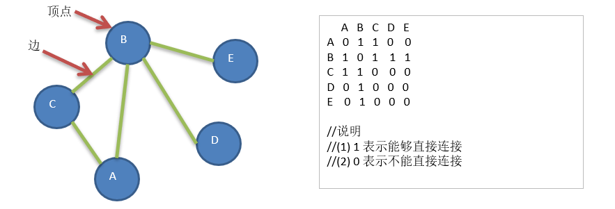
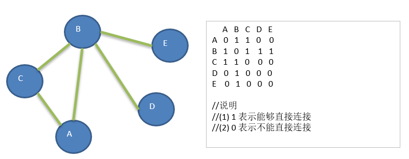
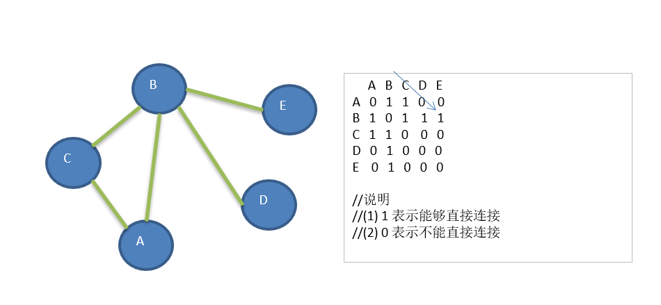
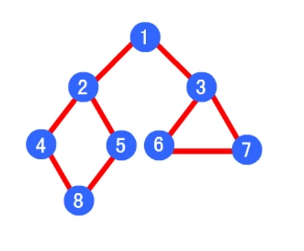

# 为什么要有图

- 线性表局限于一个直接前驱和一个直接后继的关系
- 树也只能有一个直接前驱也就是父节点
- 当我们需要**表示多对多**的关系时， 这里我们就用到了图

# 图的举例说明
图是一种数据结构，其中结点可以具有零个或多个相邻元素。两个结点之间的连接称为边。 结点也可以称为顶点。



# 图的常用概念

- 顶点(vertex)：在图中的数据元素，我们则称为顶点（在图结构中，不允许没有顶点）
- 边(edge)：图中，任意两个顶点之间都有可能有关系，顶点之间的逻辑关系用边来表示，边集可以是空的
- 路径

**无向图**
   

   > 无向边：若顶点vi到vj之间的边没有方向，则称这条边称为无向边（Edge）
   
- 用无序偶对（vi,vj）来表示。
- 如果图中任意两个顶点之间的边都是无向边，则称该图为无向图
- 在无向图中，如果任意两点之间都存在边，则称该图为无向完全图
- 含有n个顶点的无向完全图有 $n *（n-1）/ 2$ 条边

**有向图**


> 有向边：若从顶点vi到vj的边有方向，则称这条边为有向边，也称为弧(Arc)

- 用有序偶`<vi,vj>`来表示，vi称为弧尾(Tail)，vj称为弧头(Head)
- 如果图中任意两个顶点之间都是有向边，则称该图为有向图(directed graphs)
- 连接顶点A到D的有向边就是弧，A是弧尾，D是弧头，<A,D>表示弧，注意不能写成<D,A>
- 在有向图中，如果任意两个顶点之间都存在方向相反的两条弧，则称该图为有向完全图
- 含有n个顶点的有向完全图有$n *（n-1）$条边

**带权图（上图）**
   与图的边或弧相关的数叫做权（Weight）
   这种权可以表示从一个顶点到另一个顶点的距离或耗费。
   这种带权的图通常称为网（Network）。

# 图的顶点与边间的关系

对于无向图$G=(V,{E})$，如果边$(v，v')∈E$，则称顶点v与v'互为邻接点（Adjacent）,即v和v'相邻接。

# 图的表示方式

图的表示方式有两种：二维数组表示（邻接矩阵）、链表表示（邻接表）。

## 邻接矩阵

邻接矩阵是表示图形中顶点之间相邻关系的矩阵，对于n个顶点的图而言，矩阵是的row和col表示的$1....n$个点

在邻接矩阵中，算法需要遍历邻接矩阵的每一个点，而邻接矩阵有$n*n$个点，所以时间复杂度是$O(n*n)$



## 邻接表

邻接矩阵需要为每个顶点都分配n个边的空间，其实有很多边都是不存在,会造成空间的一定损失

邻接表的实现只关心存在的边，不关心不存在的边。因此没有空间浪费，邻接表由数组+链表组成

在邻接表中，就是要依次访问每个顶点，然后在每个顶点中依次访问每条边，把这些边的终点的入度+1，也就是每个顶点和每条边依次要各访问一遍，所以时间复杂度是$O(n+e)$



   


# 图的快速入门案例

要求: 代码实现如下图结构

   
思路分析 
- `存储顶点String` 使用 `ArrayList` 
- 使用矩阵(二维数组) `int[][] edges` 来保存 各个顶点之间的是否能够**直接连接**

代码实现
```java
public class Graph {
   
    private ArrayList<String> vertexList; // 存储顶点的集合
    private int[][] edges; // 存储图对应的邻接矩阵
    private int numOfEdges;// 表示边的数目
    
    // 定义给数组boolean[],记录某个结点是否被访问
    private boolean[] isVisited;

   
    // 构造器
    public Graph(int n) {
        // 初始化矩阵和vertexList
        edges = new int[n][n];
        vertexList = new ArrayList<>(n);
        numOfEdges = 0;
        isVisited = new boolean[n];
    }
```

   


# 图的深度优先遍历介绍

## 图遍历介绍

所谓图的遍历，即是对结点的访问。一个图有那么多个结点，如何遍历这些结点，需要特定策略，一般有两种访问策略
- 深度优先遍历 
- 广度优先遍历

## 深度优先遍历基本思想

图的深度优先搜索(Depth First Search) 

1. 深度优先遍历，从初始访问结点出发，初始访问结点可能有多个邻接结点，深度优先遍历的策略就是首先访问第一个邻接结点，然后再以这个被访问的邻接结点作为初始结点，访问它的第一个邻接结点， 可以这样理解：每次都在访问完**当前结点**后首先访问**当前结点的第一个邻接结点**。
2. 我们可以看到，这样的访问策略是优先往纵向挖掘深入，而不是对一个结点的所有邻接结点进行横向访问。
3. 显然，深度优先搜索是一个递归的过程

### **深度优先遍历算法步骤**

1. 访问初始结点v，并标记结点v为已访问。
2. 查找结点v的第一个邻接结点w。
3. 若w存在，则继续执行4，如果w不存在，则回到第1步，将从v的下一个结点继续。
4. 若w未被访问，对w进行深度优先遍历递归（即把w当做另一个v，然后进行步骤123）。
5. 查找结点v的w邻接结点的下一个邻接结点，转到步骤3。

**看一个具体案例分析**

要求：对下图进行深度优先搜索, 从A 开始遍历


**思路分析**
- 首先访问初始结点 A，并将 A 标记为已访问
- 方法会查找A的第一个邻接点 B，判断 B 是否存在
- 如果存在，会以 B 开始，查找 B 的第一个邻接点 C，并将 B 标记成已访问
- 在找到判断 C 后，会在以 C 开始，查找它的第一个邻接点，但是会发现C的邻接结点B和A已经访问并且标记了。
- 这时会回溯到B，从B开始查找邻接点，后面B会访问到A、C，但是A、C已经被标记了，就会找到D。

**代码实现**
```java
// 深度优先算法
// i 第一次就是 0
private void dfs(boolean[] isVisited, int i) {
    // 首先我们访问该结点，输出
    System.out.print(getValueByIndex(i) + "->");
    // 将结点设置为已经访问
    isVisited[i] = true;
    // 查找结点 i 的第一个邻接结点 w
    int w = getFirstNeighbor(i);
    while (w != -1) {
        if (!isVisited[w]) {
            dfs(isVisited, w);
        }
        // 如果w结点已经被访问过
        w = getNextNeighbor(i, w);
    }
}

// 对dfs 进行一个重载，遍历我们所有的结点，并进行dfs
public void dfs() {
    // 遍历所有的结点，进行dfs[回溯]
    for (int i = 0; i < getNumOfVertex(); i++) {
        if (!isVisited[i]) {
            dfs(isVisited, i);
        }
    }
}
```


## 广度优先遍历基本思想

**图的广度优先搜索(Broad First Search)**
类似于一个分层搜索的过程，广度优先遍历需要使用一个队列以保持访问过的结点的顺序，以便按这个顺序来访问这些结点的邻接结点


###  广度优先遍历算法步骤

1. 访问初始结点v并标记结点v为已访问
2. 结点v入队列
3. 当队列非空时，继续执行，否则算法结束
4. 出队列，取得队头结点u
5. 查找结点u的第一个邻接结点w
6. 若结点u的邻接结点w不存在，则转到步骤3
7. 否则循环执行以下三个步骤
   1. 若结点w尚未被访问，则访问结点w并标记为已访问。 
   2. 结点w入队列 
   3. 查找结点u的继w邻接结点后的下一个邻接结点w，转到步骤6。

**看一个具体案例分析**
1. 要求：对下图进行深度优先搜索, 从A 开始遍历.



**思路分析**
- 首先访问初始结点 A，会将 A 结点入队列并将 A 标记为已访问
- 在队列不为空时，取出队列第一个元素 A，根据 A 得到一个邻接结点 B
- 在将 B 入队列，接着 A 继续查找除了 B 之外的邻接结点
- 找到 C 后并将入队，A 会查找
- 但是 A 会找不到其他的邻接结点，这时 取出队列的第一个元素 B 会以 B 开始查找 其他的邻接结点

**代码实现**
```java
// 对一个结点进行广度优先遍历的方法
private void bfs(boolean[] isVisited, int i) {
    int u;// 表示队列的头节点对应下标
    int w;// 邻接结点w
    // 队列，记录结点访问的顺序
    LinkedList queue = new LinkedList();
    // 访问结点，输出结点信息
    System.out.println(getValueByIndex(i) + "=>");
    // 标记为已访问
    isVisited[i] = true;
    // 将结点加入队列
    queue.addLast(i);

    while (!queue.isEmpty()) {
        // 取出队列的头结点下标
        u = (int) queue.removeFirst();
        // 得到第一个邻接结点的下标 w
        w = getFirstNeighbor(u);
        while (w != -1) { // 找到
            // 是否访问过
            if (!isVisited[w]) {
                System.out.println(getValueByIndex(w) + "=>");
                // 标记已经访问
                isVisited[w] = true;
                //入队
                queue.addLast(w);
            }
            // 以 u 为前驱点，找到后面的下一个邻结点
            w = getNextNeighbor(u, w);
        }
    }
}

// 遍历所有的结点，都进行广度优先搜索
public void bfs() {
    for (int i = 0; i < getNumOfVertex(); i++) {
        if (!isVisited[i]) {
            bfs(isVisited, i);
        }
    }
}
```


# 图的深度优先VS广度优先

**应用实例**



1. 深度优先遍历顺序为 1->2->4->8->5->3->6->7

2. 广度优先算法的遍历顺序为：1->2->3->4->5->6->7->8 

**思路分析：**

深度优先遍历

```html
1->2, 2->4，4 -> 8，8 -> 5
5 会继续找 ，但是2 和8 已经被访问到了,这时递归就会回溯
回到1，从以开始继续找，会找到3 -> 6 -> 7
```

广度优先遍历

```html
1 -> 2, 1 -> 3, 2和3会入队，1后面会继续找 但是没有邻接节点了
会从队列里取出 2 ,从2 开始查找邻接结点 2 -> 4 ,2 -> 5,并且 4和5 会入队
2 后面也找不到邻接结点 ,会从队列里取出3 从 3 开始查找邻接结点
3 -> 6, 3 -> 7
```


# 完整代码

```java
package graph;

import java.util.ArrayList;
import java.util.Arrays;
import java.util.LinkedList;


public class Graph {
    public static void main(String[] args) {
        Graph graph = new Graph(5);
        String[] Vertex = new String[]{"A", "B", "C", "D", "E"};
        for (String vertex : Vertex) {
            graph.insertVertex(vertex);
        }


        graph.insertEdge(0, 1, 1);
        graph.insertEdge(0, 2, 1);
        graph.insertEdge(1, 2, 1);
        graph.insertEdge(1, 3, 1);
        graph.insertEdge(1, 4, 1);

        graph.showGraph();

        graph.dfs();
    }

    private ArrayList<String> vertexList; // 存储顶点的集合
    private int[][] edges;// 存储图对应的邻接矩阵
    private int numOfEdges;// 表示边的数目
    // 定义给数组boolean[],记录某个结点是否被访问
    private boolean[] isVisited;


    // 构造器
    public Graph(int n) {
        // 初始化矩阵和vertexList
        edges = new int[n][n];
        vertexList = new ArrayList<>(n);
        numOfEdges = 0;
        isVisited = new boolean[n];
    }

    // 插入结点
    public void insertVertex(String vertex) {
        vertexList.add(vertex);
    }

    // 添加边

    /**
     * @param v1     表示点的下标 即是第几个顶点 "A" - "B"  "A" -> 0 "B" -> 1
     * @param v2     顶点对应第二个顶点的下标
     * @param weight 表示顶点之间关系
     */
    public void insertEdge(int v1, int v2, int weight) {
        edges[v1][v2] = weight;
        edges[v2][v1] = weight;
        numOfEdges++;
    }

    // 深度优先算法
    // i 第一次就是 0
    private void dfs(boolean[] isVisited, int i) {
        // 首先我们访问该结点，输出
        System.out.print(getValueByIndex(i) + "->");
        // 将结点设置为已经访问
        isVisited[i] = true;
        // 查找结点 i 的第一个邻接结点 w
        int w = getFirstNeighbor(i);
        while (w != -1) {
            if (!isVisited[w]) {
                dfs(isVisited, w);
            }
            // 如果w结点已经被访问过
            w = getNextNeighbor(i, w);
        }

    }

    // 对dfs 进行一个重载，遍历我们所有的结点，并进行dfs
    public void dfs() {
        // 遍历所有的结点，进行dfs[回溯]
        for (int i = 0; i < getNumOfVertex(); i++) {
            if (!isVisited[i]) {
                dfs(isVisited, i);
            }
        }
    }

    // 对一个结点进行广度优先遍历的方法
    private void bfs(boolean[] isVisited, int i) {
        int u;// 表示队列的头节点对应下标
        int w;// 邻接结点w
        // 队列，记录结点访问的顺序
        LinkedList queue = new LinkedList();
        // 访问结点，输出结点信息
        System.out.println(getValueByIndex(i) + "=>");
        // 标记为已访问
        isVisited[i] = true;
        // 将结点加入队列
        queue.addLast(i);

        while (!queue.isEmpty()) {
            // 取出队列的头结点下标
            u = (int) queue.removeFirst();
            // 得到第一个邻接结点的下标 w
            w = getFirstNeighbor(u);
            while (w != -1) { // 找到
                // 是否访问过
                if (!isVisited[w]) {
                    System.out.println(getValueByIndex(w) + "=>");
                    // 标记已经访问
                    isVisited[w] = true;
                    //入队
                    queue.addLast(w);
                }
                // 以 u 为前驱点，找到后面的下一个邻结点
                w = getNextNeighbor(u, w);
            }
        }

    }

    // 遍历所有的结点，都进行广度优先搜索
    public void bfs() {
        for (int i = 0; i < getNumOfVertex(); i++) {
            if (!isVisited[i]) {
                bfs(isVisited, i);
            }
        }
    }

    // 得到第一个邻接结点的下标
    public int getFirstNeighbor(int index) {
        for (int i = 0; i < vertexList.size(); i++) {
            if (edges[index][i] > 0) {
                return i;
            }
        }
        return -1;
    }

    // 根据前一个邻接结点的下标来获取下一个邻接结点
    public int getNextNeighbor(int v1, int v2) {
        for (int i = v2 + 1; i < vertexList.size(); i++) {
            if (edges[v1][i] > 0) {
                return i;
            }
        }
        return -1;
    }


    // 图中常用的方法
    // 返回结点的个数
    public int getNumOfVertex() {
        return vertexList.size();
    }


    //得到边的数目
    public int getNumOfEdges() {
        return numOfEdges;
    }

    //返回结点i(下标)对应的数据
    public String getValueByIndex(int index) {
        return vertexList.get(index);
    }

    // 返回v1和v2的权值
    public int getWeight(int v1, int v2) {
        return edges[v1][v2];
    }

    // 显示图对应的矩阵
    public void showGraph() {
        for (int[] link : edges) {
            System.out.println(Arrays.toString(link));
        }
    }
}

```

