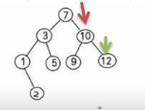
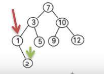
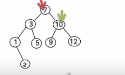

**先看一个需求**
给你一个数列 (7, 3, 10, 12, 5, 1, 9)，要求能够高效的完成对数据的查询和添加。


**解决方案分析**
使用数组
![[attachment/图片2.png]]
1. 数组未排序， 优点：直接在数组尾添加，速度快。 缺点：查找速度慢. 
2. 数组排序，优点：可以使用二分查找，查找速度快，缺点：为了保证数组有序，在添加新数据时，找到插入位置后，后面的数据需整体移动，速度慢。
3. 使用链式存储-链表：不管链表是否有序，查找速度都慢，添加数据速度比数组快，不需要数据整体移动。
4. 使用二叉排序树


# 二叉排序树介绍

二叉排序树：BST: (Binary Sort(Search) Tree), 对于二叉排序树的**任何一个非叶子节点，要求左子节点的值比当前节点的值小，右子节点的值比当前节点的值大。**

特别说明：如果有相同的值，可以将该节点放在左子节点或右子节点

比如针对前面的数据 (7, 3, 10, 12, 5, 1, 9) ，对应的二叉排序树为：
![[attachment/5.png]]
从上面的分析可以看出，对于二叉排序树而言，其检索速度，添加速度都比较好。
我们在进行插入的时候，仍然需要先找到适当的节点位置，但是查找位置的速度很快，类似二分查找效率


# 二叉排序树创建和遍历
一个数组创建成对应的二叉排序树，并使用中序遍历二叉排序树，比如: 数组为 Array(7, 3, 10, 12, 5, 1, 9) ，创建成对应的二叉排序树为 :

```java
   	// 添加结点的方法
    // 递归的形式添加结点，注意需要满足二叉排序数的要求
    public void add(Node node) {
        if (node == null) {
            return;
        }
        // 判断传入的结点的值，和当前子树的根节点的值关系
        if (node.value < this.value) {
            // 如果当前结点左子结点为null
            if (this.left == null) {
                this.left = node;
            } else {
                // 递归的向右左子树添加
                this.left.add(node);
            }
        } else { // 添加的结点的值大于当前结点的值
            if (this.right == null) {
                this.right = node;
            } else {
                // 递归的向右子树添加
                this.right.add(node);
            }
        }
    }
```

# **二叉排序树的删除**
二叉排序树的删除情况比较复杂，有下面三种情况需要考虑
1. 删除叶子节点 (比如：2, 5, 9, 12)
2. 删除只有一颗子树的节点 (比如：1)
3. 删除有两颗子树的节点. (比如：7, 3，10 )


## 情况一：删除叶子节点（比如 2,5,9,12）
删除的节点是叶子节点，即该节点下没有左右子节点。例如下图的12结点


**思路**
需要先去找到要删除的结点 targetNode（12）
```java
	Node targetNode = search(value);
```

找到targetNode 的 父结点 parent （10）
```java
	Node parent = searchParent(value);
```

确定 targetNode 是 parent的左子结点 还是右子结点
```java
	// 如果要删除的结点是叶子节点
	if (targetNode.left == null && targetNode.right == null) {
		// 判断 targetNode 是父结点的左子节点，还是右子结点
        if (parent.left != null && parent.left.value == value) {// 是左子结点
            parent.left = null;
   		} else if (parent.right != null && parent.right.value == value) {// 是右子结
        	parent.right = null;
        }
    }
```


## 情况二：删除只有一颗子树的节点（比如1）
删除的节点有一个子节点，即该节点有左子节点或者右子节点。



**思路**
1. 需求先去找到要删除的结点 targetNode （2）
   ```java
   	Node targetNode = search(value);
   ```

2. 找到targetNode 的 父结点 parent （1）
 ```java
	Node parent = searchParent(value);
```

3. 确定 targetNode 的子结点是左子结点还是右子结点
   ```java
	   if (targetNode.left != null) {
	       ...
	   } else {
	       ...
	   }
   ```

4. targetNode 是 parent 的左子结点还是右子结点
   ```java
       if (parent.left.value == value) {
           ...
       } else {
           ...
       }
   ```

- 如果targetNode 有左子结点
   1. 如果 targetNode 是 parent 的左子结点
      ```java 
      parent.left = targetNode.left;
      ```

   2. 如果 targetNode 是 parent 的右子结点
      ```java
      parent.right = targetNode.left;
      ```

- 如果targetNode 有右子结点
   1. 如果targetNode 是 parent的左子节点
      ```java
      parent.left = targetNode.right;
      ```

   2. 如果targetNode 是 parent 的右子节点
      ```java
      parent.right = targetNode.right;
      ```

代码：
```java
 				// 如果要删除的结点有左子节点
                if (targetNode.left != null) {
                    if (parent != null) {
                        // 如果 targetNode 是 parent 的左子节点
                        if (parent.left.value == value) {
                            parent.left = targetNode.left;
                        } else { // target是 parent 的右子结点
                            parent.right = targetNode.left;
                        }
                    } else {
                        root = targetNode.left;
                    }

                } else {// 如果删除的结点有右子结点
                    if (targetNode.right != null) {
                        // 如果 targetNode 是 parent 的左子结点
                        if (parent.right.value == value) {
                            parent.right = targetNode.right;
                        } else { // 如果targetNode 是parent 的右子节点
                            parent.left = targetNode.right;
                        }
                    } else {
                        root = targetNode.right;
                    }
                }
```


##  情况三：删除有两颗子树的节点(比如：7, 3，10)
删除的节点有两个子节点，即该节点有左子节点和右子节点。



**思路**
1. 需要先去找到要删除的结点 targetNode（10）
```java
	Node targetNode = search(value);
```

2. 找到 targetNode 的 父结点 parent （7）
```java
	Node parent = searchParent(value);
```

3. 从 targetNode 的右子树找到最小的结点

4. 用一个临时变量，将 最小结点的值保存 temp = 12

5. 删除该最小结点
   ```java
      public int delRigidNodeMin(Node node) {
           Node target = node;
           while (target.left != null) {
               target = target.left;
           }
           delNode(target.value);
           return target.value;
       }
   ```

6. 将最小结点的值，修改到要删除的结点
   ```java
   } else if (targetNode.left != null && targetNode.right != null) {
             int minVal = delRigidNodeMin(targetNode.right);
             parent.right.value = minVal;
   }
   ```

   
# 完整代码

```java
package tree.binarysorttree;


public class BinarySortTreeDemo {
    public static void main(String[] args) {
        int[] arr = {7, 3, 10, 12, 5, 1, 9};
        BinarySortTree binarySortTree = new BinarySortTree();

        // 循环的添加结点到二叉排序树
        for (int j : arr) {
            binarySortTree.add(new Node(j));
        }
        binarySortTree.delNode(10);

        binarySortTree.infixOrder();
    }
}

// 创建二叉排序树
class BinarySortTree {
    private Node root;

    // 添加结点的方法
    public void add(Node node) {
        if (root == null) {
            root = node;//如果root 为空则直接让root指向node
        } else {
            root.add(node);
        }
    }

    // 遍历
    public void infixOrder() {
        if (root == null) {
            System.out.println("二叉排序树为空，不能遍历");
        } else {
            root.infixOrder();
        }
    }

    // 查找要删除的结点
    public Node search(int value) {
        if (root == null) {
            return null;
        } else {
            return root.search(value);
        }
    }


    // 查找父结点
    public Node searchParent(int value) {
        if (root == null) {
            return null;
        } else {
            return root.searchParent(value);
        }
    }

    // 删除结点
    public void delNode(int value) {
        if (root == null) {
            return;
        } else {
            // 1. 需求先去找到要删除的结点 targetNode
            Node targetNode = search(value);
            // 如果没有找到要删除的结点
            if (targetNode == null) {
                return;
            }
            // 如果我们发现当前这颗二叉排序树只有一个结点
            if (root.left == null && root.right == null) {
                root = null;
                return;
            }

            // 去找到targetNode的父结点
            Node parent = searchParent(value);

            //如果要删除的结点是叶子节点
            if (targetNode.left == null && targetNode.right == null) {
                // 判断targetNode 是父结点的左子节点，还是右子结点
                if (parent.left != null && parent.left.value == value) {// 是左子结点
                    parent.left = null;
                } else if (parent.right != null && parent.right.value == value) {// 是右子结点
                    parent.right = null;
                }
            } else if (targetNode.left != null && targetNode.right != null) {
                int minVal = delRigidNodeMin(targetNode.right);
                parent.right.value = minVal;
            } else { //删除的只有一个子树的结点
                // 如果要删除的结点有左子节点
                if (targetNode.left != null) {

                    // 有一个情况当只有root结点和一个子节点时，如果要删除根节点。在获取根节点的父节点，会发生空指针异常
                    // 所以需要判断当获取到的父节点为空时，就发生上面的情况，就将root指向根节点的子节点
                    if (parent != null) {
                        // 如果 targetNode 是 parent 的左子节点
                        if (parent.left.value == value) {
                            parent.left = targetNode.left;
                        } else { // target是 parent 的右子结点
                            parent.right = targetNode.left;
                        }
                    } else {
                        root = targetNode.left;
                    }

                } else {// 如果删除的结点有右子结点
                    if (targetNode.right != null) {
                        // 如果 targetNode 是 parent 的左子结点
                        if (parent.right.value == value) {
                            parent.right = targetNode.right;
                        } else { // 如果targetNode 是parent 的右子节点
                            parent.left = targetNode.right;
                        }
                    } else {
                        root = targetNode.right;
                    }
                }
            }

        }
    }

    public int delRigidNodeMin(Node node) {
        Node target = node;
        while (target.left != null) {
            target = target.left;
        }
        delNode(target.value);
        return target.value;
    }
}

class Node {
    int value;
    Node left;
    Node right;

    public Node(int value) {
        this.value = value;
    }

    // 添加结点的方法
    // 递归的形式添加结点，注意需要满足二叉排序数的要求
    public void add(Node node) {
        if (node == null) {
            return;
        }
        // 判断传入的结点的值，和当前子树的根节点的值关系
        if (node.value < this.value) {
            // 如果当前结点左子结点为null
            if (this.left == null) {
                this.left = node;
            } else {
                // 递归的向右左子树添加
                this.left.add(node);
            }
        } else { // 添加的结点的值大于当前结点的值
            if (this.right == null) {
                this.right = node;
            } else {
                // 递归的向右子树添加
                this.right.add(node);
            }
        }
    }

    // 查找要删除的结点

    /**
     * @param value 希望删除的结点的值
     * @return 如果找到返回该结点，否者返回null
     */
    public Node search(int value) {
        if (this.value == value) { // 找到就是该结点
            return this;
        }
        if (this.value > value) {// 如果查找的值小于当前结点，向左子树递归查找
            // 如果左子结点为空
            if (this.left == null) {
                return null;
            }
            return this.left.search(value);
        } else { // 如果查找的值不小于当前结点，向左子树递归查找
            if (this.right == null) {
                return null;
            }
            return this.right.search(value);
        }
    }

    // 查找要删除的父结点
    public Node searchParent(int value) {
        if ((this.left != null && this.left.value == value) || (this.right != null && this.right.value == value)) {
            return this;
        } else {
            // 如果查找的值小于当前结点的值，并且当前结点的左子结点不为空
            if (value < this.value && this.left != null) {
                return this.left.searchParent(value); // 向左子树递归查找
            } else if (value > this.value && this.right != null) {
                return this.right.searchParent(value);// 右子树递归查找
            } else {
                return null; // 没有找到父结点
            }
        }
    }

    // 中序遍历
    public void infixOrder() {
        if (this.left != null) {
            this.left.infixOrder();
        }
        System.out.println(this);
        if (this.right != null) {
            this.right.infixOrder();
        }
    }

    @Override
    public String toString() {
        return "Node{" +
                "value=" + value +
                '}';
    }
}
```

