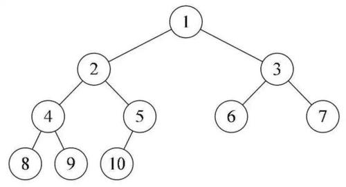
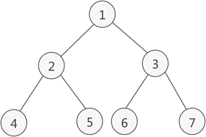
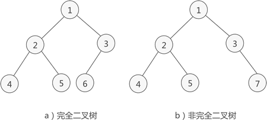

# 二叉树的概念
1.  任意一个节点的子节点个数最多两个，且子节点的位置不可更改，即左子树和右子树的位置不可更改。
2.  二叉树的子节点分为左节点和右节点。

# 二叉树的性质
- 性质1：**在二叉树的第i层至多有$2^{i-1}$个结点（i>=1)**
![[attachment/Pasted image 20220521095916.png]]
  例上图：
	第一层是根节点，只有一个，所以$2^{1-1}=2^{0}=1$
	第3层有4个，$2^{3-1}=2^{2}=4$

- 性质2：**在深度为k的二叉树至多有$2^{k}-1$个结点（k >= 1）**
  深度为k的意思就是有k层的二叉树，我们先来看看简单的
  如果有一层，至多$2^{1}-1$个节点
  如果有二层，至多$2^{2}-1$个节点
  如果有三层，至多$2^{3}-1$个节点
  
- 性质3：对于任何一个二叉树T，如果其终端结点数为$n_{0}$,，度为2的结点数为$n_{2}$，则$n_{0}=n_{2}+1$

  

  设叶子结点数为$n_{0}$，$n_{1}$为度是1的结点数，$n_{2}$为度是2的结点数，则树T结点总数为
$$n=n_{0}+n_{1}+n_{2}$$
  如图，结点数为10，它由1、2、3、4等度为2结点，6、7、8、9、10等度为0的叶子结点和5这个度为1的结点组成。总和为4+1+5=10

  我们换个角度，再数一数它的连接线数，由于根节点只有分支出去，没有分支进入，所以**分支线总数为结点总数减1**。上图就是9各分支，对于1、2、3、4结点来说，他们都有两个分支线出去，而5结点只有一个分支线出去。所以总分支线为4×2+1×1=9

  用代数表达就是分支线总数=$n-1=n_{1}+2n_{2}$，因为刚才我们有等式，$n=n_{0}+n_{1}+n_{2}$可以推导出$$n_{0}+n_{1}+n_{2}-1=n_{1}+n_{2}$$
  结论就是$n_{0}=n_{2}+1$

- 性质4：具有n个结点的完全二叉树的深度为$\left| \log_2n \right|+1$ (X表示不大于x的最大整数）

- 性质5：如果对一颗有n结点的完全二叉树其深度为$\log_2n +1$ 的结点按层序编号（从第1层到第$\log_2n +1$层，每层从左到右），对任一结点i（1 <= i <= n）有：
	-   如果i=1，则结点i是二叉树的根，无双亲；如果i>1,则起双亲是结点i/2
	-   如果$2_{i}$>n,则结点i无左孩子（结点i为叶子结点），否则其左孩子是结点$2_{i}$
	-   如果$2_{i}$+1>n，则结点i无右孩子；否则其右孩子是结点$2_{i}+1$

# 特殊的二叉树
## 满二叉树
**在不增加树的层数的前提下，无法再多添加一个节点的二叉树就是满二叉树**，及所有的节点都是两个度数（两个子节点）

特点：
  - 叶子只能出现在最下一层。出现在其他层就不可能达到平衡
  - 非叶子结点的度一定是2，否则就是“缺胳膊扫腿”了
  - 在同样深度的二叉树中，满二叉树的结点个数最多，叶子数最多

## 完全二叉树
如果只是删除了满二叉树最底层最右边的连续若干个节点，这样形成的二叉树就是完全二叉树。**满二叉树只是完全二叉树的一个特例。**

特点：
  - 叶子结点只能出现在最下两层。
  - 最下层的叶子一定**集中在左边连续位置**
  - 倒数两层，若有叶子结点，一定在右边连续位置
  - 如果结点度为1，则该结点只有左孩子即不存在右子树的情况
  - 同样结点数的二叉树，完全二叉树的深度最小

