# 二叉树与B树

**二叉树的问题分析**

二叉树的操作效率较高，但是也存在问题, 请看下面的二叉树

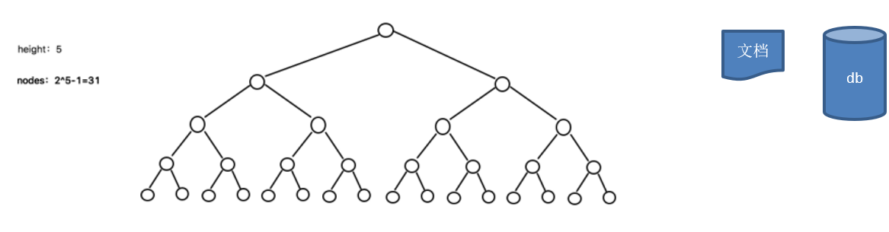

1. **二叉树需要加载到内存的，如果二叉树的节点少，没有什么问题，但是如果二叉树的节点很多(比如1亿)， 就存在如下问题:**

2. **问题1：在构建二叉树时，需要多次进行 i/o 操作(海量数据存在数据库或文件中)，节点海量，构建二叉树时，速度有影响**

3. **问题2：节点海量，也会造成二叉树的高度很大，会降低操作速度.**

 

# **多叉树**

1. 在二叉树中，每个节点有数据项，最多有两个子节点。如果**允许每个节点可以有更多的数据项和更多的子节点**，就是**多叉树（ multiway tree）**

2. **后面我们讲解的2-3树，2-3-4树就是多叉树，多叉树通过重新组织节点，减少树的高度，能对二叉树进行优化。**

3. **举例说明(下面2-3树就是一颗多叉树)**

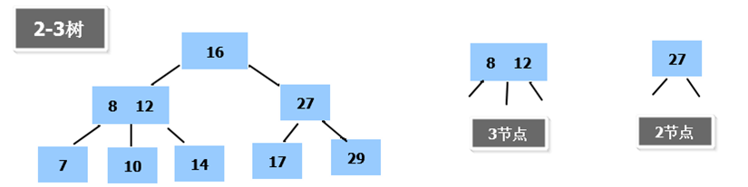

​	

 

# **B树的基本介绍**

B树通过重新组织节点，降低树的高度，并且减少 i/o 读写次数来提升效率。

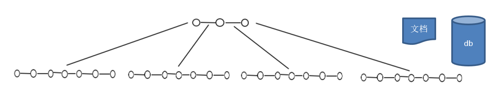

1. **如图B树通过重新组织节点， 降低了树的高度.**

2. **文件系统及数据库系统的设计者利用了磁盘预读原理，将一个节点的大小设为等于一个页(页得大小通常为4k)，这样每个节点只需要一次I/O就可以完全载入**

3. 将树的度M设置为1024，在600亿个元素中最多只需要4次I/O操作就可以读取到想要的元素, B树(B+)广泛应用于文件存储系统以及数据库系统中

 

# 2-3树

## 2-3树基本介绍

2-3树是最简单的B树结构, 具有如下特点:

1. **2-3树的所有叶子节点都在同一层.(只要是B树都满足这个条件)**
2. **有两个子节点的节点叫二节点，二节点要么没有子节点，要么有两个子节点.**
3. **有三个子节点的节点叫三节点，三节点要么没有子节点，要么有三个子节点.**
4. **2-3树是由二节点和三节点构成的树。**

## 2-3树应用案例

将数列{16, 24, 12, 32, 14, 26, 34, 10, 8, 28, 38, 20} 构建成2-3树，并保证数据插入的大小顺序。(演示一下构建2-3树的过程.)

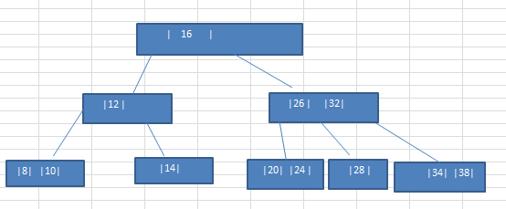

**插入规则:**

1. 2-3树的所有叶子节点都在**同一层**.(只要是B树都满足这个条件)

2. 有两个子节点的节点叫二节点，二节点**要么没有子节点，要么有两个子节点.**

3. 有三个子节点的节点叫三节点，三节点**要么没有子节点，要么有三个子节点.**

4. 当按照规则插入一个数到某个节点时，不能满足上面三个要求，就需要拆，先向上拆，如果上层满，则拆本层，拆后仍然需要满足上面3个条件。 

5. 对于三节点的子树的值大小仍然遵守(BST 二叉排序树)的规则

   

## 图解

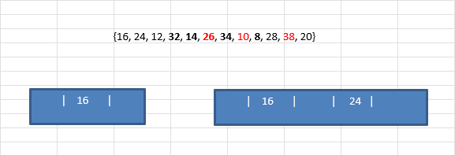

取出16和24构建成根结点

取出12值，当放入结点时，当前结点已经存放两个值了，只能让16和24的结点左指向12。

但是不满足规则2，所以向上拆16和24结点，让16结点右指向24

在根据规则5，向右加入32

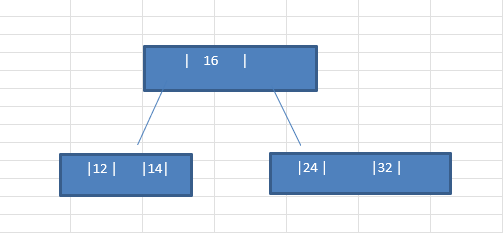

根据规则5，向左加入14

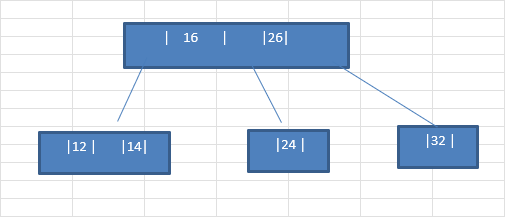

## 其它说明

除了23树，还有234树等，概念和23树类似，也是一种B树。 如图:

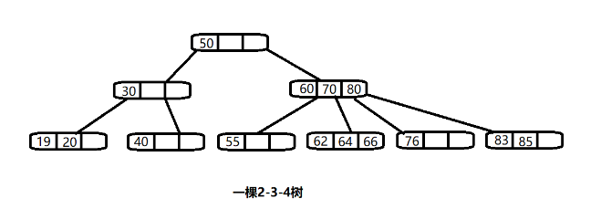

# B 树的介绍

 **[B-tree](https://baike.baidu.com/item/B-tree/6606402)树即[B](https://baike.baidu.com/item/B树/5411672)[树](https://baike.baidu.com/item/B树/5411672)**，B即Balanced，平衡的意思。有人把B-tree翻译成B-树，容易让人 产生[误解](https://baike.baidu.com/item/误解/8094198)。会以为B-树是一种树，而B树又是另一种树。实际上，**B-tree就是指的B树。**

前面已经介绍了2-3树和2-3-4树，他们就是B树(英语：B-tree 也写成B-树)，这里我们再做一个说明，我们在学习MySQL时，经常听到说某种类型的索引是基于B树或者B+树的，如图:

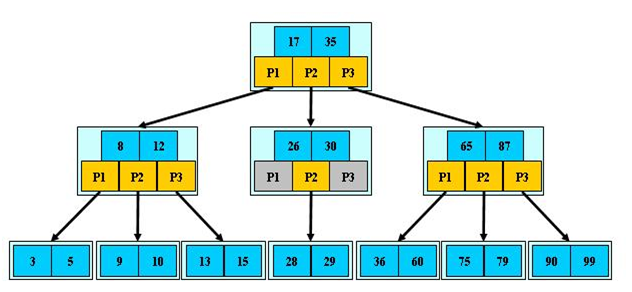

**B树的说明:**

1. B树的阶：节点的**最多子节点个数**。比如2-3树的阶是3，2-3-4树的阶是4

2. B-树的搜索，从根结点开始，对结点内的关键字（有序）序列进行二分查找，如果命中则结束，否则进入查询关键字所属范围的儿子结点；重复，直到所对应的儿子指针为空，或已经是叶子结点

3. 关键字集合分布在整颗树中, 即**叶子节点和非叶子节点都存放数据**.

4. 搜索有可能在非叶子结点结束

5. 其搜索性能等价于在关键字全集内做一次二分查找

# B+树的介绍

B+树是B树的变体，也是一种多路搜索树。

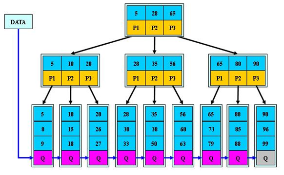

**B+树的说明:**

1. B+树的搜索与B树也基本相同，区别是B+树只有达到叶子结点才命中（B树可以在非叶子结点命中），其性能也等价于在关键字全集做一次二分查找

2. 所有**关键字都出现在叶子结点的链表中**（即数据只能在叶子节点【也叫稠密索引】），且链表中的关键字(数据)恰好是有序的。

3. 不可能在非叶子结点命中

4. 非叶子结点相当于是叶子结点的索引（稀疏索引），叶子结点相当于是存储（关键字）数据的数据层

5. 更适合文件索引系统

6. B树和B+树各有自己的应用场景，不能说B+树**完全比**B树好，反之亦然.

# B*树的介绍

B*树是B+树的变体，在B+树的非根和非叶子结点**再增加指向兄弟的指针。**

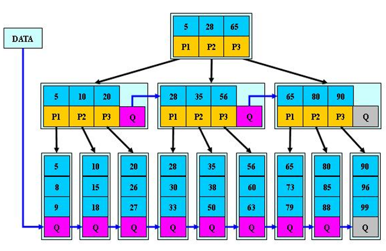

**B\* 树的说明：**

1. B\*树定义了非叶子结点关键字个数至少为(2/3)*M，即块的最低使用率为2/3，而B+树的块的最低使用率为B+树的1/2。

2. 从第1个特点我们可以看出，B*树分配新结点的概率比B+树要低，空间使用率更高

