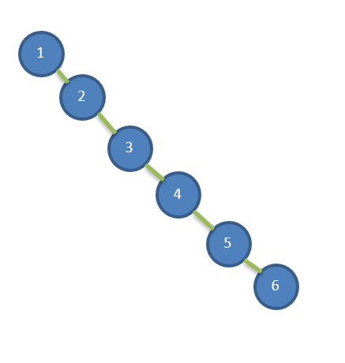
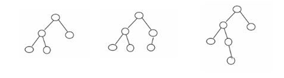
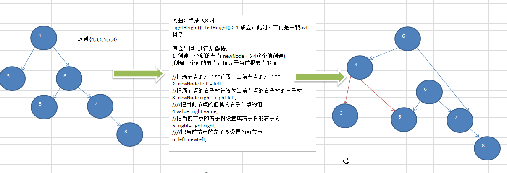
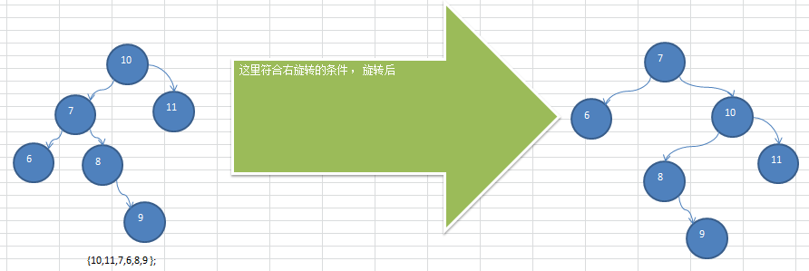
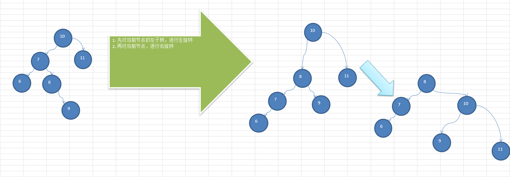

**看一个案例(说明二叉排序树可能的问题)**

给你一个数列{1,2,3,4,5,6}，要求创建一颗二叉排序树(BST), 并分析问题所在.



左边BST 存在的问题分析:

1. 左子树全部为空，从形式上看，更像一个单链表.
2. 插入速度没有影响
3. 查询速度明显降低(因为需要依次比较), 不能发挥BST  的优势，因为每次还需要比较左子树，其查询速度比单链表还慢
4. 解决方案-平衡二叉树(AVL)

<br />

# 基本介绍

1. 平衡二叉树也叫平衡二叉搜索树（Self-balancing binary search tree）又被称为AVL树， 可以**保证查询效率较高**。

2. 具有以下**特点**：它是一棵空树或**它的左右两个子树的高度差的绝对值不超过1**，并且**左右两个子树都是一棵平衡二叉树**。平衡二叉树的常用实现方法有[红黑树](https://baike.baidu.com/item/红黑树/2413209)、[AVL](https://baike.baidu.com/item/AVL/7543015)、[替罪羊树](https://baike.baidu.com/item/替罪羊树/13859070)、[Treap](https://baike.baidu.com/item/Treap)、[伸展树](https://baike.baidu.com/item/伸展树/7003945)等。

3. 举例说明, 看看下面哪些AVL树, 为什么?

   

<br />

# 应用案例 - 获取左右子树的高度

```java
    // 返回左子树的高度
    public int leftHeight() {
        if (left == null) {
            return 0;
        }
        return left.height();
    }

    // 返回右子树的高度
    public int rightHeight() {
        if (right == null) {
            return 0;
        }
        return right.height();
    }

    // 返回当前结点的高度，以该结点为根节点的树的高度
    public int height() {
        return Math.max(left == null ? 0 : left.height(), right == null ? 0 : right.height()) + 1;
    }
```


<br />


# 应用案例-单旋转(左旋转)

1. 要求: 给你一个数列，创建出对应的平衡二叉树.数列 {4,3,6,5,7,8}

   

   ```java
       // 左旋转方法
       private void leftRotate() {
           // 创建新的结点，以当前根节点的值
           Node newNode = new Node(value);
           // 把新的结点的左子树设置成当前结点的左子树
           newNode.left = left;
           // 把新的结点的右子树设置成当前结点的右子树的左子树
           newNode.right = right.left;
           // 把当前结点的值替换成右子结点的值
           value = right.value;
           // 把当前结点的右子树设置成当前结点右子树的右子树
           right = right.right;
           // 把当前结点的左子树(左子节点)设置成新的结点
           left = newNode;
       }
   ```

   

   <br />


# 应用案例-单旋转(右旋转)

1. 要求: 给你一个数列，创建出对应的平衡二叉树.数列 {10,12, 8, 9, 7, 6}

   

   ```java
       // 右旋转方法
       private void rightRotate() {
           // 创建新的结点，以当前根节点的值
           Node newNode = new Node(value);
           // 把新的结点的右子树设置成当前结点的右子树
           newNode.right = right;
           // 把新的结点的左子树设置成当前结点的左子树的右子树
           newNode.left = left.right;
           // 把当前结点的值替换成左子结点的值
           value = left.value;
           // 把当前结点的左子树设置成当前结点的左子树的左子树
           left = left.left;
           // 把当前结点的右子树(右子节点)设置成新的结点
           right = newNode;
       }
   ```


<br />

# 应用案例-双旋转

前面的两个数列，进行单旋转(即一次旋转)就可以将非平衡二叉树转成平衡二叉树,但是在某些情况下，单旋转不能完成平衡二叉树的转换。

比如数组

**int\[\] arr = { 10, 11, 7, 6, 8, 9 }; ➡️ 运行原来的代码可以看到，并没有转成 AVL 树.**





**问题分析出来: 在满足右旋转条件时，要判断**
1. 如果 是 左子树的 右子树高度 大于左子树的左子树时：
2. 就是 对 当前根节点的左子树，先进行 左旋转，
3. 然后， 在对当前根节点进行右旋转即可
4. 否则，直接对当前节点（根节点）进行右旋转.即可.




```java
		// 当添加完一个结点后，如果：(右子树的高度 - 左子树的高低) > 1, 左旋转
        if (leftHeight() - rightHeight() > 1) {
            // 如果它的右子树的左子树高度大于它的右子树的右子树高度
            if (right != null && right.leftHeight() > right.rightHeight()) {
                // 先对右子结点进行右旋转
                right.rightRotate();
                // 然后在对当前结点进行左旋转
                leftRotate();
            } else {
                // 直接进行左旋转即可
                leftRotate();
            }
            return;
        }
        // 当添加完一个结点后，如果：(左子树的高度 - 右子树的高度) > 1 ,右旋转
        if (rightHeight() - leftHeight() > 1) {
            // 如果它的左子树的右子树高度大于它的左子树的左子树高度
            if (left != null && left.leftHeight() > left.rightHeight()) {
                // 先对当前结点的左结点(左子树) -> 左旋转
                left.leftRotate();
                // 再对当前结点进行右旋转
                rightRotate();
            } else {
                // 直接进行右旋转即可
                rightRotate();

            }
        }
```


# 完整代码

```java
package tree.avl;

public class AVLTreeDemo {
    public static void main(String[] args) {
        int[] arr = {10, 12, 8, 9, 7, 6};
        AVLTree avlTree = new AVLTree();
        for (int i = 0; i < arr.length; i++) {
            avlTree.add(new Node(arr[i]));
        }

        avlTree.infixOrder();

    }
}

class AVLTree {
    private Node root;

    public Node getRoot() {
        return this.root;
    }

    // 添加结点的方法
    public void add(Node node) {
        if (root == null) {
            root = node;//如果root 为空则直接让root指向node
        } else {
            root.add(node);
        }
    }

    // 遍历
    public void infixOrder() {
        if (root == null) {
            System.out.println("二叉排序树为空，不能遍历");
        } else {
            root.infixOrder();
        }
    }

    // 查找要删除的结点
    public Node search(int value) {
        if (root == null) {
            return null;
        } else {
            return root.search(value);
        }
    }


    // 查找父结点
    public Node searchParent(int value) {
        if (root == null) {
            return null;
        } else {
            return root.searchParent(value);
        }
    }

    // 删除结点
    public void delNode(int value) {
        if (root == null) {
            return;
        } else {
            // 1. 需求先去找到要删除的结点 targetNode
            Node targetNode = search(value);
            // 如果没有找到要删除的结点
            if (targetNode == null) {
                return;
            }
            // 如果我们发现当前这颗二叉排序树只有一个结点
            if (root.left == null && root.right == null) {
                root = null;
                return;
            }

            // 去找到targetNode的父结点
            Node parent = searchParent(value);

            //如果要删除的结点是叶子节点
            if (targetNode.left == null && targetNode.right == null) {
                // 判断targetNode 是父结点的左子节点，还是右子结点
                if (parent.left != null && parent.left.value == value) {// 是左子结点
                    parent.left = null;
                } else if (parent.right != null && parent.right.value == value) {// 是右子结点
                    parent.right = null;
                }
            } else if (targetNode.left != null && targetNode.right != null) {
                int minVal = delRigidNodeMin(targetNode.right);
                parent.right.value = minVal;
            } else { //删除的只有一个子树的结点
                // 如果要删除的结点有左子节点
                if (targetNode.left != null) {

                    // 有一个情况当只有root结点和一个子节点时，如果要删除根节点。在获取根节点的父节点，会发生空指针异常
                    // 所以需要判断当获取到的父节点为空时，就发生上面的情况，就将root指向根节点的子节点
                    if (parent != null) {
                        // 如果 targetNode 是 parent 的左子节点
                        if (parent.left.value == value) {
                            parent.left = targetNode.left;
                        } else { // target是 parent 的右子结点
                            parent.right = targetNode.left;
                        }
                    } else {
                        root = targetNode.left;
                    }

                } else {// 如果删除的结点有右子结点
                    if (targetNode.right != null) {
                        // 如果 targetNode 是 parent 的左子结点
                        if (parent.right.value == value) {
                            parent.right = targetNode.right;
                        } else { // 如果targetNode 是parent 的右子节点
                            parent.left = targetNode.right;
                        }
                    } else {
                        root = targetNode.right;
                    }
                }
            }

        }
    }

    public int delRigidNodeMin(Node node) {
        Node target = node;
        while (target.left != null) {
            target = target.left;
        }
        delNode(target.value);
        return target.value;
    }
}

// 创建 Node 结点
class Node {
    int value;
    Node left;
    Node right;

    public Node(int value) {
        this.value = value;
    }

    // 返回左子树的高度
    public int leftHeight() {
        if (left == null) {
            return 0;
        }
        return left.height();
    }

    // 返回右子树的高度
    public int rightHeight() {
        if (right == null) {
            return 0;
        }
        return right.height();
    }

    // 返回当前结点的高度，以该结点为根节点的树的高度
    public int height() {
        return Math.max(left == null ? 0 : left.height(), right == null ? 0 : right.height()) + 1;
    }


    // 左旋转方法
    private void leftRotate() {
        // 创建新的结点，以当前根节点的值
        Node newNode = new Node(value);
        // 把新的结点的左子树设置成当前结点的左子树
        newNode.left = left;
        // 把新的结点的右子树设置成当前结点的右子树的左子树
        newNode.right = right.left;
        // 把当前结点的值替换成右子结点的值
        value = right.value;
        // 把当前结点的右子树设置成当前结点右子树的右子树
        right = right.right;
        // 把当前结点的左子树(左子节点)设置成新的结点
        left = newNode;
    }


    // 右旋转方法
    private void rightRotate() {
        // 创建新的结点，以当前根节点的值
        Node newNode = new Node(value);
        // 把新的结点的右子树设置成当前结点的右子树
        newNode.right = right;
        // 把新的结点的左子树设置成当前结点的左子树的右子树
        newNode.left = left.right;
        // 把当前结点的值替换成左子结点的值
        value = left.value;
        // 把当前结点的左子树设置成当前结点的左子树的左子树
        left = left.left;
        // 把当前结点的右子树(右子节点)设置成新的结点
        right = newNode;
    }

    // 添加结点的方法
    // 递归的形式添加结点，注意需要满足二叉排序数的要求
    public void add(Node node) {
        if (node == null) {
            return;
        }
        // 判断传入的结点的值，和当前子树的根节点的值关系
        if (node.value < this.value) {
            // 如果当前结点左子结点为null
            if (this.left == null) {
                this.left = node;
            } else {
                // 递归的向右左子树添加
                this.left.add(node);
            }
        } else { // 添加的结点的值大于当前结点的值
            if (this.right == null) {
                this.right = node;
            } else {
                // 递归的向右子树添加
                this.right.add(node);
            }
        }
        // 当添加完一个结点后，如果：(右子树的高度 - 左子树的高低) > 1, 左旋转
        if (leftHeight() - rightHeight() > 1) {
            // 如果它的右子树的左子树高度大于它的右子树的右子树高度
            if (right != null && right.leftHeight() > right.rightHeight()) {
                // 先对右子结点进行右旋转
                right.rightRotate();
                // 然后在对当前结点进行左旋转
                leftRotate();
            } else {
                // 直接进行左旋转即可
                leftRotate();
            }
            return;
        }
        // 当添加完一个结点后，如果：(左子树的高度 - 右子树的高度) > 1 ,右旋转
        if (rightHeight() - leftHeight() > 1) {
            // 如果它的左子树的右子树高度大于它的左子树的左子树高度
            if (left != null && left.leftHeight() > left.rightHeight()) {
                // 先对当前结点的左结点(左子树) -> 左旋转
                left.leftRotate();
                // 再对当前结点进行右旋转
                rightRotate();
            } else {
                // 直接进行右旋转即可
                rightRotate();

            }
        }
    }

    // 查找要删除的结点

    /**
     * @param value 希望删除的结点的值
     * @return 如果找到返回该结点，否者返回null
     */
    public Node search(int value) {
        if (this.value == value) { // 找到就是该结点
            return this;
        }
        if (this.value > value) {// 如果查找的值小于当前结点，向左子树递归查找
            // 如果左子结点为空
            if (this.left == null) {
                return null;
            }
            return this.left.search(value);
        } else { // 如果查找的值不小于当前结点，向左子树递归查找
            if (this.right == null) {
                return null;
            }
            return this.right.search(value);
        }
    }

    // 查找要删除的父结点
    public Node searchParent(int value) {
        if ((this.left != null && this.left.value == value) || (this.right != null && this.right.value == value)) {
            return this;
        } else {
            // 如果查找的值小于当前结点的值，并且当前结点的左子结点不为空
            if (value < this.value && this.left != null) {
                return this.left.searchParent(value); // 向左子树递归查找
            } else if (value > this.value && this.right != null) {
                return this.right.searchParent(value);// 右子树递归查找
            } else {
                return null; // 没有找到父结点
            }
        }
    }

    // 中序遍历
    public void infixOrder() {
        if (this.left != null) {
            this.left.infixOrder();
        }
        System.out.println(this);
        if (this.right != null) {
            this.right.infixOrder();
        }
    }

    @Override
    public String toString() {
        return "Node{" +
                "value=" + value +
                '}';
    }
}
```

