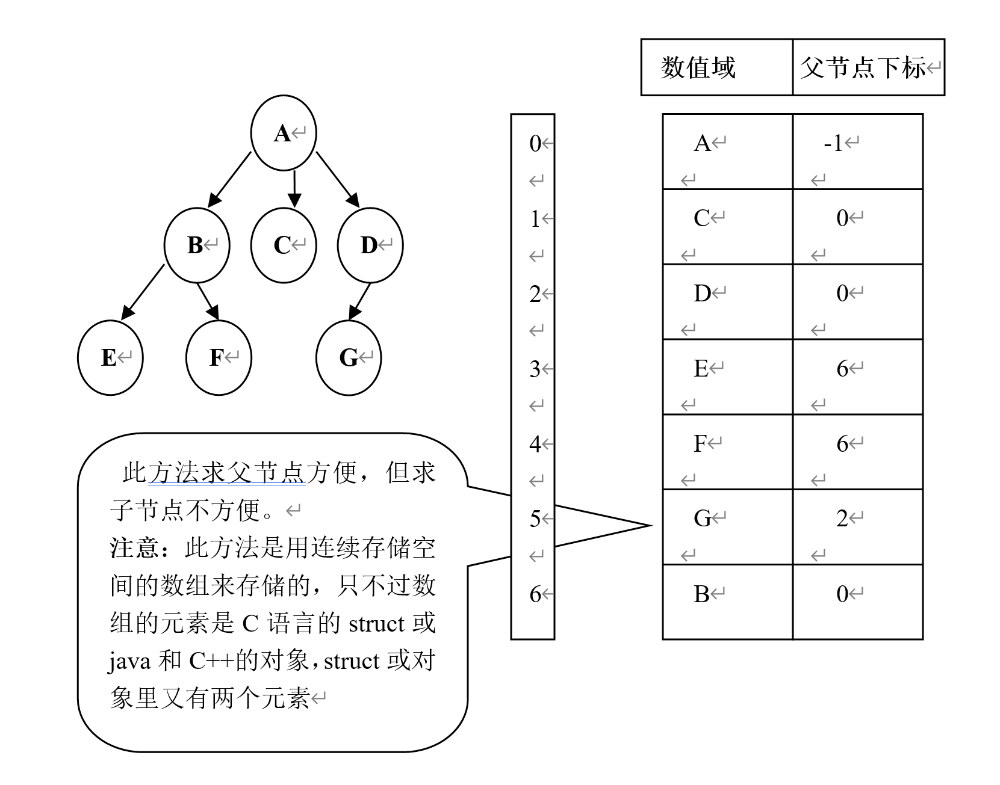
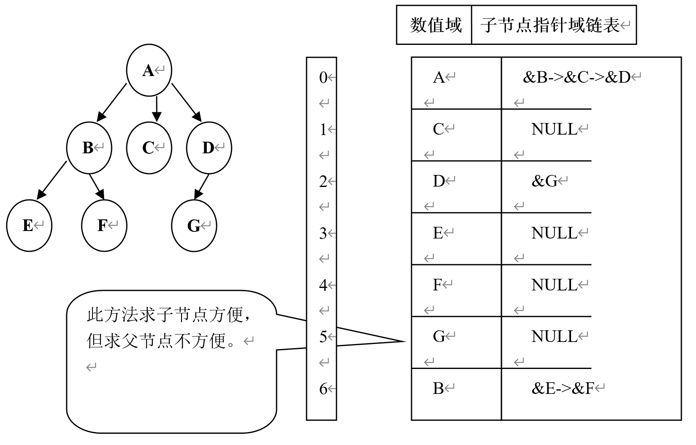
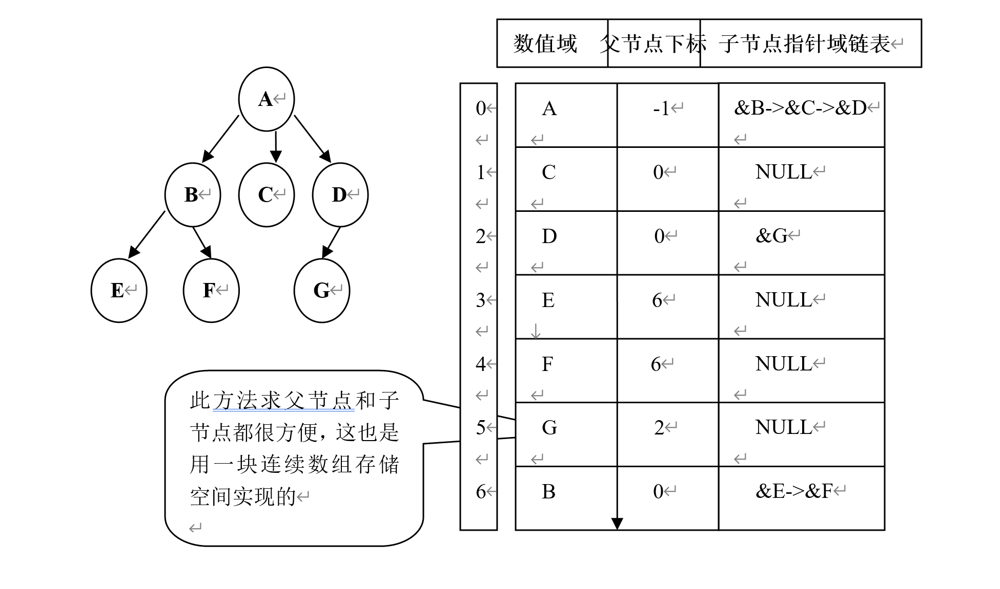
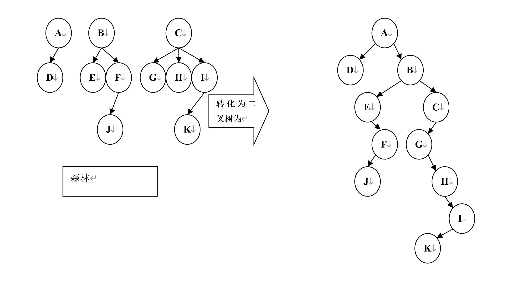
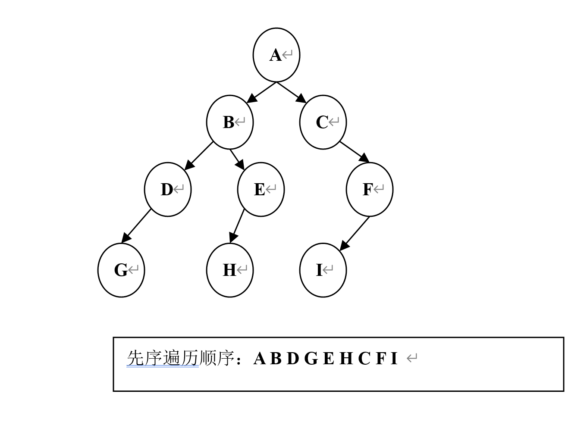
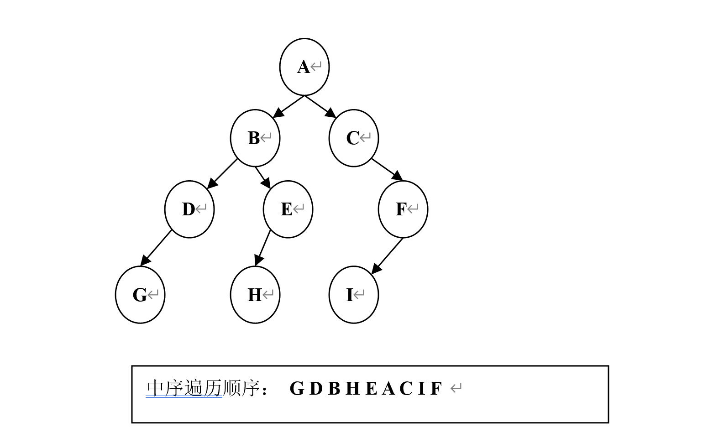
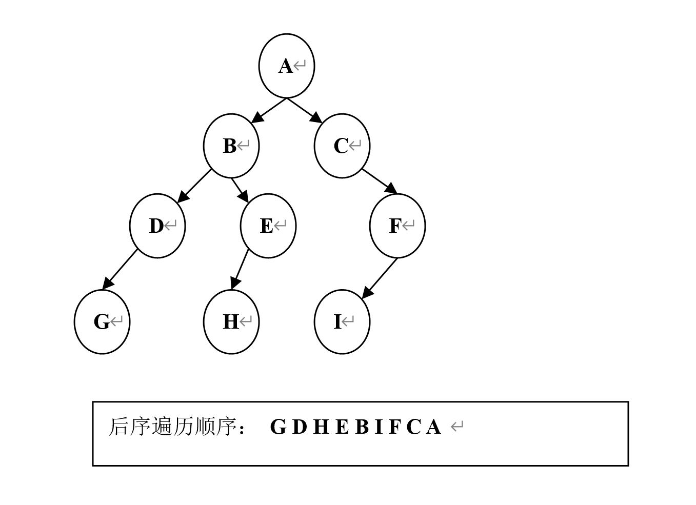
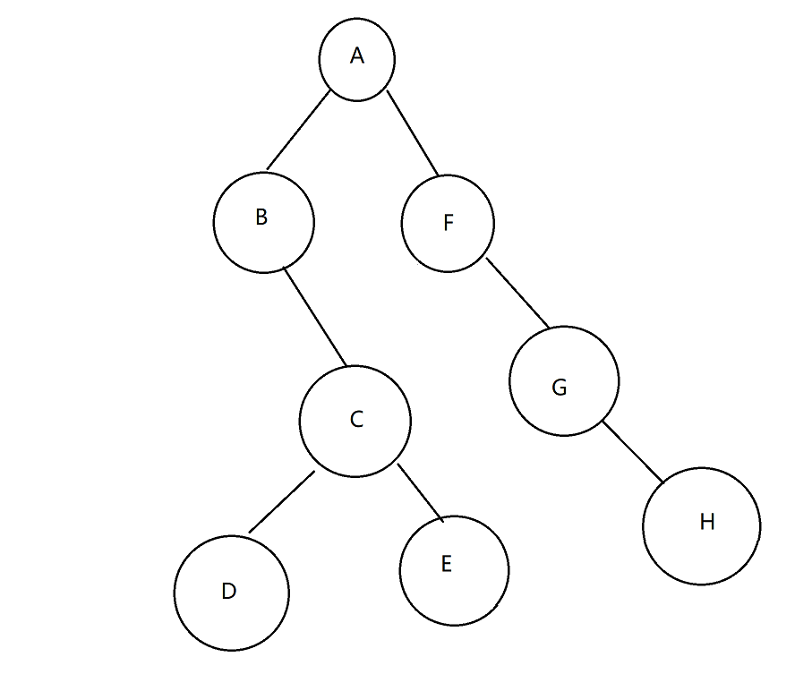

# 为什么需要树这种数据结构

数组存储方式的分析 
- 优点：通过下标方式访问元素，速度快。对于有序数组，还可使用二分查找提高检索速度。  
- 缺点：如果要检索具体某个值，或者插入值(按一定顺序)会整体移动，效率较低 

链式存储方式的分析  
 - 优点：在一定程度上对数组存储方式有优化(比如：插入一个数值节点，只需要将插入节点，链接到链表中即可， 删除效率也很好)。  
- 缺点：在进行检索时，效率仍然较低，比如(检索某个值，需要从头节点开始遍历)

树存储方式的分析  
   - 能提高数据存储，读取的效率, 比如利用二叉排序树(Binary Sort Tree)，既可以保证数据的检索速度，同时也可以保证数据的插入，删除，修改的速度。

# 定义

## 专业定义

1.  有且只有一个称为根的节点
2.  有若干个互不相交的子树，这些子树本身也是一棵树。

## 通俗的定义

1. 树是由节点和边组成。
2. 每个节点只有一个父节点但可以有多个子节点
3. 但有一个节点例外，该节点没有父节点，此节点称为根节点。

## 树相关的专业术语

- **节点**
- **根节点**
- **父节点**
- **子节点**：有直接父子关系的才能叫子节点
- **子孙节点**
- **堂兄弟节点**：其父节点是兄弟节点的为堂兄弟节点
- **深度**：从根节点到对底层节点的层数称之为深度，根节点是第一层
- **叶子节点**：没有子节点的节点
- **非终端节点**：实际就是非叶子节点
- **度**：子节点的个数称为度，整个树的度就是所有节点的度数中，度数最大的那个为整个树的度数
- **节点的权**：节点值
- **路径**：从根节点找到该节点的路线


## 树的分类

-   一般树：任意一个节点的**子节点的个数都不受限制**，子节点的顺序可以更改也可以不能更改，能更改的树为无序一般树，不能更改的为有序一般树
- 二叉树：任意一个节点的子节点**个数最多两个**，且子节点的位置不可更改，即左子树和右子树的位置不可更改。

分类
- 一般二叉树
- 满二叉树： 在不增加树的层数的前提下，无法再多添加一个节点的二叉树就是满二叉树，及所有的节点都是两个度数（两个子节点）
- 完全二叉树：如果只是删除了满二叉树最底层最右边的连续若干个节点，这样形成的二叉树就是完全二叉树。满二叉树只是完全二叉树的一个特例。
- 森林：n个互不相交的树的集合


# 树的存储

## 二叉树的存储

连续存储：用数组存储（适用于完全二叉树，不是完全二叉树的树补充为完全二叉树）
- 优点:查找某个节点的父节点和子节点（也包括判断有没有子节点）方便快速
- 缺点：耗用内存空间过大

链式存储 两个指针域分别指向两个子节点，没有子节点的为空
- 优点：耗用内存空间小
- 缺点：查找父节点不方便
  
## 一般树的存储

  ### 双亲表示法


### 孩子表示法


### 双亲孩子表示法


### 二叉树表示法

先把一个普通树转换为二叉树，再存储二叉树。

具体转换方法
设法保证任意一个节点的
- **左指针域指向它的第一个孩子
- **右指针域指向它的下一个兄弟**

只要能满足条件，就可以把一个普通树转化为二叉树。

一个普通树转化成的二叉树一定没有右子树


### 森林的存储

先把森林转化为二叉树，再存储二叉树

具体转换方法
  将森林中的每个树的节点当做兄弟存储
  设法保证任意一个节点的
  
- **左指针域指向它的第一个孩子**
- **右指针域指向它的下一个兄弟**

只要满足条件，就可以把一个森林转化为二叉树



# 树的遍历

## 前序遍历

先访问根节点

方法
1. 先访问根节点
2. 再先序访问左子树
3. 再先序访问右子树



## 中序遍历

中间访问根节点

方法
1. 中序遍历左子树
2. 再访问根节点
3. 再中序遍历右子树



## 后序遍历

最后访问根节点

 方法
1. 先中序遍历左子树
2. 在中序遍历右子树
3. 再访问根节点




**已知两种遍历序列求原始二叉树**
1. 先序、中序和后序三种遍历中，只知道其中任意一个，是无法还原其原始的树结构的。
2. 通过先序和中序 或者 中序和后序 两种方式我们可以还原原始的二叉树。但是通过先序和后序是无法还原原始的二叉树的。

  换种说法**只有通过先序和中序** **或者** **通过中序和后序我们才能唯一的确定一个二叉树的。**


**已知先序和中序求后序例子**

示例1
```txt
先序：ABCDEFGH（排在前面的为根节点）
中序：BDCEAFHG
求后序：DECBHGFA
```



从先序遍历中排在前面的为根节点，得知A是根节点，以A在中序遍历的位置，在A的左边为左子树，右边为右子树。先序遍历的下一个B，在中序遍历的A的左边，是A的左子树，且B中序遍历没有左子树。在DCE中，根据先序遍历的顺序，最先出现的是C，在对比中序遍历，D是C的左子树,E是C的右子树

#  树的应用

1. 树是数据库中数据组织的一种重要形式
2. 操作系统父子进程的关系本身就是一棵树
3. 面向对象语言中类的继承关系本身就是一棵树
4. 赫夫曼树