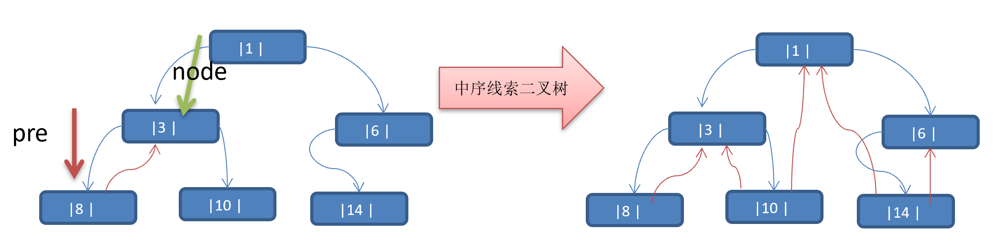

**先看一个问题**
将数列 {1, 3, 6, 8, 10, 14 } 构建成一颗二叉树. 


问题分析: 
1. 当我们对上面的二叉树进行中序遍历时，数列为 {8, 3, 10, 1, 6, 14 }
2. 但是 6, 8, 10, 14 这几个节点的 左右指针，并没有完全的利用上.
3. 如果我们希望充分的利用 各个节点的左右指针， 让各个节点可以指向自己的前后节点,怎么办?
4. 解决方案-线索二叉树

# 线索二叉树基本介绍
1. n个节点的二叉链表中含有 n+1 【公式：2n-(n-1)=n+1】个空指针域。利用二叉链表中的空指针域，存放指向该结点在<font color='red'>某种遍历次序</font>下的前驱或后继结点的指针（这种附加的指针称为“线索”）
2. 这种加上了线索的二叉链表称为**线索链表**，相应的二叉树称为**线索二叉树(Threaded BinaryTree)**。根据线索性质的不同，线索化二叉树可分为**前序线索二叉树、中序线索二叉树**和**后序线索二叉树**三种
3. 一个结点的前一个结点，称为<font color="red">前驱</font>结点
4. 一个结点的后一个结点，称为<font color="red">后继</font>结点


# 线索二叉树应用案例
**应用案例说明**：将下面的二叉树，进行**中序线索二叉树**。中序遍历的数列为 {8, 3, 10, 1, 14, 6}


**思路分析**: 中序遍历的结果：{8, 3, 10, 1, 14, 6}



**说明 :当线索化二叉树后，Node节点的 属性left和right**，有如下情况.:

1. left 指向的是左子树，也可能是指向的前驱节点. 比如 ① 节点 left 指向的左子树, 而 ⑩ 节点的 left 指向的就是前驱节点.

2. right指向的是右子树，也可能是指向后继节点，比如 ① 节点right 指向的是右子树，而⑩ 节点的right 指向的是后继节点.


# 代码实现

```java
public class HeroNode {
    private int id;
    private String name;
    private HeroNode left;//默认null
    private HeroNode right;//默认null


    /*
    说明
    1.如果leftTy == 0 表示指向的是左子树，如果1 则表示指向前驱节点
    2.如果 rightType == 0表示指向的是右子树，如果1表示指向后继节点
     */
    private int leftType;
    private int rightType;
}
```

```java
public class ThreadedBinaryTree {
    private HeroNode root;

    // 为了实现线索化，需要创建要给指向当前结点的前驱结点的指针
    // 在递归进行线索化时，pre总是保留前一个结点
    private HeroNode pre;

    public void setRoot(HeroNode root) {
        this.root = root;
    }

    // 遍历线索化二叉树的方法
    public void threadedList() {
        // 定义一个变量，存储当前遍历的结点，从root开始
        HeroNode node = root;
        while (node != null) {
            /*
            循环找到的leftType==1的结点，第一个找到就是8结点
            后面随着遍历而变化，因为当leftType==1时，说明该结点是按照线索化处理后的有效节点
             */
            while (node.getLeftType() == 0) {
                node = node.getLeft();
            }
            //打印当前这个结点
            System.out.println(node);
            //如果当前这个结点
            while (node.getRightType() == 1) {
                node = node.getRight();
                System.out.println(node);
            }
            node = node.getRight();
        }
    }


    public void threadedNodes() {
        this.threadedNodes(root);
    }

    /**
     * @param node 就是当前需要线索化的结点
     */
    public void threadedNodes(HeroNode node) {
        // 如果node==null,不能线索化
        if (node == null) {
            return;
        }
        
        // (一)：先线索化左子树
        threadedNodes(node.getLeft());
        
        /* (二):线索化当前结点
         处理当前结点的前驱结点
         以8结点来理解
         8结点的.left==null,8结点的leftType==1 */
        if (node.getLeft() == null) {
            // 让当前结点的左指针指向前驱结点
            node.setLeft(pre);
            // 修改当前结点的左指针的类型，指向前驱结点
            node.setLeftType(1);
        }
        /* 处理后继结点，下一次再处理，
        	例如当处理8结点右指针时，因为pre为空，不会进入下面if语句。只有在8结点方法栈出栈，回到3结点方法栈时，pre指向了8结点
        	当pre == 8结点时，node == 3时，让pre指向node，即8结点指向3结点
        	*/
        if (pre != null && pre.getRight() == null) {
            // 让前驱结点的右指针指向当前结点
            pre.setRight(node);
            // 修改前驱结点的右指针类型
            pre.setRightType(1);
        }
        //！！！ 每处理一个结点后，让当前结点pre是下一个结点的前驱结点
        pre = node;

        // (三)：再线索化右子树
        threadedNodes(node.getRight());
    }
}
```
