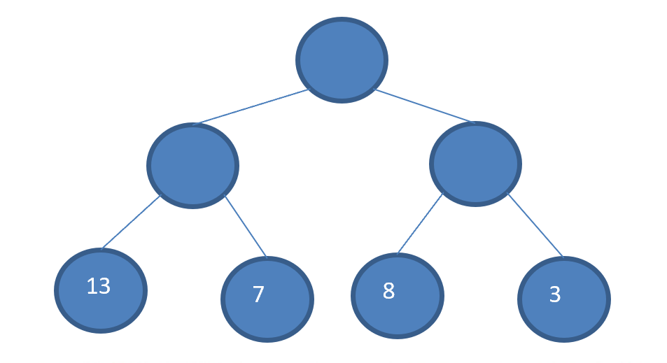
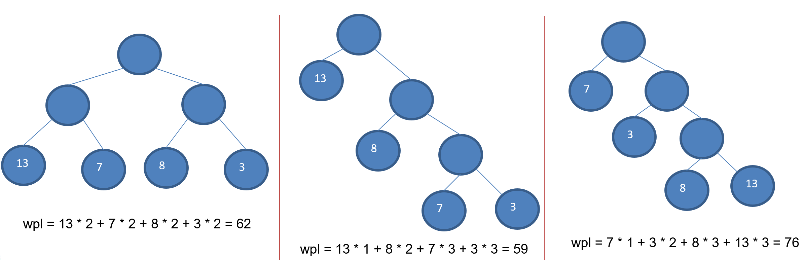

   

# 基本介绍
1. 给定n个权值作为n个[叶子结点](https://baike.baidu.com/item/%E5%8F%B6%E5%AD%90%E7%BB%93%E7%82%B9/3620239)，构造一棵二叉树，若该树的带权路径长度(wpl)达到最小，称这样的二叉树为最优二叉树，也称为哈夫曼树(Huffman Tree), 还有的书翻译为霍夫曼树。
   
2. **赫夫曼树是带权路径长度最短的树，权值较大的结点离根较近。**

   

# 赫夫曼树几个重要概念和举例说明
1. 路径和路径长度：在一棵树中，从一个结点往下可以达到的孩子或孙子结点之间的通路，称为路径。通路中分支的数目称为路径长度。若规定根结点的层数为1，则从根结点到第L层结点的路径长度为L-1

2. 结点的权及带权路径长度：若将树中结点赋给一个有着某种含义的数值，则这个数值称为**该结点的权。**结点的带权路径长度为：从根结点到该结点之间的路径长度与该结点的权的乘积



3. 树的带权路径长度：树的带权路径长度规定为所有叶子结点的带权路径长度之和，记为WPL(weighted path length) ,权值越大的结点离根结点越近的二叉树才是最优二叉树。
4. WPL最小的就是赫夫曼树
   

   

# 赫夫曼树创建思路图解
给你一个数列 {13, 7, 8, 3, 29, 6, 1}，要求转成一颗赫夫曼树.


<br />


## 构成赫夫曼树的步骤：

1. 从小到大进行排序, 将每一个数据，每个数据都是一个节点 ， 每个节点可以看成是一颗最简单的二叉树
```java
// 排序 从小到大  
Collections.sort(nodes);
```
2. 取出根节点权值最小的两颗二叉树
```java
// 取出根节点最小的两颗二叉树  
// (1) 取出权值最小的结点(二叉树)  
Node leftNode = nodes.get(0);  
// (2) 取出取值第二小的结点(二叉树)  
Node rightNode = nodes.get(1);
```

3. 组成一颗新的二叉树, 该新的二叉树的根节点的权值是前面两颗二叉树根节点权值的和 
```java
// (3) 构建成一颗新的二叉树  
Node parent = new Node(leftNode.value + rightNode.value);  
parent.left = leftNode;  
parent.right = rightNode;
```

4. 删除原来的两个最小结点，将新的结点加入，并重新排序

```java
// (4) 从ArrayList删除处理过的二叉树
nodes.remove(leftNode);
nodes.remove(rightNode);
   
// (5) 将parent 加入到nodes
nodes.add(parent);
```

5. 再将这颗新的二叉树，以根节点的权值大小 再次排序， 不断重复 1-2-3-4 的步骤，直到数列中，所有的数据都被处理，就得到一颗赫夫曼树

```java
while (nodes.size() > 1) {
		....
}
```


<br />


#   赫夫曼树的代码实现

```java
public class HuffmanTree {
    public static void main(String[] args) {
        int[] arr = {13, 7, 8, 3, 29, 6, 1};
        Node root = createHuffmanTree(arr);

        preOrder(root);

    }

    // 创建赫夫曼树的方法
    public static Node createHuffmanTree(int[] arr) {
        // 第一步为了操作方便
        // 1. 遍历arr 数组
        // 2. 将arr的每个元素构成一个Node
        // 3. 将Node 放入ArrayList中
        ArrayList<Node> nodes = new ArrayList<>();
        for (int value : arr) {
            nodes.add(new Node(value));
        }
        // 排序 从小到大
        Collections.sort(nodes);


        // 我们处理的过程是一个循环的过程
        while (nodes.size() > 1) {
            // 取出根节点最小的两颗二叉树
            // (1) 取出权值最小的结点(二叉树)
            Node leftNode = nodes.get(0);
            // (2) 取出取值第二小的结点(二叉树)
            Node rightNode = nodes.get(1);

            // (3) 构建成一颗新的二叉树
            Node parent = new Node(leftNode.value + rightNode.value);
            parent.left = leftNode;
            parent.right = rightNode;

            // (4) 从ArrayList删除处理过的二叉树
            nodes.remove(leftNode);
            nodes.remove(rightNode);

            // (5) 将parent 加入到nodes
            nodes.add(parent);

            Collections.sort(nodes);
        }
        // 返回哈夫曼树的root 结点
        return nodes.get(0);
    }

    public static void preOrder(Node root) {
        if (root != null) {
            root.preOrder();
        } else {
            System.out.println("是空树，不能遍历");
        }
    }
}

// 创建结点类
// 为了让Node 对象持续实现排序 Collections 集合排序
// 让 Node 实现 Comparable 接口
class Node implements Comparable<Node> {
    int value; // 结点权值
    Node left;// 指向左子节点
    Node right;// 指向右子节点

    public Node(int value) {
        this.value = value;
    }


    // 写一个前序遍历
    public void preOrder() {
        System.out.println(this);
        if (this.left != null) {
            this.left.preOrder();
        }
        if (this.right != null) {
            this.right.preOrder();
        }
    }

    @Override
    public int compareTo(Node o) {
        return this.value - o.value;
    }

    @Override
    public String toString() {
        return "Node{" +
                "value=" + value +
                '}';
    }
}
```

