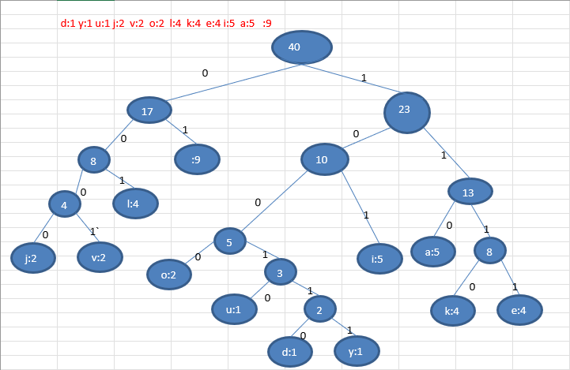

# 基本介绍

1. 赫夫曼编码也翻译为  [哈夫曼](https://baike.baidu.com/item/%E5%93%88%E5%A4%AB%E6%9B%BC)编码(Huffman Coding)，又称霍夫曼编码，是一种编码方式, 属于一种程序算法
2. 赫夫曼编码是赫哈夫曼树在电讯通信中的经典的应用之一。
3. 赫夫曼编码广泛地用于数据文件压缩。其压缩率通常在20%～90%之间
4. 赫夫曼码是可变[字长](https://baike.baidu.com/item/%E5%AD%97%E9%95%BF/97660)编码(VLC)的一种。Huffman于1952年提出一种编码方法，称之为最佳编码

<br />

# 原理剖析
## 通信领域中信息的处理方式1-定长编码

- i like like like java do you like a java➡️ 共40个字符(包括空格) 
- 105 32 108 105 107 101 32 108 105 107 101 32 108 105 107 101 32 106 97 118 97 32 100 111 32 121 111 117 32 108 105 107 101 32 97 32 106 97 118 97   ➡️ 对应Ascii码
- 01101001 00100000 01101100 01101001 01101011 01100101 00100000 01101100 01101001 01101011 01100101 00100000 01101100 01101001 01101011 01100101 00100000 01101010 01100001 01110110 01100001 00100000 01100100 01101111 00100000 01111001 01101111 01110101 00100000 01101100 01101001 01101011 01100101 00100000 01100001 00100000 01101010 01100001 01110110 01100001 ➡️ 对应的二进制
- 按照二进制来传递信息，总的长度是 359 (包括空格)

<br />

## 通信领域中信息的处理方式2-变长编码

- i like like like java do you like a java ➡️ 共40个字符(包括空格)
- d:1 y:1 u:1 j:2 v:2 o:2 l:4 k:4 e:4 i:5 a:5 :9 ➡️ 各个字符对应的个数
- 0= , 1=a, 10=i, 11=e, 100=k, 101=l, 110=o, 111=v, 1000=j, 1001=u, 1010=y, 1011=d 说明：按照各个字符出现的次数进行编码，原则是出现次数越多的，则编码越小，比如 空格出现了9 次， 编码为0 ,其它依次类推.
- 按照上面给各个字符规定的编码，则我们在传输 "i like like like java do you like a java" 数据时，编码就是  10010110100... 
- 字符的编码都不能是其他字符编码的前缀，符合此要求的编码叫做前缀编码， 即不能匹配到重复的编码

<br />

## 通信领域中信息的处理方式3-赫夫曼编码
- i like like like java do you like a java ➡️ 共40个字符(包括空格)
- d:1 y:1 u:1 j:2 v:2 o:2 l:4 k:4 e:4 i:5 a:5 :9 ➡️ 各个字符对应的个数

按照上面字符出现的次数构建一颗赫夫曼树, 次数作为权值.


根据赫夫曼树，给各个字符：规定编码 ， 向左的路径为0，向右的路径为1 

编码如下:
o: 1000 
u: 10010 
d: 100110 
y: 100111
i: 101
a : 110 
k: 1110 
e: 1111 
j: 0000 
v: 0001
l: 001 
(空格): 01

按照上面的赫夫曼编码，我们的"i like like like java do you like a java" 字符串对应的编码为 (注意这里我们使用的无损压缩)

1010100110111101111010011011110111101001101111011110100001100001110011001111000011001111000100100100110111101111011100100001100001110

长度为 ： 133

说明:

1. 原来长度是 359 , 压缩了 (359-133) / 359 = 62.9%
2. 此编码满足前缀编码, 即字符的编码都不能是其他字符编码的前缀。不会造成匹配的多义性

<br/>

## 注意事项
 这个赫夫曼树根据排序方法不同，也可能不太一样，这样对应的赫夫曼编码也不完全一样，**但是wpl 是一样的，都是最小的,最后生成的赫夫曼树的长度都是一样的** ,比如: 如果我们让每次生成的新的二叉树总是排在权值相同的二叉树的最后一个，则生成的二叉树为:
.png)

<br />

# 最佳实践-数据压缩(创建赫夫曼树)

功能：根据赫夫曼编码压缩数据的原理，需要创建" i like like like java do you like a java"对应的赫夫曼树
**思路**
1. Node结点 { data(存放数据), weight(权值), left 和 right }

   ```java
   // 创建Node，存放数据和权值
   class Node implements Comparable<Node> {
       Byte data; // 存放数据(字符)本身，比如'a'=>97 ,' '=> 32
       int weight;// 权值，表示字符出现的次数
       Node left;
       Node right;
   
       public Node(Byte data, int weight) {
           this.data = data;
           this.weight = weight;
       }
   
       @Override
       public int compareTo(Node o) {
           return this.weight - o.weight;
       }
   
       @Override
       public String toString() {
           return "Node{" +
                   "data=" + data +
                   ", weight=" + weight +
                   '}';
       }
   
       // 前序遍历
       public void preOrder() {
           System.out.println(this);
           if (this.left != null) {
               this.left.preOrder();
           }
           if (this.right != null) {
               this.right.preOrder();
           }
       }
   }
   ```
   
2. 得到 "i like like like java do you like a java" 对应的byte\[\] 数组

   ```java
    	String str = "i like like like java do you like a java";
   	byte[] contentBytes = str.getBytes();
   ```

3. 编写一个方法，将准备构建的赫夫曼树的Node 节点放到List，形式\[Node\[data='97' ,weight=5\],Node\[data='32' ,weight=9\],......\],体现 d:1 y:1 u:1 j:2 v:2 o:2 l:4 k:4 e:4 i:5 a:5 :9 

   ```java
     /**
        * 将结节数组封装成Node集合
        *
        * @param bytes 接收字节数组
        * @return 返回的就是 List 形式 [Node[data='97' ,weight=5],Node[data='32' ,weight=9],......]
        */
       private static List<Node> getNodes(byte[] bytes) {
           // 1 创建一个ArrayList
           ArrayList<Node> nodes = new ArrayList<>();
   
           // 遍历bytes, 统计 每一个byte出现的次数 -> map[key,value]
           HashMap<Byte, Integer> counts = new HashMap<>();
           for (byte b : bytes) {
               Integer count = counts.get(b);
               if (count == null) { // Map还没有这个字符数据，第一次
                   counts.put(b, 1);
               } else {
                   counts.put(b, count + 1);
               }
           }
   
           // 把每一个键值对转成一个Node 对象，并加入到nodes集合
           // 遍历map
           for (Map.Entry<Byte, Integer> entry : counts.entrySet()) {
               nodes.add(new Node(entry.getKey(), entry.getValue()));
           }
   
           return nodes;
       }
   ```
   
4. 可以通过List创建对应的赫夫曼树

   ```java
   // 可以通过List创建对应的赫夫曼树
       private static Node createHumanTree(List<Node> nodes) {
           while (nodes.size() > 1) {
               // 排序，从小到大
               Collections.sort(nodes);
   
               //取出第一颗最小的二叉树
               Node leftNode = nodes.get(0);
               //取出第二颗最小的二叉树
               Node rightNode = nodes.get(1);
   
               // 创建一个新的二叉树，他的根节点没有data
               Node parent = new Node(null, leftNode.weight + rightNode.weight);
               parent.left = leftNode;
               parent.right = rightNode;
   
               // 将已经处理的两颗二叉树从nodes删除
               nodes.remove(leftNode);
               nodes.remove(rightNode);
   
               // 将新的二叉树，加入到nodes
               nodes.add(parent);
   
               Collections.sort(nodes);
           }
           return nodes.get(0);
       }
   ```
   
   

# 最佳实践-数据压缩(创建赫夫曼编码)

生成赫夫曼树对应的赫夫曼编码
思路：

 1. 将赫夫曼编码表存放在Map<Byte,String> 形式
 32 -> 01、97 -> 100、100->11000等等 [形式]


```java
 // 生成赫夫曼树对应的赫夫曼编码
    // 思路：
    // 1. 将赫夫曼编码表存放在Mao<Byte,String> 形式
    // 32 -> 01、97 -> 100、100->11000等等 [形式]
    static Map<Byte, String> huffmanCodes = new HashMap<>();
    // 2. 在生成赫夫曼编码表示，需要去拼接路径，定义一个StringBuilder 存储某个叶子结点的路径
    static StringBuilder stringBuilder = new StringBuilder();

    // 为了调用方便，我们重载getCodes
    private static Map<Byte, String> getCodes(Node root) {
        if (root == null) {
            return null;
        }
        //处理root的左子树
        getCodes(root.left, "0", stringBuilder);
        //处理root的右子树
        getCodes(root.right, "1", stringBuilder);
        return huffmanCodes;

    }

    /**
     * 功能：将传入的node结点的所有叶子结点的赫夫曼树得到，并放入到huffmanCodes集合
     *
     * @param node          传入的结点
     * @param code          路径：左子结点是 0，右子节点是 1
     * @param stringBuilder 用于拼接路径
     */
    private static void getCodes(Node node, String code, StringBuilder stringBuilder) {
        StringBuilder stringBuilder2 = new StringBuilder(stringBuilder);
        // 将code 加入到 stringBuilder2
        stringBuilder2.append(code);
        if (node != null) {// 如果node == null 不处理
            // 判断当前node 是叶子结点还是非叶子结点
            if (node.data == null) { // 非叶子结点
                // 递归处理
                // 向左递归
                getCodes(node.left, "0", stringBuilder2);
                // 向右递归
                getCodes(node.right, "1", stringBuilder2);
            } else { // 说明是一个叶子结点
                // 就表示找到某一个叶子结点的最后
                huffmanCodes.put(node.data, stringBuilder2.toString());
            }
        }
    }
```

<br />

# 最佳实践-数据压缩(**赫夫曼编码后的数据**)


我们已经生成了 赫夫曼树, 下面我们继续完成任务

1. 生成赫夫曼树对应的赫夫曼编码 , 如下表:  
=01 a=100 d=11000 u=11001 e=1110 v=11011 i=101 y=11010 j=0010 k=1111 l=000 o=0011  

2. 使用赫夫曼编码来生成赫夫曼编码数据 ,即按照上面的赫夫曼编码，将"i like like like java do you like a java" 字符串生成对应的编码数据, 形式如下.  
1010100010111111110010001011111111001000101111111100100101001101110001110000011011101000111100101000101111111100110001001010011011100
```java
 	/**
     * 编写一个方法，将字符串对应的byte[] 数组，通过生成的赫夫曼编码表，返回一个赫夫曼编码 压缩后的byte[]
     *
     * @param bytes        这是原始的字符串对应的byte[]
     * @param huffmanCodes 生成的赫夫曼编码表map
     * @return 返回赫夫曼编码处理后的byte[]
     * 举例：String str = "i like like like java do you like a java"; -> byte[] contentBytes = str.getBytes();
     * 返回的是字符串"1010100010111111110010001011111111001000101111111100100101001101110001110000011011101000111100101000101111111100110001001010011011100"
     * => 对应的byte[] huffmanCodeBytes，即8位对应一个 byte，放入到huffmanCodeBytes
     * huffmanCodeBytes[0]= 10101000(补码) => byte[推导 10101000 -> 10101000 - 1 -> 10100111(反码) -> 11011000(源码)] = -88
     */
    private static byte[] zip(byte[] bytes, Map<Byte, String> huffmanCodes) {
        // 1. 利用 huffmanCodes 将 bytes 转成 赫夫曼编码对应的字符串
        StringBuilder stringBuilder = new StringBuilder();
        // 遍历 bytes 数组
        for (byte b : bytes) {
            stringBuilder.append(huffmanCodes.get(b));
        }

        // 将 "101010001011111111...." 转成byte[]

        //统计返回 byte[] huffmanCodeBytes 长度
        // 一句话 int len = (stringBuilder.length() + 7) / 8;
        // 如果除不尽，说明有一个字节不满8位，+7是因为最后一个不满8位的字节，不管你剩几位加上这个7也不会多出一个8位来，反而补上之前的位数不够
        int len;
        if (stringBuilder.length() % 8 == 0) {
            len = stringBuilder.length() / 8;

        } else {
            len = stringBuilder.length() / 8 + 1;
        }

        // 创建 存储压缩后的 byte 数组
        byte[] huffmanCodeBytes = new byte[len];
        int index = 0;// 记录是第几个byte

        for (int i = 0; i < stringBuilder.length(); i += 8) { // 因为是每8位对应一个byte，所有步长 +8
            String strByte;
            if (i + 8 > stringBuilder.length()) { // 不够8位
                strByte = stringBuilder.substring(i);
            } else {
                strByte = stringBuilder.substring(i, i + 8);
            }

            //将strByte 转成一个byte，放入到 huffmanCodeBytes
            huffmanCodeBytes[index++] = (byte) Integer.parseInt(strByte, 2);
        }

        return huffmanCodeBytes;
    }
```

<br />

# 最佳实践数据解压(使用赫夫曼编码解码)

使用赫夫曼编码来解码数据，具体要求是

1. 前面我们得到了赫夫曼编码和对应的编码  byte[] , 即:[-88, -65, -56, -65, -56, -65, -55, 77, -57, 6, -24, -14, -117, -4, -60, -90, 28]

2. 现在要求使用赫夫曼编码， 进行解码，又重新得到原来的字符串"i like like like java do you like a java"

```java
	// 思路
    // 1. 将huffmanCodeBytes [-88, -65, -56, -65, -56, -65, -55, 77, -57, 6, -24, -14, -117, -4, -60, -90, 28]
    //      重写先转成 赫夫曼编码对应的二进制的字符串 "101010001011111111...."
    // 2. 赫夫曼编码对应的二进制的字符串 "101010001011111111...." -> 对照赫夫曼编码 -> "i like like like java do you like a java";

    // 编写一个方法，完成对压缩数据的解码
    private static byte[] decode(Map<Byte, String> huffmanCodes, byte[] huffmanBytes) {
        // 先得到 huffmanBytes 对应的 二进制的字符串，形式 101010001011111111....
        StringBuilder stringBuilder = new StringBuilder();
        // 将 byte 数组转成二进制的字符串
        for (int i = 0; i < huffmanBytes.length; i++) {
            byte b = huffmanBytes[i];
            // 判断是不是最后一个字节
            boolean flag = (i == huffmanBytes.length - 1);
            stringBuilder.append(byteToBitString(!flag, b));
        }
        HashMap<String, Byte> map = new HashMap<>();
        for (Map.Entry<Byte, String> entry : huffmanCodes.entrySet()) {
            map.put(entry.getValue(), entry.getKey());
        }

        // 创建要给集合，存放byte
        ArrayList<Byte> list = new ArrayList<>();
        // i 可以理解成就是索引，扫描stringBuilder
        for (int start = 0; start < stringBuilder.length(); ) {
            int end = 1; // 小的计数器
            boolean flag = true;
            Byte b = null;
            while (flag) {
                // "101010001011111111...."
                // 递增的取出 key 1
                String key = stringBuilder.substring(start, start + end);
                b = map.get(key);
                if (b == null) { // 说明没有匹配到
                    end++;
                } else {
                    // 匹配到
                    flag = false;
                }
            }
            list.add(b);
            start += end;
        }
        // 当for 循环结束后 所有的字符“i like like like java do you like a java”
        // 把list 中的数据放入到 byte[] 并返回
        byte[] b = new byte[list.size()];
        for (int i = 0; i < b.length; i++) {
            b[i] = list.get(i);
        }
        return b;
    }

    private static String byteToBitString(boolean flag, byte b) {
        // 使用变量保存b
        int temp = b; //将b转成int
        // 如果是正数 我们还存在补高位
        if (flag) {
            temp |= 256; //按位与 256 1 0000 0000 | 0000 0001 -> 1 0000 0001
        }
        String str = Integer.toBinaryString(temp); // 返回的是temp 对应的二进制的补码
        if (flag) {
            return str.substring(str.length() - 8);
        } else {
            return str;
        }
    }
```


<br />

# 最佳实践-文件压缩

我们学习了通过赫夫曼编码对一个字符串进行编码和解码, 下面我们来完成对文件的压缩和解压， 具体要求：给你一个图片文件，要求对其进行无损压缩, 看看压缩效果如何。

**思路**：读取文件-> 得到赫夫曼编码表 -> 完成压缩

```java
// 编写一个方法,将一个文件进行压缩
    /**
     * @param srcFile 传入文件的绝对路径
     * @param dstFile 压缩文件的输出路径
     */
    public static void zipFile(String srcFile, String dstFile) {
        //创建文件的输入流
        BufferedInputStream is = null;
        FileOutputStream os = null;
        ObjectOutputStream oos = null;
        try {
            is = new BufferedInputStream(new FileInputStream(srcFile));
            //创建一个和源文件大小一样的byte[]
            byte[] b = new byte[is.available()];
            //读取文件
            is.read(b);

            // 直接对源文件压缩
            byte[] huffmanBytes = huffmanZip(b);
            // 创建文件的输出流，存放压缩文件
            os = new FileOutputStream(dstFile);
            // 创建一个和文件输出流关联的ObjectOutputStream
            oos = new ObjectOutputStream(os);
            // 把赫夫曼编码后的字节数组写入压缩文件
            oos.writeObject(huffmanBytes);

            // 这里我们以对象流的方式写入赫夫曼编码，是为了以后我们恢复源文件时使用
            // 注意一定要把赫夫曼编码写入压缩文件
            oos.writeObject(huffmanCodes);


        } catch (Exception e) {
            e.printStackTrace();
        } finally {
            try {
                assert is != null;
                is.close();
            } catch (IOException e) {
                e.printStackTrace();
            }
            try {
                os.close();
            } catch (IOException e) {
                e.printStackTrace();
            }
            try {
                oos.close();
            } catch (IOException e) {
                e.printStackTrace();
            }
        }
    }
```

<br />

# 最佳实践-文件解压(文件恢复)

 具体要求：将前面压缩的文件，重新恢复成原来的文件。

**思路**：读取压缩文件(数据和赫夫曼编码表)-> 完成解压(文件恢复)

**代码实现**：

```java
 public static void unZipFile(String zipFile, String dstFile) {
        // 定义文件输入流
        InputStream is = null;
        // 定义一个对象的输出流
        ObjectInputStream ois = null;
        // 定义文件的输出流
        OutputStream os = null;

        try {
            // 创建文件输入流
            is = new FileInputStream(zipFile);
            // 创建一个和 is 关联的对象输入流
            ois = new ObjectInputStream(is);

            // 读取 byte 数组 huffmanBytes
            byte[] huffmanBytes = (byte[]) ois.readObject();

            // 读取赫夫曼编码表
            Map<Byte, String> huffmanCodes = (Map<Byte, String>) ois.readObject();

            byte[] bytes = decode(huffmanCodes, huffmanBytes);
            // 将bytes 数组写入到目标文件
            os = new FileOutputStream(dstFile);
            // 写数据到 dstFile文件
            os.write(bytes);

        } catch (IOException | ClassNotFoundException e) {
            e.printStackTrace();
            try {
                assert is != null;
                is.close();
            } catch (IOException ioException) {
                ioException.printStackTrace();
            }
            try {
                assert ois != null;
                ois.close();
            } catch (IOException ioException) {
                ioException.printStackTrace();
            }
            try {
                assert os != null;
                os.close();
            } catch (IOException ioException) {
                ioException.printStackTrace();
            }
        }
    }
```


<br />

# 完整代码

```java
package haffumancode;

import java.io.*;
import java.util.*;

/**
 * @author Jum
 * @date 2022/03/08 14:14
 **/
public class HuffmanCode {

    public static void main(String[] args) {
//        String str = "i like like like java do you like a java ";
//        byte[] contentBytes = str.getBytes();
//
//        byte[] zip = huffmanZip(contentBytes);
//
//        byte[] decode = decode(huffmanCodes, zip);
//        System.out.println(new String(decode));

        zipFile("C:/Users//Jun//3D Objects//数据结构//尚硅谷Java数据结构与java算法//笔记//尚硅谷图解Java数据结构和算法.pdf", "C:/Users//Jun//3D Objects//数据结构//尚硅谷Java数据结构与java算法//笔记//尚硅谷图解Java.zip");
        unZipFile("C:/Users//Jun//3D Objects//数据结构//尚硅谷Java数据结构与java算法//笔记//尚硅谷图解Java.zip","C://Users//Jun//3D Objects//数据结构//尚硅谷Java数据结构与java算法//笔记/1.pdf");
    }

    private static byte[] huffmanZip(byte[] bytes) {
        List<Node> nodes = getNodes(bytes);
        // 根据 nodes 创建的赫夫曼树
        Node humanTreeRoot = createHumanTree(nodes);
        // 对应的赫夫曼编码(根据 赫夫曼树)
        Map<Byte, String> huffmanCodes = getCodes(humanTreeRoot);
        // 根据生成的赫夫曼编码，压缩得到压缩后的赫夫曼字节数组
        byte[] huffmanCodeBytes = zip(bytes, huffmanCodes);
        return huffmanCodeBytes;
    }


    /**
     * 将结节数组封装成Node集合
     *
     * @param bytes 接收字节数组
     * @return 返回的就是 List 形式 [Node[data='97' ,weight=5],Node[data='32' ,weight=9],......]
     */
    private static List<Node> getNodes(byte[] bytes) {
        // 1 创建一个ArrayList
        ArrayList<Node> nodes = new ArrayList<>();

        // 遍历bytes, 统计 每一个byte出现的次数 -> map[key,value]
        HashMap<Byte, Integer> counts = new HashMap<>();
        for (byte b : bytes) {
            Integer count = counts.get(b);
            if (count == null) { // Map还没有这个字符数据，第一次
                counts.put(b, 1);
            } else {
                counts.put(b, count + 1);
            }
        }

        // 把每一个键值对转成一个Node 对象，并加入到nodes集合
        // 遍历map
        for (Map.Entry<Byte, Integer> entry : counts.entrySet()) {
            nodes.add(new Node(entry.getKey(), entry.getValue()));
        }

        return nodes;
    }


    // 可以通过List创建对应的赫夫曼树
    private static Node createHumanTree(List<Node> nodes) {
        while (nodes.size() > 1) {
            // 排序，从小到大
            Collections.sort(nodes);

            //取出第一颗最小的二叉树
            Node leftNode = nodes.get(0);
            //取出第二颗最小的二叉树
            Node rightNode = nodes.get(1);

            // 创建一个新的二叉树，他的根节点没有data
            Node parent = new Node(null, leftNode.weight + rightNode.weight);
            parent.left = leftNode;
            parent.right = rightNode;

            // 将已经处理的两颗二叉树从nodes删除
            nodes.remove(leftNode);
            nodes.remove(rightNode);

            // 将新的二叉树，加入到nodes
            nodes.add(parent);

            Collections.sort(nodes);
        }
        return nodes.get(0);
    }

    // 前序遍历
    public static void preOrder(Node root) {
        if (root != null) {
            root.preOrder();
        } else {
            System.out.println("是空树，不能遍历");
        }
    }


    // 生成赫夫曼树对应的赫夫曼编码
    // 思路：
    // 1. 将赫夫曼编码表存放在Mao<Byte,String> 形式
    // 32 -> 01、97 -> 100、100->11000等等 [形式]
    static Map<Byte, String> huffmanCodes = new HashMap<>();
    // 2. 在生成赫夫曼编码表示，需要去拼接路径，定义一个StringBuilder 存储某个叶子结点的路径
    static StringBuilder stringBuilder = new StringBuilder();

    // 为了调用方便，我们重载getCodes
    private static Map<Byte, String> getCodes(Node root) {
        if (root == null) {
            return null;
        }
        //处理root的左子树
        getCodes(root.left, "0", stringBuilder);
        //处理root的右子树
        getCodes(root.right, "1", stringBuilder);
        return huffmanCodes;

    }

    /**
     * 功能：将传入的node结点的所有叶子结点的赫夫曼树得到，并放入到huffmanCodes集合
     *
     * @param node          传入的结点
     * @param code          路径：左子结点是 0，右子节点是 1
     * @param stringBuilder 用于拼接路径
     */
    private static void getCodes(Node node, String code, StringBuilder stringBuilder) {
        StringBuilder stringBuilder2 = new StringBuilder(stringBuilder);
        // 将code 加入到 stringBuilder2
        stringBuilder2.append(code);
        if (node != null) {// 如果node == null 不处理
            // 判断当前node 是叶子结点还是非叶子结点
            if (node.data == null) { // 非叶子结点
                // 递归处理
                // 向左递归
                getCodes(node.left, "0", stringBuilder2);
                // 向右递归
                getCodes(node.right, "1", stringBuilder2);
            } else { // 说明是一个叶子结点
                // 就表示找到某一个叶子结点的最后
                huffmanCodes.put(node.data, stringBuilder2.toString());
            }
        }
    }

    /**
     * 编写一个方法，将字符串对应的byte[] 数组，通过生成的赫夫曼编码表，返回一个赫夫曼编码 压缩后的byte[]
     *
     * @param bytes        这是原始的字符串对应的byte[]
     * @param huffmanCodes 生成的赫夫曼编码表map
     * @return 返回赫夫曼编码处理后的byte[]
     * 举例：String str = "i like like like java do you like a java"; -> byte[] contentBytes = str.getBytes();
     * 返回的是字符串"1010100010111111110010001011111111001000101111111100100101001101110001110000011011101000111100101000101111111100110001001010011011100"
     * => 对应的byte[] huffmanCodeBytes，即8位对应一个 byte，放入到huffmanCodeBytes
     * huffmanCodeBytes[0]= 10101000(补码) => byte[推导 10101000 -> 10101000 - 1 -> 10100111(反码) -> 11011000(源码)] = -88
     */
    private static byte[] zip(byte[] bytes, Map<Byte, String> huffmanCodes) {
        // 1. 利用 huffmanCodes 将 bytes 转成 赫夫曼编码对应的字符串
        StringBuilder stringBuilder = new StringBuilder();
        // 遍历 bytes 数组
        for (byte b : bytes) {
            stringBuilder.append(huffmanCodes.get(b));
        }

        // 将 "101010001011111111...." 转成byte[]

        //统计返回 byte[] huffmanCodeBytes 长度
        // 一句话 int len = (stringBuilder.length() + 7) / 8;
        // 如果除不尽，说明有一个字节不满8位，+7是因为最后一个不满8位的字节，不管你剩几位加上这个7也不会多出一个8位来，反而补上之前的位数不够
        int len;
        if (stringBuilder.length() % 8 == 0) {
            len = stringBuilder.length() / 8;

        } else {
            len = stringBuilder.length() / 8 + 1;
        }

        // 创建 存储压缩后的 byte 数组
        byte[] huffmanCodeBytes = new byte[len];
        int index = 0;// 记录是第几个byte

        for (int i = 0; i < stringBuilder.length(); i += 8) { // 因为是每8位对应一个byte，所有步长 +8
            String strByte;
            if (i + 8 > stringBuilder.length()) { // 不够8位
                strByte = stringBuilder.substring(i);
            } else {
                strByte = stringBuilder.substring(i, i + 8);
            }

            //将strByte 转成一个byte，放入到 huffmanCodeBytes
            huffmanCodeBytes[index++] = (byte) Integer.parseInt(strByte, 2);
        }

        return huffmanCodeBytes;
    }

    // 思路
    // 1. 将huffmanCodeBytes [-88, -65, -56, -65, -56, -65, -55, 77, -57, 6, -24, -14, -117, -4, -60, -90, 28]
    //      重写先转成 赫夫曼编码对应的二进制的字符串 "101010001011111111...."
    // 2. 赫夫曼编码对应的二进制的字符串 "101010001011111111...." -> 对照赫夫曼编码 -> "i like like like java do you like a java";


    // 编写一个方法，完成对压缩数据的解码
    private static byte[] decode(Map<Byte, String> huffmanCodes, byte[] huffmanBytes) {
        // 先得到 huffmanBytes 对应的 二进制的字符串，形式 101010001011111111....
        StringBuilder stringBuilder = new StringBuilder();
        // 将 byte 数组转成二进制的字符串
        for (int i = 0; i < huffmanBytes.length; i++) {
            byte b = huffmanBytes[i];
            // 判断是不是最后一个字节
            boolean flag = (i == huffmanBytes.length - 1);
            stringBuilder.append(byteToBitString(!flag, b));
        }
        HashMap<String, Byte> map = new HashMap<>();
        for (Map.Entry<Byte, String> entry : huffmanCodes.entrySet()) {
            map.put(entry.getValue(), entry.getKey());
        }

        // 创建要给集合，存放byte
        ArrayList<Byte> list = new ArrayList<>();
        // i 可以理解成就是索引，扫描stringBuilder
        for (int start = 0; start < stringBuilder.length(); ) {
            int end = 1; // 小的计数器
            boolean flag = true;
            Byte b = null;
            while (flag) {
                // "101010001011111111...."
                // 递增的取出 key 1
                String key = stringBuilder.substring(start, start + end);
                b = map.get(key);
                if (b == null) { // 说明没有匹配到
                    end++;
                } else {
                    // 匹配到
                    flag = false;
                }
            }
            list.add(b);
            start += end;
        }
        // 当for 循环结束后 所有的字符“i like like like java do you like a java”
        // 把list 中的数据放入到 byte[] 并返回
        byte[] b = new byte[list.size()];
        for (int i = 0; i < b.length; i++) {
            b[i] = list.get(i);
        }
        return b;
    }

    private static String byteToBitString(boolean flag, byte b) {
        // 使用变量保存b
        int temp = b; //将b转成int
        // 如果是正数 我们还存在补高位
        if (flag) {
            temp |= 256; //按位与 256 1 0000 0000 | 0000 0001 -> 1 0000 0001
        }
        String str = Integer.toBinaryString(temp); // 返回的是temp 对应的二进制的补码
        if (flag) {
            return str.substring(str.length() - 8);
        } else {
            return str;
        }
    }

    // 编写一个方法,将一个文件进行压缩

    /**
     * @param srcFile 传入文件的绝对路径
     * @param dstFile 压缩文件的输出路径
     */
    public static void zipFile(String srcFile, String dstFile) {
        //创建文件的输入流
        BufferedInputStream is = null;
        FileOutputStream os = null;
        ObjectOutputStream oos = null;
        try {
            is = new BufferedInputStream(new FileInputStream(srcFile));
            //创建一个和源文件大小一样的byte[]
            byte[] b = new byte[is.available()];
            //读取文件
            is.read(b);

            // 直接对源文件压缩
            byte[] huffmanBytes = huffmanZip(b);
            // 创建文件的输出流，存放压缩文件
            os = new FileOutputStream(dstFile);
            // 创建一个和文件输出流关联的ObjectOutputStream
            oos = new ObjectOutputStream(os);
            // 把赫夫曼编码后的字节数组写入压缩文件
            oos.writeObject(huffmanBytes);

            // 这里我们以对象流的方式写入赫夫曼编码，是为了以后我们恢复源文件时使用
            // 注意一定要把赫夫曼编码写入压缩文件
            oos.writeObject(huffmanCodes);


        } catch (Exception e) {
            e.printStackTrace();
        } finally {
            try {
                assert is != null;
                is.close();
            } catch (IOException e) {
                e.printStackTrace();
            }
            try {
                os.close();
            } catch (IOException e) {
                e.printStackTrace();
            }
            try {
                oos.close();
            } catch (IOException e) {
                e.printStackTrace();
            }
        }
    }

    public static void unZipFile(String zipFile, String dstFile) {
        // 定义文件输入流
        InputStream is = null;
        // 定义一个对象的输出流
        ObjectInputStream ois = null;
        // 定义文件的输出流
        OutputStream os = null;

        try {
            // 创建文件输入流
            is = new FileInputStream(zipFile);
            // 创建一个和 is 关联的对象输入流
            ois = new ObjectInputStream(is);

            // 读取 byte 数组 huffmanBytes
            byte[] huffmanBytes = (byte[]) ois.readObject();

            // 读取赫夫曼编码表
            Map<Byte, String> huffmanCodes = (Map<Byte, String>) ois.readObject();

            byte[] bytes = decode(huffmanCodes, huffmanBytes);
            // 将bytes 数组写入到目标文件
            os = new FileOutputStream(dstFile);
            // 写数据到 dstFile文件
            os.write(bytes);

        } catch (IOException | ClassNotFoundException e) {
            e.printStackTrace();
            try {
                assert is != null;
                is.close();
            } catch (IOException ioException) {
                ioException.printStackTrace();
            }
            try {
                assert ois != null;
                ois.close();
            } catch (IOException ioException) {
                ioException.printStackTrace();
            }
            try {
                assert os != null;
                os.close();
            } catch (IOException ioException) {
                ioException.printStackTrace();
            }
        }
    }

}


// 创建Node，存放数据和权值
class Node implements Comparable<Node> {
    Byte data; // 存放数据(字符)本身，比如'a'=>97 ,' '=> 32
    int weight;// 权值，表示字符出现的次数
    Node left;
    Node right;

    public Node(Byte data, int weight) {
        this.data = data;
        this.weight = weight;
    }

    @Override
    public int compareTo(Node o) {
        return this.weight - o.weight;
    }

    @Override
    public String toString() {
        return "Node{" +
                "data=" + data +
                ", weight=" + weight +
                '}';
    }

    // 前序遍历
    public void preOrder() {
        System.out.println(this);
        if (this.left != null) {
            this.left.preOrder();
        }
        if (this.right != null) {
            this.right.preOrder();
        }
    }
}
```

