# 1.计算机网络在信息时代的作用

计算机网络已由一种**通信基础设施**发展成为一种重要的**信息服务基础设施**

计算机网络已经像水、电、煤气这些基础设施一样，成为我们**生活中不可或缺**的一部分

# 2. 因特网概述

### 网络、互连网（互联网）和因特网
网络（Network）由若干个**结点**（Node）和连接这些结点的**链路**（Link）组成

多个网络还可以通过路由器互连起来，这样就构成了一个覆盖范围更大的网络，即互联网（或互连网）

因此，互联网是“**网络的网络**（Network of Networks）”

因特网（Internet）是世界上最大的互连网络（用户数以亿计，互连的网络数以百万计）

> internet与Internet的区别
>
> internet（互联网或互连网）是一个通用名词，它泛指由多个计算机网络互连而成的网络。在这些网络之间的通信协议可以是任意的
>
> Internet（因特网）则是一个专用名词，它指当前全球最大的、开放的、由众多网络相互连接而成的特定计算机网络，它采用TCP/IP协议簇作为通信的规则，其前身是美国的ARPANET

## 因特网发展的三个阶段

从单个网络ARPANET向互联网发展

- 1969年，第一个分组交换网**ARPANET**
- 70年代中期，研究多种网络之间的互连
- 1983年，**TCP/IP协议**成为ARPANET的标准协议（因特网诞生时间）

逐步建成三级结构的因特网

- 1985年，NSF围绕六个大型计算机中心建成NSFNET（主干网、地区网和校园网）
- 1990年，ARPANET任务完成，正式关闭
- 1991年，美国政府将因特网主干网交给私人公司经营，并开始对接入因特网的单位收费

逐步形成了多层次ISP结构的因特网

- 1993年，NSFNET逐渐被若干商用因特网主干网替代；政府机构不在负责因特网运营，让各种**因特网服务提供者ISP**来运营
- 1994年，**万维网WWW技术**促使因特网迅猛发展
- 1995年，NSFNET停止运作，**因特网彻底商业化**

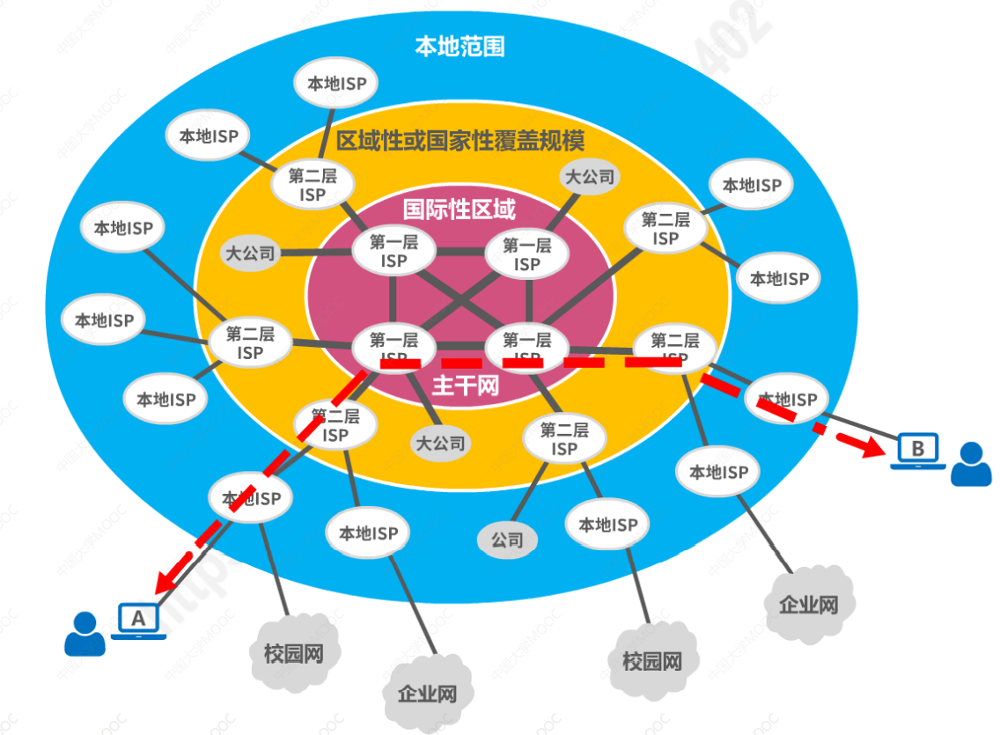

## 因特网的标准化工作

因特网的标准化工作对因特网的发展起到了非常重要的作用。

因特网在制定其标准上的一个很大的特点是**面向公众**

- 因特网所有的RFC（Request For Comments）技术文档都可以从因特网上免费下载
- 任何人都可以随时用电子邮件发表对某个文档的意见或建议

因特网协会ISOC是一个国际性组织，它负责对因特网进行全面管理，以及在世界范围内出近期发展和使用

- 因特网体系结构委员会IAB，负责管理因特网有关协议的开发
- 因特网工程部IETF，负责研究中短期工程问题，主要针对协议的开发和标准化
- 因特网研究部IRTF，从事理论方面的研究和开发一些需要长期考虑的问题

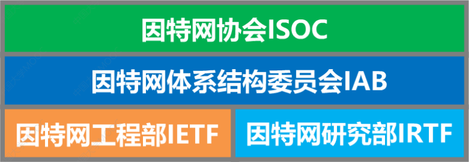

制定因特网的正式标准要经过一下4个阶段

1. 因特网草案（在这个阶段还不是RFC文档）
2. 建议标准（从这个阶段开始就成为RFC文档）
3. 草案标准
4. 因特网标准

# 3. 因特网的组成

边缘部分
- 由所有连接在因特网上的**主机**组成。这部分是**用户直接使用**的，用来进行**通信**（传送数据、音频或视频）和**资源共享**

核心部分
- 由**大量网络**和连接这些网络的**路由器**组成。这部分是**为边缘部分提供服务**的（提供连通性和交换）

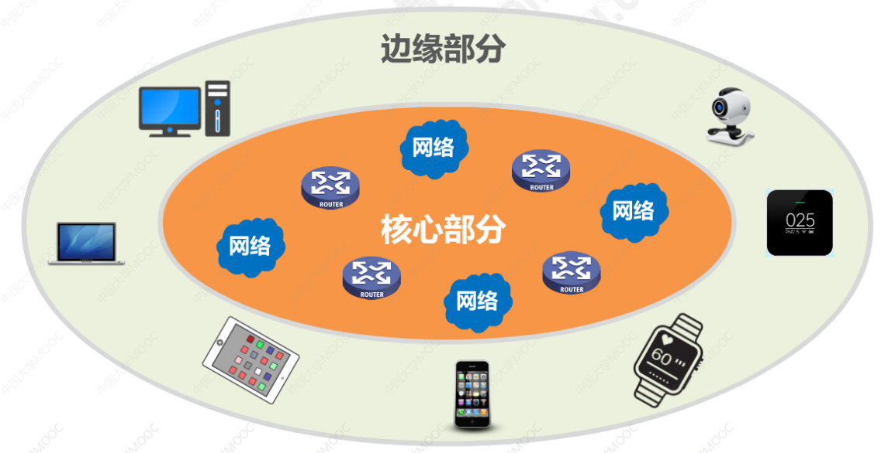
## 互联网的边缘部分

处在互联网边缘的部分就是连接在互联网上的所有的主机。这些主机又称为**端系统（end system）**。边缘部分利用核心部分所提供的服务，使众多主机之间能够相互通信并交换或共享信息。

主机A和主机B进行通信，实际上是指**主机A的某个进程和主机B上的另一个进程进行通信**，简称为“计算机之间通信”

### 客户-服务端方式

客户（client）和服务器（server）都是指通信中所涉及的两个**应用进程**。客户-服务器方式所描述的是进程之间服务和被服务的关系

> 客户是服务请求方，服务器是服务提供方

客户程序
- 被用户调用后运行，在通信时**主动**向远地服务器发起通信（请求服务）。因此客户程序必须知道服务器程序的地址
- 不需要特殊的硬件和很复杂的操作系统

服务器程序
- 是一种专门用来提供某种服务的程序，**可同时处理**多个远地或本地客户的请求
- 系统启动后即自动调用并一直不断地着，被动地等待并接受来自各地客户的通信请求。因此，服务器不需要知道客户程序的地址
- 一般需要有强大的硬件和操作系统支持

客户与服务器的通信建立后，通信是双向的，客户和服务器都可以发送和接受数据

### 对等连接方式

对等连接P2P是指两台主机在通信时并不区分哪一个是服务请求方哪个是服务提供方。只要两台主机都运行了对等连接软件，它们就**可以进行平等，对等连接通信**

> 对等连接中的每台主机既是客户又同时是服务器

## 互联网的核心部分

**三种交换方式**
### 电路交换（Circuit Switching）
电话交换机接通电话线的方式称为电路交换

从通信资源的分配角度来看，交换（Switching）就是**按照某种方式动态地分配传输线路的资源**

电路交换的三个步骤
1. 建立连接（分配通信资源）
2. 通话（一直占用通信资源）
3. 释放连接（归还通信资源）

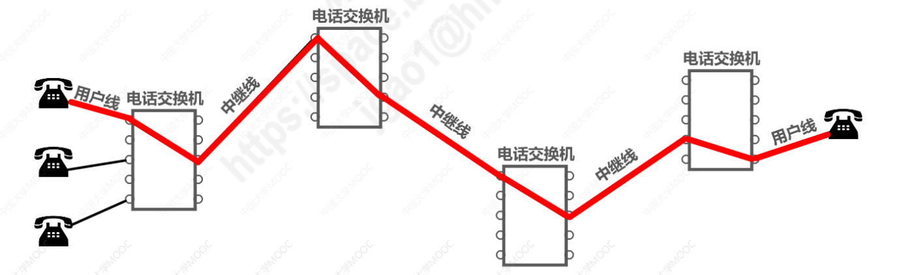

在通话的全部时间内，通话的两个用户始终**占用**端到端的通信资源

## 分组交换（Packet Switching）

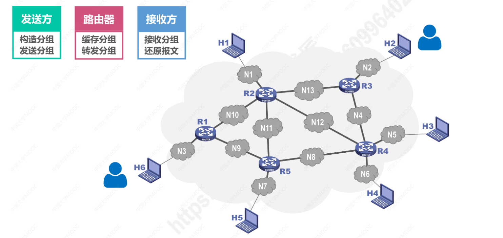
- 发送方将*报文进行不同的分组，通过不同的路由器转发*，向接收方发送数据
- 接收方只用把接收到分组，根据分组的首部，还原成原来的报文

## 报文交换（Message Switching）
报文交换就是不分组，一整个报文的传送

## 电路交换、报文交换、分组交换的对比

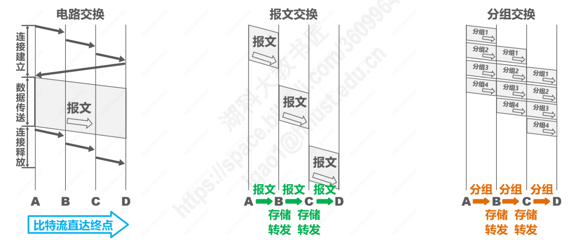

**电路交换**

优点
- **通信时延小**：这是因为通信线路为通信双方用户专用，数据直达，因此通信延迟非常小
- **有序传输**：这是因为通信双方之间只有条专用的通信线路，数据只在这条线路上传输。因此不存在失序问题
- **没有冲突**：不同的通信双方拥有不同的信道。不会出现争用物理信道的间题。
- **适用范围广**：电路交换既适用于传输模拟信号。也适用于传输数字信号。
- **实时性强**：这主要得益于其通信时延小的优点。
- **控制简单**

缺点
- **建立连接时间长**：电路交换的平均连接建立时间对机算机通信来说太长
- 线路独占**使用效率低**：电路交换一旦建立连接,物理通路就被通信双方独占，即使通信线路空闲，也不能供其他用户使用，因而信道利用率很低
- **灵活性差**：只要连接所建立的物理通路中的任何一点出现了故障，就必须重新拨号建立新的连接，这对十分紧急和重要的通信是很不利的。
- **难以规格化**：电路交换时，数据直达。不同类型。不同规格。不同速率的终端很难相互进行通信，也难以在通信过程中进行差错控制。

**报文交换**

优点
- **无需建立连接**：报文交换不需要为通信双方预先建立一条专用的通信线路，不存在建立连接的时延，用户可以随时发生报文
- **动态分配路线**：当发送方把报文传送给结点交换机时，结点交换机先存储整个报文，然后选择一条合适的空闲路线，将报文发送出去
- **提高线路可靠性**：如果某条传输路线出现异常会从心选择另一条路径传输数据，因此提高了传输的可靠性
- **提高线路利用率**：通信双方不是固定占用一条通信线路，而是在不同的时间分段部分占用物理线路，因而大大提高了通信线路的利用率
- **提供多目标服务**：一个报文可以同时发送给多个目的地址

缺点
- **引起了转发时延**：这是因为报文在节点交换机上要经历存储转发的过程
- **需要较大存储缓存空间**：这是因为报文交换对报文的大小没有限制
- **需要传输额外的信息量**：这是因为报文需要携带目标地址，源地址等信息

**分组交换**

优点
- **无需建立连接**：分组交换不需要为通信双方预先建立一条专用的通信线路，不存在建立连接的时延，用户可以随时发生报文
- **线路利用率高**：通信双方不是固定占用一条通信线路，而是在不同的时间分段部分占用物理线路，因而大大提高了通信线路的利用率
- **简化了存储管理**：这是相对与报文交换而言的。因为分组的长度固定，相应的缓冲区的大小也固定，管理起来也相对容易
- **加速传输**：由于分组是逐个传输的，这就使得后一个分组的存储操作，与前一个分组的转发操作可以同时同时进行
- **减少出错概率和重发数据量**：因为分组比报文小，因此出错概率必然减小，即便分组出错，也只需重传出错的分组，这比重传整个报文的数据量小很多，这样不仅提高了回靠牲。也减少了传输时延

缺点
- **引起转发时延**：是因为报文在节点交换机上要经历存储转发的过程
- **需要传输额外的信息量**：将原始报文分割成等长的数据块，每个数据块都要加上源地址，目的地址等控制信息从而控制分组，因此使得传送的信息量增大了
- 对于数据报服务，**存在失序，丢失或重复分组的问题**；对于虚电路服务，存在呼叫建立、数据传输和虚电路释放三个过程

# 4. 计算机网络的定义和分类
### 计算机网络的精确定义并未统一
计算机网络的最简单的定义是：一些相**互**连**接**的、**自治**的计算机的**集合**

- 互连 是指计算机之间可以通过有线或无线的方式进行数据通信
- 自治 是指独立的计算机，它有自己的硬件和软件，可以单独运行使用
- 集合 是指至少需要两台计算机

计算机网络的较好的定义是：计算机网络主要是由一些**通用的、可编程的硬件互连**而成的，而这些硬件并非专门用来实现某一特定目的（例如，传送数据或视频信号）。这些可编程的硬件能够用来**传送多种不同类型的数据**，并能**支持广泛的和日益增长的应用**。

## 计算机网络的分类
**按交换技术分类**
- 电路交换网络
- 报文交换网络
- 分组交换网络

**按网络的使用者分类**
- 公用网：公用网对所有的人提供服务，只要符合网络拥有者的要求就能使用这个网，也就是说它是为全社会所有的人提供服务的网络。
- 专用网：是某个部门为本单位的特殊工作的需要而建立的网络。这种网络不向本单位以外的人提供服务。例如军队、铁路、电力等系统均有本系统的专用网。

**按传输介质分类**
- 有线网络
- 无线网络

**按覆盖范围分类**
- 广域网WAN：不同国家与国家之间的范围
- 城域网MAN：不同城市与城市之间范围
- 局域网LAN：企业网，校园网
- 个域网PAN：蓝牙、无线设备

**按拓扑结构分类**

总线型网络：使用单根传输线把计算机连接起来

- 它的优点是建网容易、增减结点方便、节省线路
- 缺点是重负载时通信效率不高，意线任意一处出现故障。则全网瘫痪。

星型网络：星型网络是将每个计算机都以单独的线路与中央设备相连

- 这种网络拓邦便于网络的集中控制和管理，因为端用户之间的通信必须经过中央设备。
- 缺点是成本高。中央设备对故障敏感

环型网络：环型网络是将所有计算机的网络接口连接成一个环

- 环可以是单环。也可以是双环。环中信号是单向传输的。

网状型网络：一般情况下。每个结点至少由两条路径与其他结点相连。

- 其优点是可靠性高。
- 缺点是控制复杂、线路成本高

# 5. 计算机网络的性能指标
## 速率
连接在计算机网络上的主机在数字信道（[信道的概念](https://www.cnblogs.com/kkdd-2013/p/4027227.html)）上**传送比特的速率**，也称为**比特率**或**数据率**

基本单位：`bit/s（b/s,bps）`,常用单位：`kb/s, Mb/s, Gb/s, Tb/s`

当提到网络的速率时，往往指的是**额定速率或标称速率（理论最大速度）**，而非网络实际上运行的速率

> 常见的有网速计量单位有KB/s和Kb/s两种 。但是，往往大家容易混淆在这两个单位中。
>
> Kb/s
>
>也就是Kbps。这里面小写的b是bit（比特）的缩写，是位的意思。一个位就是二进制的0或者1。一般代表传输单位，p就是 / 号，s是秒。**bps就是b/s=比特/秒** ，Kb就是千比特 ， Mb就是兆比特。我们**装宽带运营商说的什么2M宽带，4M，20M，甚至100M宽带说的就是Mbps（Mb/s）** 每秒多少兆比特。
>
> KB/s
> 
> 同样也可以写成KBps。B是大写，是Byte（字节）的意思。**1Byte=8bit，Byte一般用作容量单位**。KB就是千字节，MB就是兆字节，还有GB，TB…手机存储容量16G，32G，64G就是这个意思，买的硬盘，U盘，TF卡等等说的容量也是这个意思。 1TB=1024GB 1GB=1024MB 1MB=1024KB 说到这里再顺便说个常识，我们是用1024来换算，**可是生产存储设备的厂家都是取整用1000来计算**。如8G的TF卡，在电脑上显示容量绝对不会是8x1024=8192M，这也就是为什么大家在网上购买的存储设备实际存储空间大小总是小于商品标定值的主要原因。

**换算**
通过上面的介绍可以计算
容量单位时：`1KB=8Kb 1MB=8Mb 1GB=8Gb`
速度单位时：`1KB/s=8Kb/s 1MB/s=8Mb/s 1GB/s=8Gb/s`

举例 首先给大家举个宽带的例子，我们去运营商那里装个4M的宽带，这里的4M肯定是4Mb/s了，那么我们在家用迅雷，QQ旋风等下载软件下载东西的时候速度达到多少才是正常能呢。这些**下载软件显示的速度一般都是KB/s**，我们用上面的换算方法计算下 4Mb/s=4x1024Kb/s=4096Kb/s 4096Kb/s=4096÷8KB/s=512KB/s ，也就是说4M宽带的理论下载速度是512KB/s，一般考虑到线路等原因400-500KB/s都算正常。

## 带宽
用来表示网络的**通信线路所能传送数据的能力，因此网络带宽表示在单位时间内从网络中的某一点到另一点所能通过的“ 最高数据率 “**；单位与速率单位相同
（类似于某一时刻道路最大能承载通过的车辆）

## 吞吐量
吞吐量表示在**单位时间内通过某个网络（或信道、接口）的数据量**

吞吐量被经常用于对现实世界中的网络的一种测量，以便知道实际上到底有多少数据量能通过网络；吞吐量**受网络的宽带或额定速率的限制**

（类似于在某一时刻道路汽车的数量）

## 时延
时延是**指一个报文或分组从一个网络的一端传送到另一个端所需要的时间。** 它包括了发送时延，传播时延，处理时延，排队时延。（时延 = 发送时延 + 传播时延 + 处理时延 + 排队时延）一般，发送时延与传播时延是我们主要考虑的。对于报文长度较大的情况，发送时延是主要矛盾；报文长度较小的情况，传播时延是主要矛盾。

`发送时延 = 分组长度（b）/ 发送速率（b/s）`

`传播时延 = 信道长度（m）/电磁波传播速率（m/s）`

`处理时延  一般不便于计算`

## 时延带宽积
**传播时延**和**带宽**的乘积
若发送端连续发送数据，则在所发送的第一个比特即将到达终点时，发送端就已经发送了时延带宽个比特

链路的时延带宽积又称为**以比特为单位的链路长度**

 

## 往返时间RTT
在许多情况下，因特网上的信息不仅仅单方向传输，而是**双向交互**
我们有时候很需要知道双向交互一次所需的时间

## 利用率
**信道利用率**：用来表示某信道有百分之几的时间是被利用的（有数据通过）

**网络利用率**：全网络的信道利用率的加权平均

利用率**并非越高越好**：当某信道的利用率增大时，该信道引起的时延也会迅速增加（类似于马路上的汽车，如果把传输的比特当作汽车，汽车越多造成的道路拥堵机率也越高）,也不能**使信道利用率**太低**，这会使宝贵的通信资源被白白浪费

## 丢包率
丢包率即分组丢失率，是指在一定的时间范围内，传输过程中**丢失的分组数量与总分组数量的比率**

分组丢失的两个主要原因：**分组误码**，结点交换机缓存队列（**网络拥塞**）

# 6. 计算机网络体现结构
## 常用的计算机网络体系结构

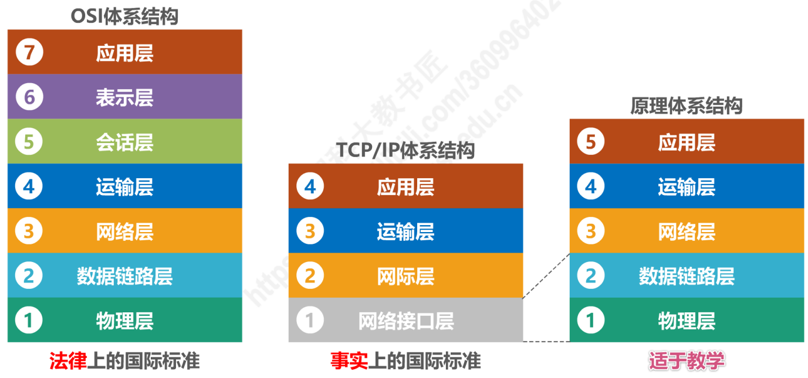

**计算机网络体系结构分层的必要性**
**计算机网络是个非常复炸的系统**。早在最初的ARPANET设计时就提出了分层的设计理念

**“分层”** 可将庞大而复炸的问题，转化为若干较小的局部问题，而这些较小的局部问题就比较易于研究和处理

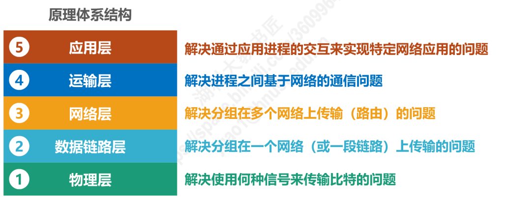

## 计算机网络体系结构分成思想举例

### 计算机网络体系结构中的专用术语
- 实体：任何可发送或接收信息的**硬件**或**软件进程**
- 对等实体：收发双发**相同层次中的实体**

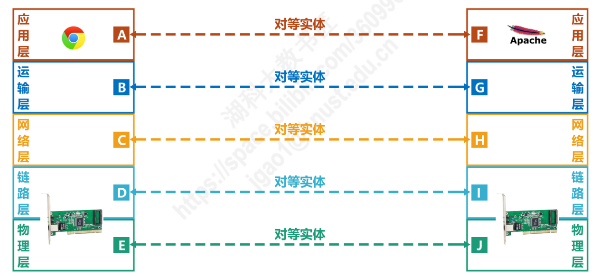

- 协议：**控制两个对等实体进行逻辑通信的规则的集合**

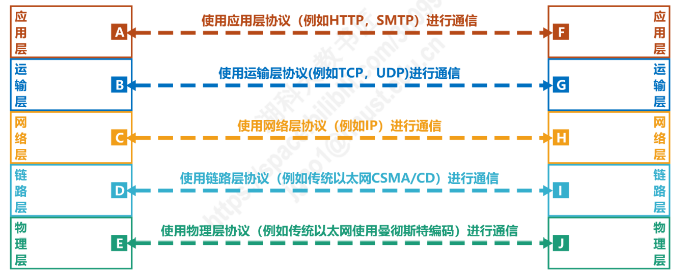

协议的三要素
- 语法：定义所交换信息的格式
- 语义：定义收发双发索要完成的操作
- 同步：定义收发双发的时序关系

**在协议的控制下，两个对等实体间的逻辑通信使得本层能够向上一层提供服务
要实现本层协议，还需要使用下面一层所提供的服务**

协议是“**水平的**”，服务是“**垂直的**”

实体看得见相邻下层所提供的服务，但并不知道实现该服务的具体协议。也就是说，下面的协议对上面的实体是“**透明**”的

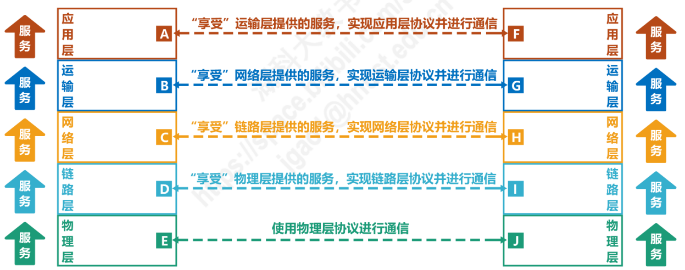

服务访问点：在同一系统中**相邻两层的实体交换信息的逻辑接口**，用于区分不同的服务类型。

- 数据链路层的服务访问点为帧的“类型”字段。
- 网络层的服务访问点为IP数据报首部中的“协议字段”。
- 运输层的服务访问点为“端口号”。

服务原语 上层使用下层所提供的服务必须通过与下层**交换一些命令**，这些命令称为服务原语。

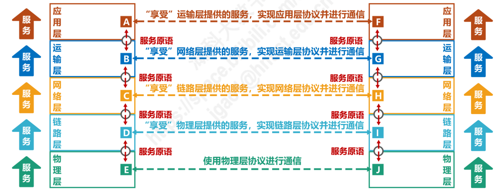

协议数据单元PDU：**对等层次之间传送的数据包**称为该层的协议数据单元。

服务数据单元SDU：**同一系统内，层与层之间交换的数据包**称为服务数据单元。

多个SDU可以合成为一个PDU，一个SDU也可划分为几个PDU。

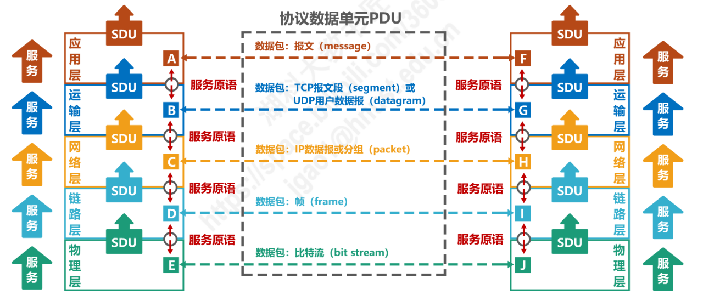
