# 1. 物理层的基本概念
物理层考虑的是怎样才能在连接各种计算机的传输媒体上传输数据比特流

物理层为数据链路层屏蔽了各种传输媒体的差异，使数据链路层只需要考虑如何完成本层的协议和服务，而不必考虑网络具体的传输媒体是什么。

物理层协议的主要任务
- 机械特性：指明接口所用接线器的**形状**和**尺寸**、**引脚数目**和**排列**、**固定**和**锁定**装置
- 电气特性：指明在接口电缆的各条线上出现的**电压的范围**
- 功能特性：指明某条线上出现的某一电平的**电压表示何种意义**
- 过程特性：指明对于不同功能的各种可能**事件的出现顺序**

# 2. 物理层下面的传输媒体
## 导引型传输媒体
### 同轴电缆

同轴电缆由导体铜质芯线（单股实心线或多股绞合线）、绝缘层、网状编织的外导体屏蔽层以及保护塑料外层所组成。

- 基带同轴电缆（50Ω）

  数字传输，过去用于局域网

- 宽带同轴电缆（75Ω）

  模拟传输，目前主要用于有线电视

同轴电缆价格较贵且布线不够灵活和方便,随着集线器的出现,在局域网领域基本上都是采用双绞线作为传输媒体。

#### 双绞线

双绞线，是由两根具有绝缘保护层的铜[导线](https://baike.baidu.com/item/导线/1413914)组成的。把两根绝缘的铜导线按一定密度互相绞在一起，每一根导线在传输中[辐射](https://baike.baidu.com/item/辐射/5676)出来的电波会被另一根线上发出的电波抵消，有效降低信号干扰的程度。

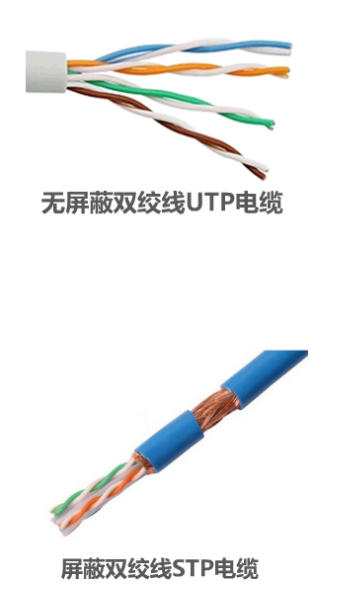

绞合的作用：

- 抵御部分来自外界的电磁波干扰

- 减少相邻导线的电磁干扰

与其他传输介质相比，双绞线在传输距离，[信道宽度](https://baike.baidu.com/item/信道宽度/1208670)和数据传输速度等方面均受到一定限制，但价格较为低廉。

#### 光纤

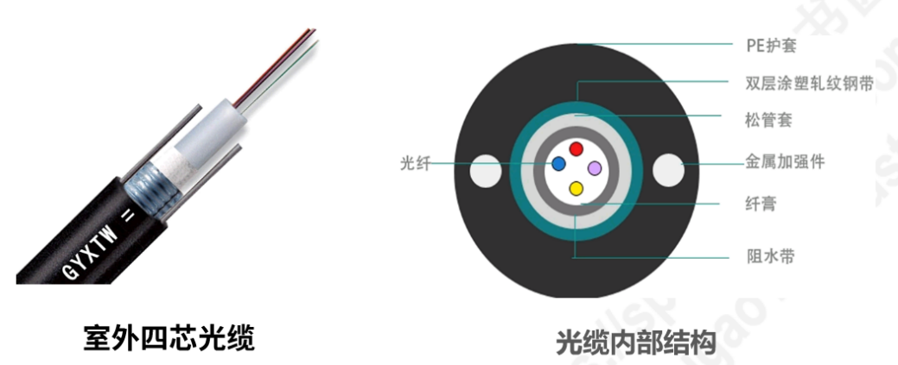

- 纤芯直径
  - 多模光纤：50微米，62.5微米
  - 单模光纤：9微米
- 包层直径125微米
- 工作波长
  - 0.85微米（衰减较大）
  - 1.30微米（衰减较小）
  - 1.55微米（衰减较小）

- 光纤的优点
  - 通信容量大（25000~30000 GHz的带宽）
  - 传输损耗小，远距离传输时更加经济
  - 抗雷电和电磁干捞性能好，这在大电流脉冲干扰的环境下尤为重要
  - 无串音干扰，保密性好，不易被窃听
  - 体积小，重量轻
- 光纤的缺点
  - 切割需要专用设备
  - 光电接口价格较贵

当光线从**高折射率**的媒体射**向低折射率**的媒体时，其**折射角将大于入射角**

因此，如果**入射角足够大**，就会**出现全反射**，即光线碰到包层就会折射回纤芯

- 由于色散（模式、材料、波导色散），光在多模光纤中传输一定距离后必然产生信号失真（**脉冲展宽**）
- 因此，多模光纤只**近距离传输**（建筑物内）

- 发送光源：发光二极管；接收检测：广电二极管

- 没有模式色散，在1.31微米波长附近材料色散和波导色散大小相等符号相反，两者正好抵消
- 单模光纤适合长距离传输且衰减小，但其制造成本高，对光源要求高
- 发送光源：激光发生器；接收检测：激光检波器

#### 电力线

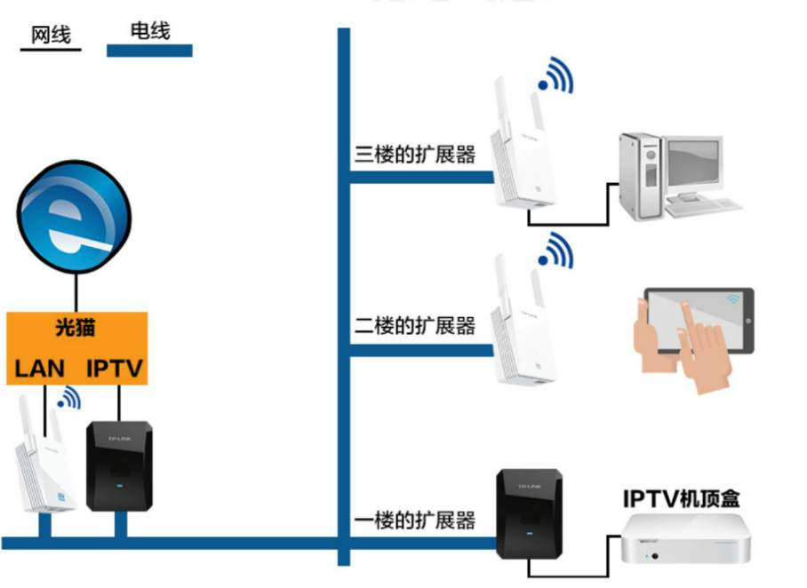

### 非导引型传输媒体

#### 无线电波

#### 微波

#### 红外线

#### 可见光

## 2.3 传输方式

### 串行传输和并行传输

串行传输，即逐个比特按照时间顺序传输

适合远距离传输

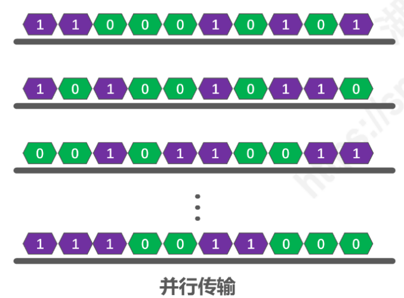

并行传输指的是数据以成组的方式，在多条并行信道上同时进行传输，是在传输中有多个数据位同时在设备之间进行的传输。 

并行传输只适合于短距离、要求传输速度快的场合使用。如CPU和内存之间的通信

### 同步传输和异步传输

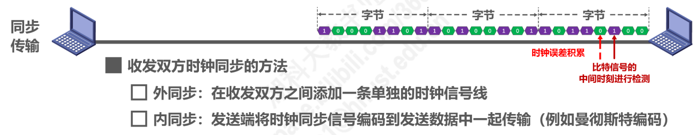

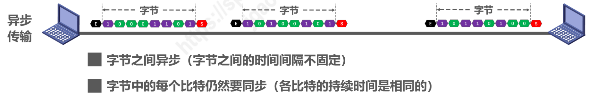

#### 单向通信（单工）

即只能一个方向的通信而没有反方向的交互

#### 双向交替通信（半双工）

通信的双方都可以发送信息，但是不能双方同时发送（也不能同时接收）

#### 双向同时通信（全双工）

即通信的双方可以同时发送和接收信息

## 2.4 编码和调制

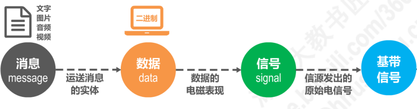

通信的目的是传送消息（message）。如话音、文字、图像、视频等都是消息。

数据（data）是运送消息的实体（数据是使用特定方式表示的信息，通常是有意义的符号序列）

信号（signal）则是数据的电气或电磁的表现

根据信号中代表消息的参数的取值方式不同，信号可分为两大类：

- 模拟信号，或连续信号：代表消息的参数的取值是连续的
- 数字信号，或离散信号：代表消息的参数的取值是离散的

**码元**

在使用时间域的波形表示数字信号时，代表**不同离散数值的基本波形**

### 常用编码方式

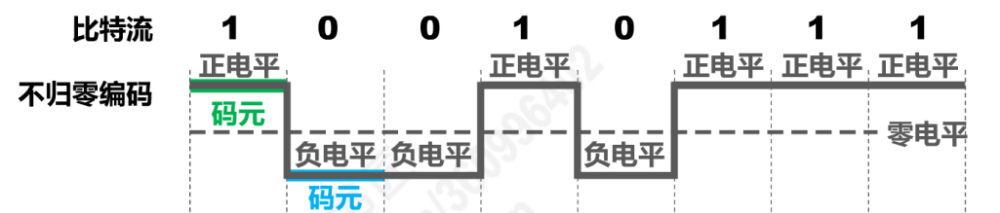

不归零编码：正电平代表1，负电平代表0

接受端 如何判断这是2个码元？

- 需要**额外一根传输线来传输时钟信号**，使发送方和接收方同步

- 对于计算机网络，**宁愿利用这跟传输线传输数据信号**，而不是传输时钟信号！

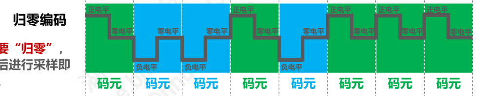

归零制：正脉冲代表1，负脉冲代表0

- **每个码元传输结束后信号都要“归零”**，所以接收方只要在信号归零后进行采样即可，不需要单独的时钟信号
- 实际上，归零编码相当于把时钟信号用“归零”方式编码在了数据之内，则称为“**自同步**”信号。
- 但是，归零编码中大部分的**数据带宽**，都要传输“归零”而**浪费**掉了。

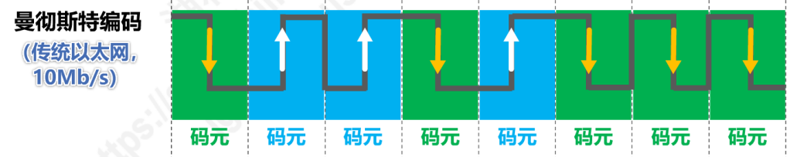

曼彻斯特编码：位周期中心的向上跳变代表0，位周期中心的向下跳变代表1。但也可以反过来定义

- 码元中间时刻的跳变即表示时钟，又表示数据

差曼彻斯特编码：在每一位的中心处始终都有跳变。位开始边界有跳变代表0，而位开始边界没有跳变代表1

- 跳变仅表示时钟
- 码元开始处电平是否发生变化表示数据

### 基本的带通调制方法

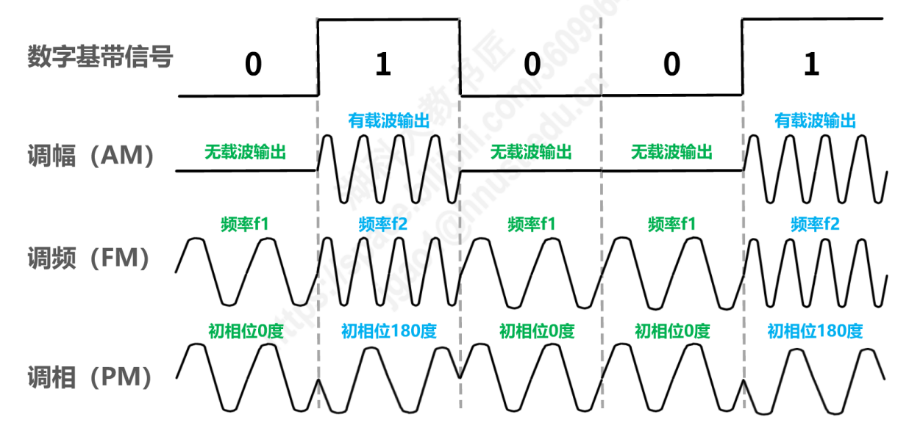

- 调幅（AM）：即载波的振幅随基带数字信号而变化。例如，0 或 1 分别对应无载波或有载波输出
- 调频（FM）：即载波的频率随基带数字信号而变化。例如，0 或 1 分别对应于频率f1 或 f2
- 调相（PM）：即载波的初始相位随基带数字信号而变化。例如，0 或 1 分别对应于相位0度或180度

## 2.5 信道的极限容量

失真因素

- 码元的传输速率
- 信号传输距离
- 噪声干扰
- 传输媒体质量

如果信号中的高频分量在传输时受到衰减，那么在接收端收到的波形前沿和后沿就变得不那么陡峭了，每个码元所占的时间界限也不再是很明确，而前后都拖了“尾巴”。这样，在接受端收到的信号波形就失去了码元之间的清晰界限，这种现象叫做码间串扰

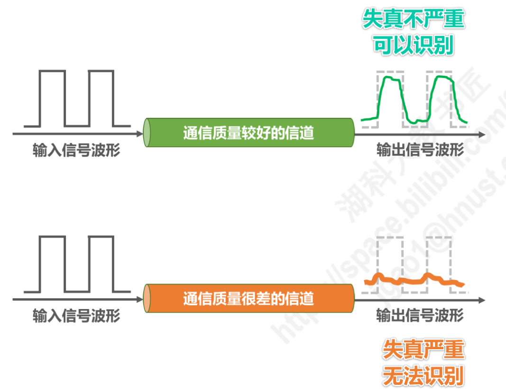

### 奈氏准则

在假定的理想条件下，**为了避免码间串扰，码元传输速率是由上限的**

理想低通信信道的最高码元传输速率 = 2W Baud = 2W 码元/秒

理想带通道信道的最高码元传输速率 = W Baud = W 码元/秒

- W：信道带宽（单位为Hz）

- Baud：波特，即码元/秒

码元传输速率又称为波特率，调制速率，波形速率或符号速率。它与比特率有一点关系：

- 当1个码元只携带1比特的信息量时，则波特率（码元/秒）与比特率（比特/秒）在数值上是相等的
- 当1个码元携带n比特的信息量时，则波特率转换成比特率时，数值要乘以n

要提高信息传输速率（比特率），就必须设法使每一个码元能携带更多个比特的信息量。这需要采用多元制

实际的信道所能传输的最高码元速率，要明显低于奈氏准则给出的这个上限数值

> 只要采用更好的调制方法，让码元可以携带更多的比特，岂不是可以无限制的提高信息的传输速率？
>
> 答案是否定的。因为信道的极限信息传输速率还要受限于实际的信号在信道中传输时的信噪比

### 信噪比

噪声存在所有的电子设备和通信信道中。由于噪声是随机产生的，它的瞬时值有时会很大，因此噪声会使接受端对码元的判决产生错误（1 误判为0或0 误判为1）

信噪比就是信号的平均功率和噪声的平均功率之比，常记为S/N，并用分贝（dB）作为度量单位。

​	$$信噪比（dB）=   10 \log_{10}{\frac{S}{N}} (dB)$$

### 香农公式

带宽受限且有高斯白噪声干扰的信道的极限信息传输速率

​		$$C = W \log_{2}({1+S/N})(bit/s)$$

- C：信道的极限信息传输速率（单位：b/s）

- W：信道带宽（单位：Hz）

- S：信道内所传信号的平均功率

- N：信道内的高斯噪声功率

- S/N：信噪比，使用分贝（dB）作为度量单位

**信道带宽或信道中信噪比越大，信息的极限传输速率越高。**

在实际信道上能够达到的信息传输速率要比该公式的极限传输速率低不少。这是因为在实际信道中，信号还要收到其他一些损伤，如各种脉冲干扰、信号在传输中的衰减和失真等，这些因素在香农公式中并未考虑。

在信道带宽一定的情况下，根据奈氏准则和香农公式，要想**提高信息的传输速率**就必须采用**多元制**（更好的调制方法）和努力**提高信道中的信噪比**

自从香农公式发表后，各种**新的信号处理和调制方法就不断出现**，其目的都是为了尽可能地**接近香农公式给出的传输速率极限**
